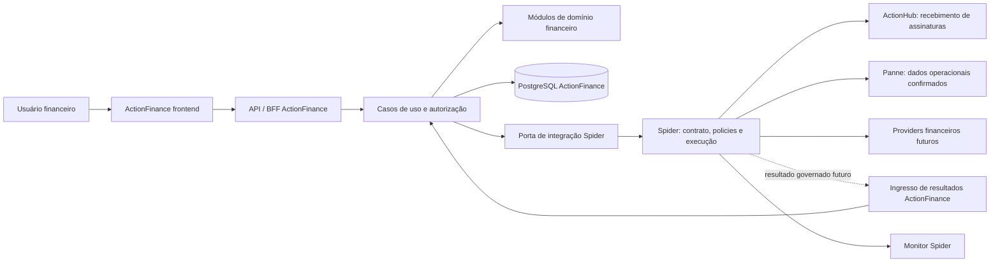

# ACTIONFINANCE_ARQ_001 — Arquitetura de produto, sistema, dados e experiência

## Controle

| Campo | Valor |
|---|---|
| Identificador | ACTIONFINANCE_ARQ_001 |
| Versão | 0.2 |
| Data | 25/09/2026 |
| Natureza | Proposta arquitetural para revisão |
| Destino | `C:\Projetos\ActionFinance` |
| Repositório | monorepo Git de `C:\Projetos` |
| Negócio, arquitetura, UX e prompts | analista nesta conversa |
| Desenvolvedor exclusivo | Cursor |
| Aprovação | proprietário do produto |
| Runtime nesta etapa | nenhum |

Este documento especifica o trabalho. Não representa implementação, ambiente funcionando ou integração homologada.

### Recorte PRM_006 (29/09/2026)

Decisão deste ciclo (não promove ADRs antigos): acesso de publicação por OIDC Authorization Code + sessão no backend; mesma origem UI/API; autorização só no banco ActionFinance; destino `actionfinance.actionhub.com.br`. Provedor IdP real pendente de provisionamento externo. Sem ativação pública neste prompt.

## 1. Decisões de negócio estabelecidas

Status destas oito decisões: **CONFIRMED_BY_OWNER**.

1. ActionFinance concentra a gestão financeira do grupo além do serviço de recebimento de assinaturas mantido no ActionHub.
2. ActionHub continua recebendo os pagamentos das subscrições dos serviços do grupo. Não é o executor financeiro geral do ActionFinance.
3. Panne é responsável pela gestão física do estoque da padaria. ActionFinance não replica entradas, saídas, lotes, validade ou movimentos físicos.
4. Spider governa as integrações, seleção de capabilities/providers, correlação e evidências. Não assume o domínio financeiro nem se torna ledger.
5. ActionFinance é aplicação independente, integrada como EXPERIENCE Satellite, com banco PostgreSQL próprio, no mesmo monorepositório da Spider. Não possui Git aninhado.
6. O produto é comum ao grupo. Padaria é contexto de uso, não limitação estrutural do modelo.
7. Cursor é o único desenvolvedor. Este documento especifica o trabalho; não representa implementação, ambiente funcionando ou integração homologada.
8. Backend, BFF e regras de negócio serão desenvolvidos em **Java, na mesma versão da Spider**. O `pom.xml` da Spider confirma Java 21. Essa é uma decisão do responsável, não uma alternativa de stack. A UI web permanece proposta em React/TypeScript, separada do backend Java, seguindo o padrão dos satélites.

Essas decisões substituem as partes do documento de transição que atribuíam toda execução financeira ao ActionHub. A existência de código de cobrança avulsa no working tree do Hub é uma divergência legada a tratar separadamente, sem remoção ou reaproveitamento automático.

## 2. Objetivo e limites

Oferecer uma experiência comum para obrigações, recebíveis, caixa, conciliação financeira, custos, resultados e planejamento, com identidade empresarial explícita, histórico verificável e integrações governadas.

Ter gestão financeira própria não implica construir core bancário, processador de cartões, folha de pagamento, ERP de produção ou escrituração contábil legal. Obrigações de folha podem ser recebidas do sistema responsável; o cálculo da folha não é escopo desta arquitetura. Um eventual razão financeiro/contábil por partidas dobradas exigirá ADR próprio; não será improvisado por somas de eventos técnicos.

O produto conhece e gere compromissos e registros financeiros. A execução externa de pagamentos depende de providers a selecionar e de contratos confirmados. Não há provider bancário aprovado neste estágio.

## 3. Evidências e divergências da plataforma

Leitura estática realizada em 25/09/2026; não foram iniciados serviços nem realizadas chamadas financeiras. Revalidação no PRM_001: [`ACTIONFINANCE_EVD_001.md`](ACTIONFINANCE_EVD_001.md).

| Evidência | Consequência arquitetural |
|---|---|
| SegSense possui React/TypeScript/Vite, Java 21/Spring Boot, PostgreSQL, Flyway e camadas próprias | Referência estrutural principal, sem copiar seu domínio de seguros |
| SegSense separa frontend, backend, database, services, scripts e documents | Adotar a mesma organização de produto |
| Migrations SegSense ficam em `database/migrations`, copiadas pelo Maven para `db/migration` | Usar uma única fonte de migrations |
| SpiderBank documenta ausência de banco na primeira entrega e idempotência em memória | Não reproduzir essa limitação no domínio financeiro |
| Spider expõe `POST /v1/satellites/interactions`; schemas 1.0/1.1/1.2 presentes | Usar contrato publicado quando houver extensão financeira aprovada |
| Schema 1.2 restringe finalidade a seguros/capital de giro e canal de resposta a SYNC | Integração financeira e retorno assíncrono ainda exigem desenho e implementação na Spider |
| EXPERIENCE não pode enviar EXECUTE_CAPABILITY ou CAPABILITY_RESULT no serviço atual | Declarar intenção/contexto; não escolher executor |
| Idempotência do serviço de satélite é mantida em memória | Não afirmar garantia financeira ponta a ponta por reinício |
| Documentos históricos do SegSense e ARCH-017 contêm estados de entregas anteriores | Confirmar suporte no código/configuração atual; não copiar declarações de prontidão |

Versões observadas no PRM_001 (workspace, não certificação de pacotes):

| Fonte | Observado |
|---|---|
| `spider/backend/pom.xml` | Java 21; parent Spring Boot **3.4.2**; WebFlux |
| `segsense/backend/pom.xml` | Java 21; parent Spring Boot **4.1.1**; starter `webmvc` |
| `spider-bank/backend/pom.xml` | Java 21; parent Spring Boot **4.1.1** (evidência adicional; não copiar) |
| `segsense/compose.yaml` | imagem `postgres:18.6` |
| `segsense/frontend/package.json` | React 19.2.8; TypeScript 5.9.3 |

Java 21 é obrigatório para ActionFinance nesta baseline. Como proposta técnica adicional, alinhar inicialmente Spring Boot à linha da Spider (3.4.2 observada), revalidando dependências no prompt de fundação. **Não copiar o POM do SegSense nem o do SpiderBank.** A convenção de diretórios/camadas e a persistência do SegSense continuam como referência; os nomes de starters e dependências precisam corresponder à versão escolhida. Cursor deve registrar as versões e verificar a resolução na etapa de fundação; não instalar “latest” nem atualizar a Spider para acomodar o ActionFinance. Se o Java da Spider mudar antes da implementação, registrar a divergência e adequar a baseline à instrução de paridade, sem alterar a Spider.

Checagem do destino em 25/09/2026, antes de escrever: `C:\Projetos\ActionFinance` não continha arquivos. Nenhum trabalho prévio foi sobrescrito.

## 4. Arquitetura proposta

### 4.1 Forma de implantação

Um frontend React proposto e um backend **Java 21 obrigatório**, independentes da Spider. O backend será um **monólito modular**: uma aplicação implantável, com módulos de negócio e dependências explícitas. BFF e API de domínio são responsabilidades lógicas do mesmo processo inicial; não criar dois serviços apenas para separá-las. Não introduzir backend Node.js ou Python.

Essa estrutura permite transações locais consistentes, auditoria e uma base operacional simples. Separação em microserviços só mediante evidência de necessidade e ADR futuro.



As ligações a Panne, Hub e providers indicam arquitetura alvo, não conectividade existente. Chamadas de retorno e subscriptions/eventos ainda dependem de contratos. Não criar webhooks fictícios com rótulo de integração pronta.

### 4.2 Dependências internas

`interface HTTP → application → domain`. Infraestrutura implementa portas definidas na aplicação/domínio. Configuração faz a composição.

- Domain: regras, valores monetários, estados e invariantes. Sem dependência de Spring, HTTP, JPA ou classes Spider.
- Application: casos de uso, autorização por contexto, fronteiras transacionais, idempotência e portas.
- Interface HTTP: validação estrutural, DTOs próprios, sessão, erros e projeções para a UI.
- Infrastructure: JPA/JDBC, Flyway, transporte Spider, relógio, armazenamento e adapters técnicos.
- Consultas podem usar projeções dedicadas; não expor entidades JPA na API.
- Módulos não acessam repositories internos de outros módulos. Usam contratos internos explícitos.
- Não importar código de `spider/backend`, Panne, SegSense ou Hub como biblioteca do ActionFinance. Estar no mesmo Git não significa compartilhar runtime ou banco.

Pacote Java proposto: `br.com.actionfinance`.

### 4.3 Operação local versus integração

Cadastrar uma obrigação, corrigir um rascunho e consultar contas locais são operações do ActionFinance. Sua autorização e auditoria pertencem ao produto; não dependem da disponibilidade da Spider.

Solicitar execução externa ou obter dados de outro sistema passa pela Spider. O frontend conversa somente com o backend ActionFinance. O backend não chama Panne, Hub, banco ou provider diretamente e não escolhe rota/provider no envelope EXPERIENCE.

Não implementar ActionFinance simultaneamente como PROVIDER só para contornar uma limitação do contrato. Se o ecossistema precisar delegar capacidades ao domínio ActionFinance, haverá ADR separado com identidade, autorização, contrato e limites próprios.

## 5. Módulos e responsabilidade sobre os dados

| Módulo ActionFinance | Responsabilidade | Origem e limite |
|---|---|---|
| Organização e acesso | Empresa, unidade, contexto ativo e permissões | Cadastro próprio mínimo; vínculo com cadastro corporativo futuro |
| Cadastros financeiros | Contrapartes, categorias gerenciais e centros de custo | Não duplica cadastro de materiais ou produtos do Panne |
| Contas a pagar | Obrigações, vencimentos, parcelamento futuro e situação de gestão | Registro manual inicial; compras/folha via contratos futuros |
| Contas a receber | Direitos de recebimento e acompanhamento | Vendas e serviços com referência ao sistema de origem |
| Tesouraria e caixa | Contas financeiras, movimentos comprovados e projeções | Não inventa saldo bancário com base em títulos |
| Conciliação financeira | Vinculação de venda, recebível, repasse, taxa e movimento | Dados de fontes distintas preservados e comparáveis |
| Custos e resultados | Custeio, margens, competência e DRE gerencial | Premissas versionadas; dados físicos continuam no Panne |
| Planejamento | Orçamento, cenários, capital de giro e investimentos | Projeções não substituem realizado |
| Integração e auditoria | Inbox/outbox, vínculos externos e histórico | Sem payloads sensíveis em logs ou Monitor |

Uma compra pode produzir entrada de estoque no Panne e obrigação no ActionFinance: são fatos diferentes ligados por referência, não duas cópias da mesma tabela. Uma venda, seu recebível e o depósito bancário também são fatos distintos. Reimportar um resultado de assinatura do Hub não deve criar receita ou recebimento em duplicidade.

A aplicação de origem é fonte de verdade do fato operacional. ActionFinance é fonte dos seus títulos e decisões gerenciais. Provedor/banco informa execução/liquidação externa. Para títulos importados, a autoridade por campo e correções deve constar no contrato de origem, evitando sobrescrever silenciosamente mudanças locais.

Conciliação financeira é módulo do ActionFinance. Não iniciar CAP-021 nem denominar esse módulo como reconciliação técnica da Spider.

## 6. Estrutura física do projeto

Estrutura **alvo**. O PRM_001 cria somente documentos. Não criar diretórios vazios de runtime nem manifests de aplicação. Não executar `git init`. Não copiar `.git`, `.env`, credenciais, dependências ou artefatos de build de outro produto.

```text
C:\Projetos\ActionFinance\
  frontend\
    src\app\
    src\features\
    src\shared\
  backend\
    src\main\java\br\com\actionfinance\
      domain\
      application\
      interfaces\http\
      infrastructure\
      configuration\
    src\main\resources\
    src\test\
  database\
    migrations\
    seeds\
  services\
    spider-integration\
  scripts\
    dev\
  documents\
    architecture\
    adr\
    domain\
    data\
    integrations\
    ux\
    prompts\
    reviews\
    README.md
  compose.yaml
  .env.example
  .gitignore
  .editorconfig
  README.md
```

Portas e nomes físicos de containers serão escolhidos no prompt de fundação após inventário local; não estão reservados por este documento. Identidade técnica candidata: `actionfinance`; rótulo de produto: ActionFinance; papel desejado: EXPERIENCE. Manifesto preliminar deve declarar não certificado e não aceito pela Spider até haver evidência real.

## 7. PostgreSQL e modelo de dados

Ver detalhe em [`../data/ACTIONFINANCE_DAT_001.md`](../data/ACTIONFINANCE_DAT_001.md).

### 7.1 Persistência

- Banco lógico próprio `actionfinance`, schema próprio `actionfinance`, usuário runtime exclusivo e volume persistente independente no ambiente local.
- Não compartilhar tabelas, foreign keys entre bancos, usuários privilegiados ou credenciais com a Spider e outros produtos.
- Migração versionada por Flyway. Uma vez aplicada e compartilhada, migration é imutável; correções por nova migration. Hibernate não cria/atualiza schema automaticamente.
- Documentar backup, restauração e teste de recuperação. Não incluir comandos que removem volumes em rotinas normais de parada.
- PostgreSQL é a base de desenvolvimento e testes de persistência. Testcontainers é a referência de integração. Não usar H2 ou memória para comprovar invariantes PostgreSQL.
- Perfil local/test com dados fictícios. Sem criação automática de base/usuário em banco corporativo ou execução de migrations sobre ambientes existentes.

### 7.2 Entidades propostas da primeira fatia

| Entidade lógica | Conteúdo mínimo e garantias |
|---|---|
| company | UUID, código único, nome, situação; sem necessidade de documento fiscal real no demo |
| business_unit | UUID, company_id, código, nome; unicidade por empresa |
| counterparty | UUID, company_id, nome e tipo; dados bancários fora da primeira fatia |
| financial_category | UUID, company_id, código e natureza gerencial |
| cost_center | UUID, company_id, código e nome |
| payable | UUID, company_id, referências de unidade/contraparte/categoria/centro, descrição, valor, moeda, competência, vencimento, situação, version e datas/atores |
| payable_history | Transição/ação, ator, empresa, data, motivo e alterações permitidas; append-only pela aplicação |
| request_idempotency | Empresa, escopo da operação, chave, fingerprint semântico, referência e resultado seguro; unique composto e política de retenção |

Usuários e permissões locais precisam de um contrato de identidade; não assumir que `actorId` vindo do corpo é confiável. O mecanismo de autenticação demo será especificado antes da fundação utilizável, com perfil explícito e ausência de fallback fora dele.

Inbox/outbox e vínculos de execução são entidades futuras, a introduzir com a primeira integração efetiva, não tabelas vazias para sugerir funcionalidade.

### 7.3 Invariantes

1. Toda entidade financeira pertence a uma empresa. Acesso exige principal autenticado e associação autorizada à empresa.
2. Selecionar empresa na UI não concede autorização; backend valida toda leitura, gravação e exportação.
3. Relações de contraparte, categoria, centro e unidade devem pertencer à mesma empresa. Garantir na aplicação e, quando aplicável, por chaves compostas/constraints PostgreSQL.
4. Dinheiro em unidades mínimas inteiras com moeda explícita. Proposta de coluna `numeric(19,0)` e código de moeda; API usa string decimal inteira para impedir perda de precisão JavaScript. Backend usa representação exata; UI não calcula dinheiro com ponto flutuante.
5. Primeira fatia BRL, escala 2, valor positivo e teto de negócio a fixar no contrato detalhado. Outras moedas não são aceitas apenas porque o campo tem três letras.
6. Competência e vencimento são conceitos diferentes. Datas de negócio usam `date`; instantes auditáveis usam `timestamptz` em UTC. Competência da primeira fatia será data informada explicitamente, com apresentação mensal possível.
7. `version` oferece concorrência otimista. Conflito não sobrescreve silenciosamente uma edição.
8. Chave idempotente + fingerprint igual devolve o mesmo recurso/resultado; conteúdo diferente gera conflito. Reserva/unique e persistência devem ser atômicas com a criação local. Duas chamadas simultâneas não podem criar duas obrigações.
9. Fingerprint exclui timestamps de transporte e segredos, mas inclui empresa e campos com efeito de negócio. Retenção não pode reabrir janela de duplicação sem regra documentada.
10. Não guardar “saldo disponível” derivado apenas da soma de títulos. Projeção de caixa, saldo informado e saldo conciliado têm fontes e data de referência distintas.
11. Correções após registro são auditadas; exclusão física de obrigação registrada não é ação de usuário.

### 7.4 Estados da primeira fatia

Estados novos propostos para a gestão local, sujeitos à especificação do contrato próprio, não copiados da Spider.

| Estado | Significado | Ações permitidas inicialmente |
|---|---|---|
| DRAFT / Rascunho | Informação em preparação, ainda não reconhecida como obrigação registrada | Editar e registrar; descarte lógico conforme política |
| OPEN / Em aberto | Obrigação registrada e ainda sem baixa financeira | Consultar, corrigir com histórico ou cancelar com motivo |
| CANCELLED / Cancelada | Obrigação retirada da previsão por decisão auditada | Consultar; sem reativação automática |

Transições iniciais propostas: `DRAFT → OPEN`, `DRAFT → CANCELLED` e `OPEN → CANCELLED`. Registro/cancelamento exigem autorização. Cancelamento aqui é da obrigação gerencial e **não** cancela pagamento bancário.

Vencida é uma condição derivada de OPEN e vencimento anterior à data de negócio, não um quarto estado persistido. Aprovação, envio ao banco, pagamento parcial e liquidação ficam fora desta fatia.

## 8. Integração com a Spider

Ver [`../integrations/ACTIONFINANCE_INT_001.md`](../integrations/ACTIONFINANCE_INT_001.md).

Não escolher agora um número de versão de Satellite Contract financeiro. O contrato atual não contém finalidade financeira genérica e não será contornado colocando dados arbitrários em metadata ou em campos de seguros/crédito.

O ActionFinance mantém modelos internos próprios. O adapter de saída traduz para DTOs locais compatíveis com o contrato publicado, sem importar entidades Java do core Spider.

Não existe transação distribuída atômica presumida. Outbox/inbox e confirmação durável devem permitir repetição de transporte sem repetir efeito.

## 9. Segurança, auditoria e operação

Autorizar no servidor por empresa, recurso e ação, com deny-by-default. Perfis funcionais candidatos: consulta, operação, aprovação e administração. Na primeira fatia, aprovação financeira externa não é implementada.

O modo demo deve ser explícito, local, com dados fictícios, principal validado no servidor e sem credenciais corporativas. Sem profile apropriado, ausência de identidade/credenciais deve bloquear acesso; nunca liberar API financeira como fallback.

Logs estruturados usam identificadores e motivos seguros, sem payload financeiro integral, tokens, documentos ou dados bancários. Auditoria de negócio fica em armazenamento próprio; append-only pela aplicação não será chamada de imutabilidade criptográfica.

Liveness: processo funcionando. Readiness: capacidade de servir o recorte local, incluindo banco/migrations. Estado da integração Spider é separado: indisponibilidade externa não deve impedir consultar obrigações locais.

Perfil local não declara `READY_FOR_PILOT`. Não expor endpoints diagnósticos com detalhes internos.

## 10. UX — direção de produto

Ver [`../ux/ACTIONFINANCE_UX_001.md`](../ux/ACTIONFINANCE_UX_001.md).

Ferramenta de trabalho financeiro: legibilidade, rapidez, precisão e previsibilidade. Não copiar a homepage editorial de SegSense/SpiderBank nem a aparência técnica do Monitor.

Na primeira fatia, exibir apenas Contas a pagar e os cadastros efetivamente necessários. Não criar dashboard com números inventados nem menus que levam a telas vazias.

## 11. Decisões arquiteturais propostas

| ADR | Decisão | Motivo / consequência | Status |
|---|---|---|---|
| AF-ADR-001 | Produto independente no mesmo monorepo | Reutilizar convenções, não código/domínio compartilhado | PROPOSED |
| AF-ADR-002 | Monólito modular Java 21 + frontend React/TypeScript | Paridade Java com a Spider obrigatória | PROPOSED |
| AF-ADR-003 | PostgreSQL próprio + Flyway | Durabilidade e evolução controlada desde o início | PROPOSED |
| AF-ADR-004 | EXPERIENCE com operações locais próprias | Governança externa via Spider sem transformar CRUD em execução canônica | PROPOSED |
| AF-ADR-005 | Dinheiro inteiro exato e API decimal em string | Eliminar perda de precisão e distinguir moedas | PROPOSED |
| AF-ADR-006 | Empresa explícita e isolamento no backend/constraints | Controle de acesso além do seletor da UI | PROPOSED |
| AF-ADR-007 | Idempotência persistida e concorrência otimista | Resistir a reenvio, disputa e reinício | PROPOSED |
| AF-ADR-008 | Panne e Hub preservam seus domínios | Evitar duplicação de estoque e ampliar indevidamente o Hub | PROPOSED |
| AF-ADR-009 | Integração financeira bloqueada até contrato Spider próprio | Não reutilizar seguros/crédito nem falsear interoperabilidade | PROPOSED |
| AF-ADR-010 | UX operacional progressiva | Mostrar apenas funções e resultados existentes | PROPOSED |

Cursor não pode alterar o status para aprovado em nome do responsável.

## 12. Sequência de prompts

Ver [`../prompts/ACTIONFINANCE_PLN_001.md`](../prompts/ACTIONFINANCE_PLN_001.md). A numeração orienta a sequência; não autoriza execução automática.

## 13. Aceite desta etapa arquitetural

- Limites Panne/Hub/Spider/ActionFinance inequívocos.
- Estrutura, stack de referência, camadas, PostgreSQL, ownership e limites de integração documentados.
- Modelo de obrigação, estados, dinheiro, empresa, idempotência e auditoria suficientemente definidos para detalhar a fundação.
- UX inicial descrita com navegação, lista, formulário, detalhe e estados de erro/ausência.
- Matriz distingue implementado na referência, proposto para ActionFinance e bloqueado por contrato externo.
- Nenhum código executável, migrations, banco, infraestrutura ou runtime do produto criado neste primeiro prompt.
- Nenhuma alteração em Spider, Panne, Hub ou outros satélites; nenhum commit/push.

## 14. Pontos a fechar nos próximos detalhamentos

Primeiro, revisar a arquitetura técnica proposta. Antes da fundação utilizável, fixar identidade demo, permissões, versões verificadas e portas livres. Antes do domínio, fixar campos obrigatórios, limites de valor, referência única de negócio, correções permitidas e retenção de idempotência. Antes de integração, aprovar contrato financeiro Spider, proveniência por campo, canal de retorno e provider. Antes de piloto, concluir os gates corporativos de segurança, operação e dados.

Essas pendências são delimitadas por etapa; não justificam inventar mecanismos ou bloquear a documentação já possível.

Detalhamento operacional: [`ACTIONFINANCE_LAC_001.md`](ACTIONFINANCE_LAC_001.md).

## 15. Fontes locais

- `C:\Projetos\AGENTS.md`
- `C:\Projetos\spider\backend\pom.xml`: Java 21 na propriedade `java.version`; parent Spring Boot 3.4.2.
- `C:\Projetos\spider\docs\architecture\SPIDER-ARCH-017-satellite-architecture.md`
- `C:\Projetos\spider\docs\architecture\SPIDER-SATELLITE-CONTRACT-V1.md`
- `C:\Projetos\spider\backend\src\main\resources\contracts\satellite\1.2\satellite-interaction-request.schema.json`
- `C:\Projetos\spider\backend\src\main\java\br\com\banco\spider\satellite\application\SatelliteInteractionService.java` e `SatelliteIdempotencyStore.java` no mesmo diretório.
- `C:\Projetos\segsense\README.md`, `backend\pom.xml`, `frontend\package.json`, `compose.yaml`, `backend\src\main\resources\application.properties` e `satellite-manifest.yaml`
- `C:\Projetos\spider-bank\backend\pom.xml` e `database\README.md`
- Levantamento ActionFinance de 25/09/2026, com evidências ActionHub/Loja de Pães e correção posterior de escopo.

Revalidar fontes antes de cada implementação; este documento é uma baseline proposta, não fotografia permanente do monorepo.

## Apêndice A — Correções factuais rastreadas (PRM_001)

Não alteram as decisões de negócio da seção 1. Não são edições silenciosas da baseline v0.2.

| ID | Tipo | Texto / lacuna | Correção |
|---|---|---|---|
| F1 | OBSERVED_IN_CODE | Destino “sem conteúdo” no ARQ original | Em 25/09 o destino já tinha documentação do PRM_001 anterior, parecer do analista, `finaction.com.br` e PRM_002 preparado. Trabalho preservado. |
| F2 | OBSERVED_IN_CODE | Só SegSense citado em Boot 4 | `spider-bank/backend/pom.xml` parent também é Spring Boot 4.1.1. Mesma proibição de copiar POM. |
| F3 | OBSERVED_IN_CODE | Pacotes `interfaces/http` na árvore alvo | SegSense vigente usa `inbound/http` + `application` + `domain` + `infrastructure`. A convenção de camadas permanece; nomes de pacote da fundação serão escolhidos no PRM_002 sem copiar o domínio de seguros. |
| F4 | PROPOSED | “Teto de negócio a fixar” no §7.3.5 | O prompt 0.2 proíbe inventar teto. O teto permanece **não definido**. |
| F5 | CONFIRMED_BY_OWNER | — | Domínio de publicação planejado `finaction.com.br` registrado em `ACTIONFINANCE_DOMINIO_001`. DNS/TLS **NOT_VERIFIED**. |
| F6 | OBSERVED_IN_CODE | — | Schemas 1.0, 1.1 e 1.2 compartilham o mesmo `purpose` enum (seguros/crédito). `extensions.workingCapitalParameters` no 1.2 não é envelope de pagamento. |

## Atualização de precedência — 28/09/2026

As novas diretrizes do proprietário substituem os limites anteriores conflitantes de ActionHub/assinaturas e endereço de publicação. Consultar ACTIONFINANCE_ARQ_002_DIRETRIZES_INTEGRACAO e a fonte ACTIONFINANCE_DIR_INT_001_2026-09-28, vinculadas no índice. Preservar domínio financeiro local, estoque Panne e histórico. Não iniciar integração nem publicar domínios.

## Apêndice B — Recorte implementado no PRM_003 (28/09/2026)

Esta atualização não aprova ADRs retroativamente nem autoriza produção.

- ActionFinance é produto autônomo e integrável: CRUD local sem Spider/Hub/Panne; Spider permanece camada futura de integração, sem conector neste ciclo.
- O recorte anterior (só pagar, telas depois) foi substituído: recebíveis e UX operacional entram nesta fatia.
- Persistência efetiva: tenant/company/counterparty/financial_category/financial_title/history/idempotency (DAT_001 v0.3). Sem inbox/outbox, tesouraria ou parcelas.
- UI local em português percorre as duas frentes. Soma de títulos não é saldo, receita ou caixa.
- PRM_004 não foi emitido.
