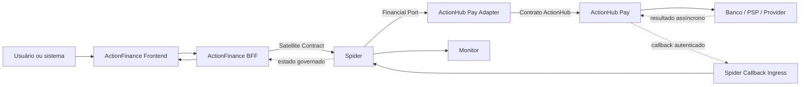
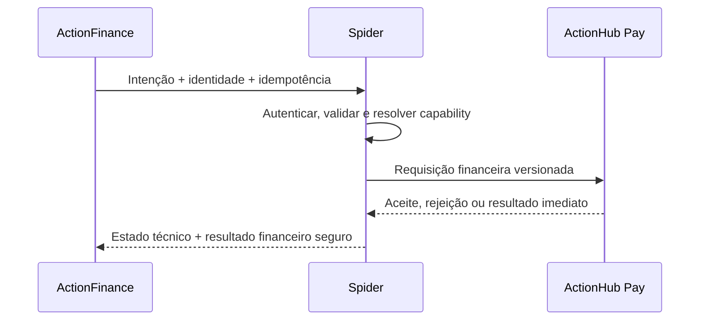
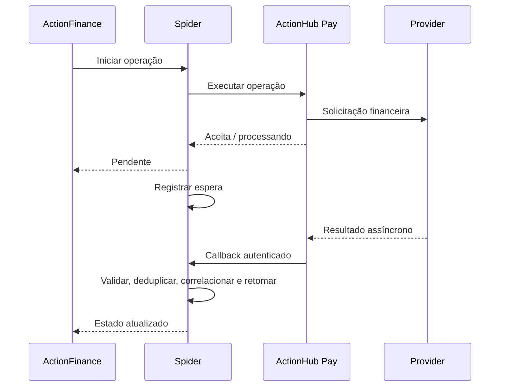

# DIRETRIZES DE INTEGRAÇÃO — ACTIONFINANCE, SPIDER E ACTIONHUB PAY

**Data de referência:** 28/09/2026  
**Finalidade:** estabelecer os limites, contratos, fluxos e regras obrigatórias para integrar o ActionFinance à Spider e ao módulo de pagamentos do ActionHub.  
**Natureza:** diretriz arquitetural; não é prompt de implementação do ActionFinance.

## 1. Decisão central

O ActionFinance deverá acessar capacidades financeiras do ActionHub exclusivamente por meio da Spider.

```text
ActionFinance → Spider → ActionHub Pay
```

O ActionHub Pay permanece como módulo do ActionHub e continua no domínio atual:

```text
actionhub.com.br
```

Não criar novo domínio para o ActionHub Pay. Não migrar o módulo para `pay.actionhub.com.br` ou qualquer domínio equivalente.

A Spider mantém seu namespace próprio:

```text
spider.actionhub.com.br
├── monitor.spider.actionhub.com.br
├── api.spider.actionhub.com.br
└── callbacks.spider.actionhub.com.br
```

O ActionFinance terá identidade própria:

```text
actionfinance.actionhub.com.br
```

## 2. Papéis e responsabilidades

### 2.1 ActionFinance

O ActionFinance é o Experience Satellite financeiro. É responsável por:

- experiência do usuário e dos sistemas consumidores;
- identificação da empresa, ator e canal;
- captura da intenção financeira;
- validações de experiência;
- apresentação de estado, resultado e histórico;
- geração e preservação das identidades de interação;
- comunicação somente com a Spider;
- proteção de dados exibidos ao usuário;
- impedimento de submissões duplicadas originadas na experiência.

O ActionFinance não deve:

- chamar o ActionHub diretamente;
- possuir credenciais técnicas do ActionHub no frontend;
- executar pagamentos;
- decidir sozinho que uma operação financeira foi liquidada;
- transformar HTTP 200/202 em confirmação financeira;
- implementar retry financeiro cego;
- receber webhook direto do ActionHub.

### 2.2 Spider

A Spider é responsável por:

- autenticar e autorizar a origem;
- validar o contrato do satélite;
- registrar a interação;
- preservar correlação e idempotência;
- resolver a capability financeira;
- selecionar rota e adapter;
- criar e executar o plano aplicável;
- aplicar timeout e retry governado;
- registrar espera por resultado externo;
- receber e correlacionar callbacks;
- classificar resultado de negócio e falha técnica;
- produzir eventos operacionais e evidências seguras;
- disponibilizar a execução no Monitor;
- entregar ao ActionFinance um estado governado.

A Spider não deve:

- tornar-se ledger financeiro;
- calcular saldo bancário;
- substituir regras do ActionHub Pay;
- armazenar credenciais bancárias no read model;
- inventar conclusão financeira;
- reenviar operação mutável quando o resultado anterior for desconhecido sem consulta ou idempotência comprovada.

### 2.3 ActionHub Pay

O ActionHub Pay permanece responsável por:

- planos e assinaturas que já pertencem ao ActionHub;
- criação e execução de cobranças;
- PIX e outros meios já implementados;
- integração com bancos, PSPs e providers;
- regras financeiras existentes;
- identificadores financeiros próprios;
- estados próprios da operação;
- recebimento de respostas dos providers;
- emissão de notificações e callbacks financeiros;
- permanência como fonte de verdade da execução financeira, salvo decisão formal diferente.

O ActionHub Pay não deve conhecer detalhes internos do ActionFinance. Sua integração nova deverá conhecer a Spider como consumidor ou coordenador técnico autorizado.

## 3. Fluxo arquitetural



## 4. Comunicação permitida

### Permitida

```text
Frontend ActionFinance → BFF ActionFinance
BFF ActionFinance → API da Spider
Spider → ActionHub Pay Adapter
ActionHub Pay Adapter → contrato técnico do ActionHub Pay
ActionHub Pay → callback ingress da Spider
Spider → consulta/entrega de estado ao ActionFinance
```

### Proibida

```text
Frontend ActionFinance → ActionHub Pay
BFF ActionFinance → ActionHub Pay
ActionHub Pay → webhook direto do ActionFinance
ActionFinance → banco ou PSP
Spider → endpoint público de ingresso do ActionHub Pay que provoque recursão
ActionHub Pay → Spider → o mesmo endpoint ActionHub Pay de origem
```

## 5. Preservação do ActionHub existente

As integrações atuais do ActionHub Pay, incluindo a loja virtual de pães integrada ao PIX, permanecem funcionando como estão.

Esta diretriz não autoriza:

- mudar o domínio do ActionHub;
- alterar o contrato da loja;
- redirecionar a loja para a Spider;
- remover webhooks atuais;
- migrar consumidores existentes;
- usar a loja como teste do ActionFinance;
- executar dual payment.

Uma futura migração das aplicações atuais deverá ser objeto de plano separado, com compatibilidade, shadow sem efeito financeiro, canary e rollback.

## 6. Fronteira técnica dentro do ActionHub Pay

Mesmo permanecendo no mesmo domínio e podendo continuar no mesmo sistema, o ActionHub Pay deverá possuir uma fronteira lógica específica para chamadas originadas pela Spider.

Essa fronteira deverá:

- usar contrato versionado;
- autenticar a Spider;
- aceitar correlação e idempotência;
- retornar identificador financeiro próprio;
- distinguir aceite de conclusão;
- expor consulta de estado quando aplicável;
- produzir erros estruturados;
- não reutilizar endpoint de frontend ou sessão de usuário;
- não provocar nova chamada à Spider como se fosse uma solicitação original;
- permitir mock ou sandbox equivalente;
- possuir observabilidade separada.

O endereço deve permanecer sob a infraestrutura e o domínio do ActionHub. O caminho exato deverá seguir a organização existente do sistema e não deve ser inventado antes da inspeção dos contratos atuais.

## 7. Contrato ActionFinance → Spider

O ActionFinance deve usar a versão do Satellite Contract realmente suportada pela Spider.

Identidade lógica proposta:

```text
satelliteId: ACTIONFINANCE
role: EXPERIENCE
domain: FINANCE
displayOrigin: ACTIONFINANCE
```

Os nomes devem ser validados contra o registry e os schemas atuais antes de publicação.

### Conteúdo semântico mínimo

O contrato deverá representar:

- versão do contrato;
- identidade do satélite;
- objetivo ou capability;
- `messageId`;
- `correlationId`;
- `idempotencyKey`, em operação mutável;
- empresa/tenant;
- ator e canal;
- referência de negócio;
- valor e moeda, quando aplicável;
- contexto estritamente necessário;
- restrições da operação;
- timestamp e validade;
- metadados permitidos.

O envelope concreto deverá obedecer ao schema oficial da Spider. Não adicionar campos livres para contornar o contrato.

## 8. Contrato Spider → ActionHub Pay

A Spider deve chamar uma porta financeira de negócio, implementada por um adapter específico para o ActionHub Pay.

### A porta deve expressar intenção financeira

Exemplos conceituais:

- iniciar operação de pagamento;
- consultar estado;
- obter comprovante permitido;
- cancelar ou devolver somente quando a capability e as regras existirem.

Esses nomes não são contratos aprovados. Devem refletir as operações reais do ActionHub Pay.

### O adapter deve

- traduzir o modelo canônico para o contrato do ActionHub;
- impedir vazamento dos DTOs do ActionHub para o domínio da Spider;
- preservar `correlationId` e `idempotencyKey`;
- capturar `actionHubTransactionId` e `providerRequestId`;
- configurar timeout explícito;
- classificar resposta síncrona;
- identificar aceite, rejeição, pendência e falha técnica;
- tratar resposta desconhecida;
- aplicar retry somente quando seguro;
- emitir evidências sem payload sensível;
- suportar implementação sandbox/mock e implementação real por configuração.

Não ampliar adapters de seguro ou crédito com condicionais financeiras. A integração financeira deve possuir porta e adapter coerentes.

## 9. Identidades obrigatórias

As seguintes identidades são distintas e não devem ser condensadas em um único campo:

| Identidade | Responsável inicial | Função |
|---|---|---|
| `messageId` | ActionFinance | Identificar a interação com a Spider |
| `correlationId` | ActionFinance ou boundary definido | Correlacionar todo o percurso |
| `idempotencyKey` | ActionFinance | Deduplicar a intenção mutável |
| `executionId` | Spider | Identificar a execução canônica |
| `actionHubTransactionId` | ActionHub Pay | Identificar a operação financeira |
| `providerRequestId` | ActionHub Pay/provider | Identificar a chamada técnica externa |
| `callbackEventId` | ActionHub Pay ou provider | Deduplicar o callback |
| `companyId`/`tenantId` | ActionFinance | Identificar a empresa autorizada |
| `actorId` | ActionFinance | Identificar usuário ou sistema solicitante |
| `businessReference` | Sistema de negócio | Referência permitida da operação |

### Regras

- `correlationId` deve atravessar todos os componentes.
- `idempotencyKey` deve sobreviver aos retries de rede.
- `executionId` não substitui o identificador financeiro do ActionHub.
- Callback deve correlacionar por identidade técnica explícita.
- Valor, horário ou descrição não podem ser usados isoladamente para correlação.
- Identificadores sensíveis devem ser mascarados nas listagens e completos somente onde autorizado.

## 10. Idempotência

Toda operação financeira mutável exige idempotência ponta a ponta.

### ActionFinance

- gerar uma chave por intenção de negócio;
- reutilizar a mesma chave ao repetir a mesma solicitação;
- não gerar nova chave em retry de transporte;
- incluir no escopo empresa, operação, referência, valor e moeda quando aplicável;
- impedir duplo clique e reenvio concorrente sem depender somente do frontend.

### Spider

- registrar chave, origem e hash semântico seguro da solicitação;
- devolver o resultado conhecido para repetição idêntica;
- rejeitar a reutilização da chave com conteúdo semanticamente diferente;
- não criar nova execução para duplicata;
- preservar o vínculo com a transação do ActionHub.

### ActionHub Pay

- aceitar e persistir a chave recebida da Spider ou uma derivação estável documentada;
- não executar duas vezes a mesma intenção;
- devolver a transação anterior em repetição válida;
- impedir reuso da chave com valor, moeda, beneficiário ou referência incompatíveis.

### Callback

- usar `callbackEventId` único;
- registrar antes de produzir efeitos;
- retornar resposta idempotente em duplicidade;
- retomar uma execução no máximo uma vez por transição válida.

## 11. Estados técnicos e financeiros

Estado da orquestração e estado financeiro devem permanecer separados.

### Estado técnico da Spider

Exemplos conceituais:

- recebido;
- validado;
- executando;
- aguardando retorno externo;
- concluído tecnicamente;
- falha técnica;
- resultado desconhecido.

### Estado financeiro

Deve ser mapeado a partir dos estados reais do ActionHub Pay. Conceitos esperados:

- solicitado;
- aceito;
- processando;
- liquidado/concluído;
- rejeitado;
- expirado;
- cancelado;
- devolvido;
- pendente de análise;
- desconhecido.

### Regras

- HTTP 200 ou 202 não significa pagamento liquidado.
- Execução técnica bem-sucedida pode terminar com rejeição financeira.
- Timeout após envio pode produzir estado `UNKNOWN`, não necessariamente falha.
- Cancelamento solicitado não significa cancelamento concluído.
- Devolução solicitada não significa dinheiro devolvido.
- ActionFinance deve apresentar os dois estados separadamente.
- Monitor deve apresentar o estado técnico e um resultado financeiro seguro.

## 12. Fluxo síncrono



O resultado síncrono pode significar:

- conclusão financeira;
- rejeição de negócio;
- aceite para processamento assíncrono;
- falha técnica antes do envio;
- resultado desconhecido após envio.

Essas situações devem possuir respostas distintas.

## 13. Fluxo assíncrono



O ActionFinance não deve depender de sessão aberta para receber o resultado. Deve poder consultar o estado posteriormente.

## 14. Callback ActionHub Pay → Spider

O destino futuro é:

```text
ActionHub Pay → callbacks.spider.actionhub.com.br
```

Esse endereço só poderá ser ativado quando existir ingresso real, seguro e testado na Spider.

### Requisitos obrigatórios

- contrato versionado;
- autenticação da origem;
- assinatura ou mTLS conforme decisão de segurança;
- timestamp;
- janela contra replay;
- `callbackEventId` único;
- `actionHubTransactionId`;
- `correlationId` ou chave de correlação acordada;
- validação de schema;
- limite de payload;
- persistência/deduplicação antes do efeito;
- resposta idempotente;
- tratamento de evento desconhecido;
- tratamento de evento fora de ordem;
- tratamento de estado conflitante;
- quarentena ou investigação para callback inválido;
- logs e eventos sem dados sensíveis.

### Situação atual

O sandbox da Spider ainda não possui ingresso externo publicável para callbacks. Portanto, fluxo assíncrono completo permanece como requisito futuro, não como capacidade já disponível.

## 15. Retry e resultado desconhecido

### Retry permitido

- falha comprovadamente anterior ao envio;
- operação de consulta idempotente;
- operação mutável com idempotência ponta a ponta comprovada;
- erro transitório classificado e dentro do orçamento de tentativas.

### Retry proibido ou condicionado

- timeout depois de possível aceite pelo ActionHub;
- desconexão após envio sem resposta;
- erro cujo efeito financeiro seja desconhecido;
- operação sem chave idempotente persistida;
- estado conflitante;
- cancelamento ou devolução sem regra específica.

Nesses casos, a Spider deve consultar o estado quando possível ou registrar `UNKNOWN` para tratamento governado. Nunca assumir que “não houve resposta” significa “não houve pagamento”.

## 16. Erros e resultados

O contrato deve distinguir pelo menos:

| Categoria | Exemplo | Tratamento |
|---|---|---|
| Validação | Campo inválido | Rejeitar sem chamar ActionHub |
| Autorização | Empresa sem permissão | Rejeitar e auditar |
| Negócio | Pagamento recusado | Estado financeiro negativo, sem falha técnica |
| Técnica antes do envio | ActionHub indisponível | Retry governado quando aplicável |
| Técnica após possível envio | Timeout incerto | Estado desconhecido e consulta |
| Duplicidade válida | Mesma chave e conteúdo | Retornar operação anterior |
| Conflito idempotente | Mesma chave, conteúdo diferente | Rejeitar conflito |
| Callback inválido | Assinatura ou schema inválido | Rejeitar e registrar segurança |
| Callback duplicado | Evento já processado | Responder idempotentemente |

Stack trace, nome de classe, SQL, token ou resposta integral de provider não devem chegar ao ActionFinance.

## 17. Valores monetários

- Não usar ponto flutuante binário.
- Usar decimal exato ou minor units conforme o contrato confirmado.
- Moeda obrigatória em ISO 4217.
- Definir escala e arredondamento.
- Valor e moeda devem participar da proteção de idempotência.
- Limites mínimo e máximo devem ser aplicados no backend autorizado.
- O frontend pode validar formato, mas não substitui a regra financeira.
- Alteração de valor exige nova intenção e nova análise de idempotência.

## 18. Segurança

### ActionFinance

- autenticar usuário ou sistema;
- identificar empresa/tenant;
- autorizar operação e valor;
- manter credenciais técnicas somente no BFF;
- nunca colocar segredo no navegador;
- aplicar proteção contra CSRF quando aplicável;
- aplicar rate limiting e prevenção de abuso.

### Spider

- autenticar o satélite;
- autorizar capability, empresa e contexto;
- usar credencial própria por ambiente;
- registrar origem e ator de forma segura;
- proteger endpoints operacionais;
- separar Monitor de APIs de execução;
- não confiar somente em WAF ou allowlist.

### ActionHub Pay

- autenticar a Spider como cliente técnico específico;
- não reutilizar credencial da loja ou de outro consumidor;
- segregar permissões;
- limitar operações disponíveis;
- registrar auditoria;
- rotacionar secrets;
- validar idempotência e contexto permitido.

### Callback

- assinatura e/ou mTLS;
- replay guard;
- allowlist como camada complementar;
- rotação de chave;
- tolerância de relógio definida;
- nenhum secret em query string;
- rejeição segura sem detalhar mecanismo de validação.

## 19. Dados e privacidade

Transportar somente o necessário.

Não incluir em Operational Events, Monitor ou logs:

- token;
- segredo;
- credencial bancária;
- payload financeiro integral;
- documento completo;
- conta completa;
- chave protegida sem mascaramento;
- dados de cartão;
- informação pessoal desnecessária.

Criar projeções seguras contendo:

- tipo da operação;
- empresa/origem;
- valor e moeda quando autorizado;
- estado técnico;
- estado financeiro;
- referências mascaradas;
- correlation ID;
- horários;
- evidências não sensíveis.

## 20. Observabilidade e Monitor

Toda operação válida do ActionFinance deve aparecer no Monitor com:

- origem `ACTIONFINANCE`;
- capability;
- `messageId`;
- `correlationId`;
- `executionId`, quando houver execução;
- componente atual real;
- ActionHub Pay Adapter como executor, quando comprovado;
- estado técnico;
- estado financeiro seguro;
- tentativas;
- espera externa;
- callback recebido;
- conclusão, rejeição, falha ou desconhecido;
- evidências sem dados sensíveis.

O Monitor não deve afirmar:

- que o ActionFinance executou o pagamento;
- que a Spider liquidou o pagamento;
- que callback foi consumido quando apenas foi enviado;
- que resultado pendente é sucesso;
- que operação desconhecida é falha definitiva.

## 21. Entrega de estado ao ActionFinance

Na primeira integração, preferir consulta de estado pelo BFF do ActionFinance à Spider, porque o ingresso assíncrono completo ainda precisa ser construído.

Alternativas futuras:

- polling controlado;
- callback da Spider para o BFF do ActionFinance;
- evento em broker;
- stream autenticado.

A escolha deve obedecer às capacidades reais da Spider e do ambiente. Não introduzir broker ou conexão persistente apenas para a demonstração.

## 22. Versionamento

- Versionar Satellite Contract.
- Versionar capability e payload quando necessário.
- Versionar o contrato Spider → ActionHub Pay.
- Versionar callback.
- Manter compatibilidade dentro da versão publicada.
- Rejeitar versão desconhecida de forma explícita.
- Não reutilizar o mesmo campo com semântica diferente.
- Documentar período de convivência e retirada.

Mudança no contrato interno da integração não deve quebrar os clientes atuais de `actionhub.com.br`.

## 23. Ambientes

### Local/demo

- dados fictícios;
- ActionHub Pay mock fiel ao contrato;
- Spider `local-demo`;
- sem operação financeira real;
- callbacks simulados;
- identidades próprias de demonstração.

### Sandbox

- ActionFinance sandbox;
- Spider sandbox;
- ActionHub sandbox oficial ou mock contratualmente fiel;
- credenciais específicas;
- sem dinheiro real;
- uma task Spider enquanto persistência for memória;
- ausência de declaração de durabilidade.

### Piloto e produção

Fora do escopo inicial. Exigem, entre outros:

- persistência durável;
- IdP;
- autorização por empresa e função;
- mTLS/assinatura;
- KMS/rotação;
- HA/DR;
- backup;
- runbooks;
- auditoria;
- gates de segurança;
- canary;
- rollback;
- aprovação formal.

## 24. Compatibilidade e migração futura

O ActionFinance nasce na arquitetura nova:

```text
ActionFinance → Spider → ActionHub Pay
```

Os consumidores atuais permanecem inicialmente:

```text
Aplicações atuais → actionhub.com.br → ActionHub Pay
```

Não utilizar a criação do ActionFinance para migrar automaticamente a loja de pães ou outros consumidores.

Uma migração futura deverá seguir:

1. inventário;
2. observação paralela sem efeito financeiro duplicado;
3. canary de um consumidor e uma capability;
4. comparação de resultados;
5. rollback disponível;
6. migração progressiva;
7. retirada dos webhooks diretos somente depois de evidência e aprovação.

## 25. Testes mínimos de integração

### Contrato

- versão suportada e não suportada;
- schema válido e inválido;
- campos obrigatórios;
- valor e moeda;
- dados proibidos;
- capability inexistente.

### Identidade e idempotência

- primeira submissão;
- repetição idêntica;
- mesma chave com conteúdo diferente;
- submissão concorrente;
- retry de transporte;
- callback duplicado;
- callback fora de ordem.

### Resultados

- sucesso financeiro;
- aceite pendente;
- rejeição de negócio;
- falha técnica antes do envio;
- timeout após possível envio;
- resultado desconhecido;
- expiração;
- callback tardio.

### Segurança

- satélite não autenticado;
- capability não autorizada;
- empresa não autorizada;
- callback com assinatura inválida;
- callback expirado;
- replay;
- ausência de dados sensíveis nos logs.

### Ponta a ponta

- ActionFinance → Spider → ActionHub Pay sandbox/mock;
- mesma correlação em todos os componentes;
- operação visível no Monitor;
- estado técnico separado do financeiro;
- ActionFinance apresentando o resultado correto;
- nenhuma chamada direta ActionFinance → ActionHub.

## 26. Critérios de conformidade

Uma integração estará conforme estas diretrizes somente quando:

1. ActionFinance chamar exclusivamente a Spider.
2. Spider usar porta e adapter financeiros específicos.
3. ActionHub Pay permanecer em `actionhub.com.br`.
4. Clientes atuais do ActionHub permanecerem compatíveis.
5. Idempotência atravessar os três sistemas.
6. Correlação atravessar os três sistemas.
7. Estado técnico e financeiro estiverem separados.
8. Retry financeiro incerto estiver proibido ou governado.
9. Callback estiver autenticado, deduplicado e correlacionado.
10. Nenhum dado sensível estiver exposto.
11. A operação aparecer corretamente no Monitor.
12. A Spider não atuar como ledger.
13. O ActionFinance não executar pagamentos.
14. Não existir ciclo entre ingresso ActionHub e adapter ActionHub.
15. Testes de contrato, segurança, idempotência e ponta a ponta passarem.

## 27. Limitações atuais conhecidas

Na data desta diretriz:

- Spider sandbox está demonstrável;
- persistência da Spider continua em memória;
- há uma única task ECS;
- Context Plane está desligado no sandbox;
- callback ingress externo ainda não está publicável;
- não existe IdP corporativo integrado;
- Monitor é protegido por allowlist;
- não há autorização para dinheiro real;
- não há autorização para migrar integrações atuais;
- não há autorização para iniciar CAP-021.

Essas limitações devem aparecer em qualquer proposta de implementação. Nenhuma delas pode ser escondida por mock ou interface visual.

## 28. Decisão resumida

```text
ActionFinance é a experiência financeira.
Spider governa e orquestra.
ActionHub Pay executa a operação financeira.
ActionHub Pay permanece em actionhub.com.br.
ActionFinance nunca chama ActionHub Pay diretamente.
ActionHub Pay nunca envia webhook diretamente ao ActionFinance.
Clientes atuais do ActionHub não mudam nesta fase.
```

## Adendo de prioridade — 30/09/2026

O proprietário confirmou, no PRM_007, o **primeiro recorte de integração** após a publicação: ActionHub Pay + fluxos da Loja de Pães; execução de pagamentos centralizada no ActionHub Pay; compras do Panne na gestão do ActionFinance; caminho ActionFinance → Spider → ActionHub Pay.

Este adendo **não** altera o texto de 28/09 nem publica contrato, adapter ou webhook. Não autoriza pagamento automático ao importar obrigação. O registro manual de pagamento já realizado permanece. Ver DOM_001 e INT_001 (atualização PRM_007).
