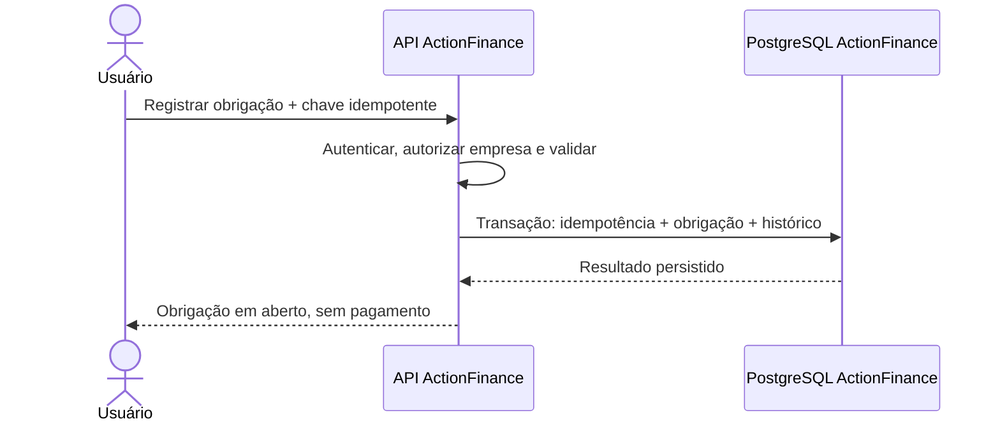
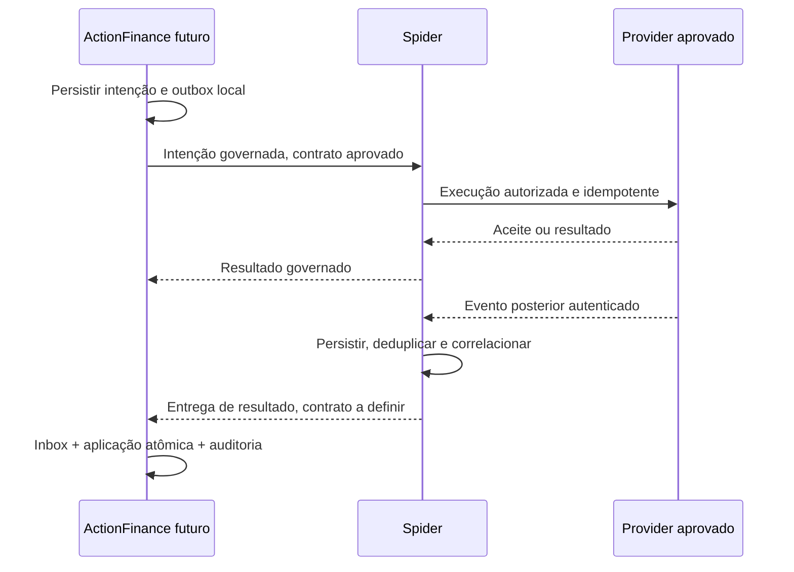

# ACTIONFINANCE_INT_001 — Fronteira Spider e identidades

## Controle

| Campo | Valor |
|---|---|
| Identificador | ACTIONFINANCE_INT_001 |
| Versão | 0.62 |
| Status | HOMOLOG_LIST — contrato 1.4 `LIST_PAYMENT_TRANSACTIONS`; 1.0–1.3 intactos; Pay real local ainda não exercitado ponta a ponta neste ciclo |
| Data | 01/10/2026 |
| Dependências | ACTIONFINANCE_ARQ_001 §8; AF-ADR-004; AF-ADR-009 |

O contrato Satellite vigente **não** é automaticamente compatível com o domínio financeiro. Esta matriz não publica versão futura, não inventa callback e não autoriza `workingCapitalParameters` como pagamento.

## 1. Contrato publicado (não financeiro)

| Afirmação | Fonte | Linha |
|---|---|---|
| `POST /v1/satellites/interactions` | `SatelliteInteractionHttpController.java` | 48 |
| Versões 1.0–1.4 suportadas; 1.0–1.3 sem campos novos | `SatelliteContractV1.java` `supports()` | — |
| `purpose` 1.0–1.2 só seguros/crédito; 1.3 acrescenta `FINANCIAL_EXTERNAL_LOOKUP` | schemas `1.2` L37–39; `1.3` L37–44 |
| `responseChannel` só `SYNC` | schema 1.2 | 69 |
| `satelliteId` minúsculo | schema 1.2 pattern `^[a-z][a-z0-9-]{1,62}$` | 22 |
| `extensions` fechado; `workingCapitalParameters` é crédito | schema 1.2 | 75–88 |
| EXPERIENCE recusa execução/resultado de capability | `SatelliteInteractionService.java` | 92–96 |
| Registry só EXPERIENCE ACTIVE | `SatelliteRegistry.requireExperience` | 19–27 |
| Registry local: `segsense`, `spiderbank` | `application-local-demo.yml` | 113+ e 186+ |
| Idempotência em memória | `SatelliteIdempotencyStore.java` | 9–17 |
| Parser não interpreta envelope financeiro | `SatelliteInteractionParser.java` | 12–31 |

## 2. Matriz de compatibilidade (obrigatória)

| Item | Capacidade observada | Fonte | Requisito ActionFinance | Gap | Proposta | Projeto a alterar | Gate |
|---|---|---|---|---|---|---|---|
| Identidade EXPERIENCE | Papel EXPERIENCE no schema e no registry; satélite precisa estar ACTIVE | Schema 1.2 L23; Registry L24 | Satélite EXPERIENCE independente; frontend só fala com o backend AF | Entrada `actionfinance` no registry local-demo (PRM_008); sem certificação de satélite | Manifesto local; não é certificação | ActionFinance; Spider 1.3 | PRM_008 (local); certificação futura |
| Nome técnico minúsculo | `satelliteId` pattern minúsculo | Schema 1.2 L22 | Identidade técnica `actionfinance`; rótulo ActionFinance | Nenhum registro atual | Não enviar rótulo maiúsculo como id | ActionFinance; Spider registry futuro | Fundação (id local); PRM_005 (registry) |
| Autenticação | Header de satélite + secret do registry; `secretMatches` SHA-256 | Registry L46–51; controller headers | Principal e empresa no AF; credencial de satélite só na borda Spider | Sem satélite AF; identidade demo AF ainda não especificada | Demo local deny-by-default no AF; credencial Spider só depois do contrato | ActionFinance PRM_002; Spider PRM_005 | PRM_002 (demo); PRM_005 (satélite) |
| Finalidade financeira | Enum 1.0–1.2 seguros/crédito; 1.3 acrescenta `FINANCIAL_EXTERNAL_LOOKUP` | Schema 1.3 L37–44; `SatelliteContractV1` | Finalidade financeira própria | Consulta 1.3 implementada; pagamento de saída ausente | Não reusar seguros/crédito | Spider | PRM_008 (lookup); execução futura |
| Contexto de empresa | Envelope sem `companyId` de gestão financeira | Parser L12–31 | Isolamento por empresa no AF; contexto empresarial no contrato futuro | Contrato atual não carrega empresa AF | Autorização local agora; campo/contexto no contrato posterior | ActionFinance; Spider | PRM_002/003; PRM_005 |
| Contrato financeiro | SAT-003 IMPLEMENTADO / DEMO ONLY para seguros/crédito | SAT-003; ARCH-017 | Envelope financeiro, classificação, referências | Inexistente | Evolução versionada com regressão SegSense/SpiderBank | Spider | PRM_005 |
| Idempotência durável | Mapa em memória; get antes, put depois | Store L9–17; Service L98–100 | Persistida, atômica com o efeito, escopo empresa/operação | RAM some no restart; não é financeira | `request_idempotency` no AF; Spider persistida só se o contrato exigir | ActionFinance PRM_003; Spider se contratado | PRM_003 / PRM_005 |
| Resposta síncrona | Só `SYNC` | Schema 1.2 L69 | Aceitar SYNC para declaração; não inferir liquidação | Adequado só para interação imediata | Usar SYNC sem tratar 200 como pagamento | Spider (manter); AF adapter futuro | PRM_005 |
| Entrega assíncrona | Canal async ausente no schema | Schema 1.2 L69 | Resultado posterior de provider | Bloqueado | Desenhar canal no contrato; sem webhook fictício | Spider | PRM_005 |
| Deduplicação | Fingerprint em memória no satélite; Hub tem outbox própria (legado) | Store; levantamento Hub | Deduplicar evento recebido (`callbackEventId`) sem repetir efeito | Sem inbox AF; store Spider não sobrevive restart | Inbox na primeira integração efetiva | ActionFinance PRM_006; Spider se necessário | PRM_006 |
| Correlação | `correlationId` obrigatório; `decisionId`/`planId`/`executionId` só se produzidos | Service L80–82; SAT-003 | Acompanhar ponta a ponta sem autorizar por correlation | IDs de plano/execução não existem no cadastro local | Não inventar IDs Spider no CRUD | ActionFinance; Spider | PRM_003 local; PRM_005 integração |
| Observabilidade | Eventos SATELLITE_* no serviço; Monitor é da Spider | Service; ARCH-017 | Logs sem payload financeiro; Monitor só o que a Spider processar | Cadastro local não gera evidência Spider | Auditoria no AF; não fabricar card no Monitor | ActionFinance; Spider só com interação real | PRM_002 logs; PRM_006 Monitor |
| Persistência | Spider: adapters JPA existem, default memória (levantamento, **NOT_VERIFIED** em runtime) | `database/README.md` SpiderBank; levantamento §8 | PostgreSQL AF próprio | SpiderBank sem banco na 1ª entrega | Não copiar limitação SAT-003 | ActionFinance | PRM_002/003 |
| Dados proibidos | Schema metadata string curta; Hub loga corpo MP (levantamento) | Schema 1.2 L70–74; levantamento §7 | Sem tokens, documentos, dados bancários, payload integral em log/Monitor | Contrato atual não define envelope financeiro seguro | Minimizar; proibir cartão/QR/segredo no contrato genérico | ActionFinance; Spider; Hub legado fora de escopo | PRM_005 / SEC futuro |

## 3. Identidades

| Identidade | Origem | Não é |
|---|---|---|
| companyId / actorId | Contexto autorizado no ActionFinance | Confiança no payload |
| payableId / receivableId | Domínio ActionFinance | ID de pagamento |
| businessReference + sourceSystem + sourceRecordId | Vínculo com fato externo | Chave de autorização |
| messageId | Interação de satélite | Chave de obrigação |
| correlationId | Acompanhamento ponta a ponta | Autorização |
| idempotencyKey | Intenção mutável estável (escopo + fingerprint) | Token de liquidação |
| decisionId / planId / executionId | Só se a Spider os produzir | Inventados no satélite |
| providerRequestId / providerTransactionId | Execução externa futura | Identidade da obrigação |
| callbackEventId | Evento recebido e deduplicado | Chave do pagamento |

Timeout não renova a chave. 200/202 não é liquidação.

## 4. Sequências

Registro local — **fluxo proposto da primeira fatia; não implementado**:

Execução governada — **arquitetura alvo; contratos ausentes**:

Inbox/outbox: evolução da primeira integração efetiva, não capacidade existente.

## 5. Proibições deste incremento

- Colocar pagamento em `workingCapitalParameters` ou `metadata`.
- Escolher provider no BFF.
- Inventar endpoint de callback.
- Redirecionar webhook do Hub para `POST /v1/canonical/signals` (ingresso distinto; levantamento §8).
- Tratar cobrança avulsa do Hub como base da fatia (achado fora de escopo).

## Atualização de precedência — 28/09/2026

As novas diretrizes do proprietário substituem os limites anteriores conflitantes de ActionHub/assinaturas e endereço de publicação. Consultar ACTIONFINANCE_ARQ_002_DIRETRIZES_INTEGRACAO e a fonte ACTIONFINANCE_DIR_INT_001_2026-09-28, vinculadas no índice. Preservar domínio financeiro local, estoque Panne e histórico. Não iniciar integração nem publicar domínios.

## Prioridade confirmada pelo proprietário — 30/09/2026

Fonte: PRM_007. **Prioridade de recorte.** O PRM_008 implementou só consulta isolada; sem ativação em produção.

## 6. Fatia PRM_008 (consulta, homologação)

Caminho implementado: ActionFinance EXPERIENCE → `POST /v1/satellites/interactions` (contrato 1.3, `QUERY_STATUS`, propósito `FINANCIAL_EXTERNAL_LOOKUP`) → seleção `LOOKUP_ACTIONHUB_PAYMENT` no registry → borda PROVIDER `actionhub-pay` → resposta SYNC → persistência AF. EXPERIENCE continua sem `EXECUTE_CAPABILITY`.

Credencial do Pay não está no ActionFinance. Sem webhook. Reconsulta é nova tentativa auditada com a mesma identidade de operação, **novo** `attempt_correlation_id` (`afa-{attemptId}`) e idempotency key `lookup-{attemptId}` (≤80; a chave antiga `lookup:{company}:{ref}` colidia na memória da Spider) — a memória da Spider não reapresenta o resultado da tentativa anterior; **não** é replay imutável de comando de escrita. Recuperação de STARTED expirado relê a operação sob `FOR UPDATE` e só conclui tentativas ainda abertas com `started_at` vencido; a operação só muda se `last_attempt_id` ainda for essa tentativa. Tentativa já `RECOVERED` não aplica observação. Resultados **não** baixam título. A Spider local-demo expõe `GET /v1/satellites/lookup-stats` só em loopback (contagem `LOOKUP_ACTIONHUB_PAYMENT` + correlações recentes, sem segredos). A borda incrementa `/__test/counts` quando `ACTIONHUB_PAY_EDGE_TEST_CONTROL=1` em loopback.

Borda: `ACTIONHUB_PAY_EDGE_MODE=SIMULATOR` ou `FORWARD` (exclusivos). FORWARD não cai em fixture. Rota Hub `GET /v1/integration/payments/:id` só com `ACTIONHUB_PAY_LOOKUP_ENABLED=true` **e** `ACTIONHUB_PAY_LOOKUP_ISOLATED=true`. Secret sozinho não liga a rota. Sandbox só com metadado/ambiente comprovado.

IDs PRM_005/006 na matriz histórica desta ficha apontavam integração futura; esses ciclos já foram usados para identidade visual e operação local. A correção de gate é esta secção, sem reescrever o histórico desses reviews.

| Afirmação | Estado |
|---|---|
| Primeira integração funcional após publicação: ActionHub Pay para pagamentos/recebimentos da Loja de Pães (fluxos da loja, não só assinaturas) | Confirmada como prioridade; contratos reais **não** inspecionados nem implementados neste ciclo |
| Executor de pagamentos: ActionHub Pay, qualquer origem (Panne, Hub, outros, manual) | Desenho alvo; não autoriza pagamento automático na importação |
| Caminho: ActionFinance → Spider → ActionHub Pay; retorno pela Spider | Igual à ARQ_002; lacunas da Spider **não** se contornam com ligação direta |
| Panne (`panne.com.br`): origem de compras e estoque físico da Loja de Pães | Levantamento futuro só para planear transição; Panne **não** é executor financeiro no alvo |
| Baixa manual de pagamento já realizado, com origem | Permanece no produto autónomo; não é segundo PSP |
| Próximo levantamento | Rastrear compra/venda → obrigação/título → execução → confirmação/estorno (IDs, empresa, parcelas, valores); autoridade de cada facto; sem duplicar manual/importação/evento |

A matriz da §2 continua a mostrar gaps. EXPERIENCE, SYNC e ausência de canal financeiro na Spider **não** foram resolvidos por esta nota.

## 7. Fatia PRM_009 (listagem, homologação)

Caminho: ActionFinance EXPERIENCE → `POST /v1/satellites/interactions` (contrato **1.4**, `QUERY_STATUS`, propósito `FINANCIAL_EXTERNAL_LIST`, objetivo `LIST_EXTERNAL_PAYMENTS`) → Spider seleciona `LIST_PAYMENT_TRANSACTIONS` → adapter `actionhub-pay` → borda `POST /v1/provider/capabilities/LIST_PAYMENT_TRANSACTIONS/executions` → Hub `GET /v1/integration/payments` → volta SYNC. EXPERIENCE continua sem `EXECUTE_CAPABILITY`. 1.0–1.3 não aceitam `financialList`.

| Campo do item | Origem | Ausência |
|---|---|---|
| `transactionId` | `orders.id` | recusa o item |
| `orderReference` | mesmo `orders.id` (Hub não tem venda distinta nesta tabela) | — |
| `processorReference` | `orders.gateway_reference` | nulo; não é o mesmo que `orderId` |
| `amountMinor` | `amount_cents` (checkout avulso); senão `paid_amount_cents`; senão `valor_negociado` em reais com 2 casas | nulo + `amountAbsent` + revisão; nunca zero inventado |
| `currency` | `currency` / `currency_id` do payload | nulo; não inventa BRL |
| `originalStatus` / `normalizedStatus` | `orders.status` → CONFIRMED/IN_PROGRESS/REFUSED/REFUNDED/REVIEW_REQUIRED | revisão |
| `testLabeled` | sandbox/test_order ou ambiente isolado | — |

Cardinalidade: uma linha `orders` é a tentativa corrente daquele pedido Hub. Não há tabela `payment_attempts`. Nova tentativa de checkout cria outra ordem ou reusa a mesma via `gateway_ref`. `orderId` ≠ `gateway_reference` do processador.

Paginação: `ORDER BY updated_at ASC, id ASC`, limite ≤50, cursor opaco `{v,a,e,u,i}` validado por app+ambiente. Janela sobreposta por `(updated_at, id)` exclusivo; alteração de registro antigo sobe `updated_at` e reaparece; AF deduplica e só aplica revisão mais nova. Não filtra só `created_at` nem só aprovados.

AF: HTTP fora de TX; página + checkpoint da página na mesma TX curta; marco global só no SUCCESS/EMPTY; dois `RUNNING` no mesmo escopo → 409. Sem push, sem polling, sem título/baixa.

Spider Monitor: eventos reais (`SATELLITE_REQUEST_RECEIVED` → `SATELLITE_COMPANY_AUTHORIZED` → `CAPABILITY_DISPATCHED` → `OUTBOUND_REQUEST_STARTED` → `PROVIDER_RESULT_RECEIVED` → `SATELLITE_RESPONSE_RETURNED`). RAM: 24h / 2000 eventos; some no restart. AF guarda `spider_message_id` e oferece `/?q=&execution=`. `importPersisted` na Spider fica `UNKNOWN`/`false` — persistir é fato do AF.

Classificação de prova: Hub real local com banco descartável (endpoint + testes de unidade); simulador **não** lista; sandbox do processador **não** exercitado; produção **não** lida.
