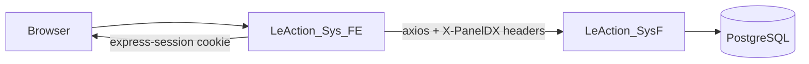
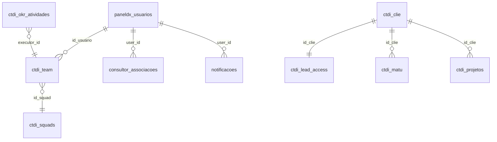

# Relatório: Infraestrutura de Usuários e Modificações Recentes — PanelDX

## 1. Visão geral da arquitetura

O PanelDX opera em **duas camadas**:

| Camada | Projeto | Porta típica | Papel |
|--------|---------|--------------|-------|
| **BFF / Frontend** | `LeAction_Sys_FE` (Node + Express + EJS) | 3000 | Sessão do browser, rotas de página, proxy para API |
| **Backend / API** | `LeAction_SysF` (Flask + PostgreSQL) | 5002 | Autenticação, RBAC, regras de negócio, dados |

O **Node é a autoridade de sessão** no browser. O Flask valida credenciais no login e, nas chamadas proxied, confia nos headers `X-PanelDX-*` montados a partir de `req.session`.



---

## 2. Infraestrutura de autenticação

### 2.1 Mecanismo principal: sessão server-side (não JWT para usuários)

- **Biblioteca:** `express-session` em `LeAction_Sys_FE/server.js`
- **Cookie:** `httpOnly`, `sameSite: 'lax'`, duração ~24h
- **JWT:** usado apenas em integrações de pagamento (Action Hub), **não** no login de usuários

### 2.2 Fluxo de login (2 etapas)

1. **`POST /verificar-email`** (Node) → **`POST /api/check-email`** (Flask)  
   Classifica o e-mail como `TEAM` (senha) ou `LEAD` (código `LA-*`).

2. **`POST /login`** (Node) → **`POST /api/login`** (Flask)  
   Valida credencial e grava na sessão Node os campos RBAC.

**UI:** `views/acesso.ejs` (formulário em 2 passos)

### 2.3 Tipos de credencial

| Tipo | Quem | Onde valida | Observação |
|------|------|-------------|------------|
| **Senha** | sysadmin, consultor, executor, alguns leads | `paneldx_usuarios.password_hash` (Werkzeug) | Fallback legado em `ctdi_team.password_hash` com sync para `paneldx_usuarios` |
| **Código LA-\*** | Gestores (lead) | `ctdi_lead_access.access_code` + `ctdi_clie.mail_clie` | Um código por cliente |

A senha é verificada **antes** do código LA-* para evitar confusão.

### 2.4 Campos principais da sessão Node (`req.session`)

| Campo | Uso |
|-------|-----|
| `system_role` | `sysadmin`, `led`, `consultor`, `executor` |
| `id_usuario` | FK em `paneldx_usuarios` |
| `id_member` | FK em `ctdi_team` (executor em squad) |
| `user_id` / `lead` | `id_clie` e dados do cliente |
| `id_matu` | Assessment / maturidade ativo |
| `id_proj`, `id_squad` | Contexto operacional |
| `is_holding`, `id_rede` | Gestor de rede (cockpit holding) |
| `isTeam` | Login administrativo/equipe |
| `auth_type` | `lead` ou `team` |

**Bridge para Flask:** headers `X-PanelDX-System-Role`, `X-PanelDX-Id-Usuario`, `X-PanelDX-Id-Clie`, etc. (`flaskRbacHeaders` em `server.js`).

**Resolução no Flask:** `LeAction_SysF/rbac/context.py` (headers primeiro, depois `session["rbac"]`).

### 2.5 Middleware e proteção de rotas

| Componente | Arquivo | Função |
|------------|---------|--------|
| `authMiddleware` | `server.js` | Porteiro de páginas; holding lockdown; injeta `res.locals` para EJS |
| `gatekeeper` | `middleware/gatekeeper.js` | Modo manutenção (`system_locked` no DB) |
| `@require_role` | `rbac/decorators.py` | Guard de API por papel |
| `isSessionAdmin()` | `lib/auth-session.js` | Checagem de admin por e-mail |

### 2.6 Logout

`GET /logout` → `req.session.destroy()` → redirect `/`

---

## 3. Papéis, perfis e escopo de dados

### 3.1 Papéis de sistema (RBAC v2 — fonte única: `paneldx_usuarios.system_role`)

Definidos em `LeAction_SysF/rbac/constants.py`:

| Papel | Perfil | Destino pós-login |
|-------|--------|-------------------|
| **sysadmin** | Administrador da plataforma | `/admin` |
| **led** | Gestor do cliente | `/projeto` (ou inovador se `SOLO`) |
| **consultor** | Consultor estratégico | `/projeto` |
| **executor** | Analista de squad | `/execucao` |

`sysadmin` ignora todas as checagens `@require_role`.

### 3.2 Papéis legados em squad (`ctdi_team.role` / `position`)

Mapeados em `rbac/auth_helpers.py` para `system_role` na migração e no login.

### 3.3 Perfil de cliente (`ctdi_clie`)

| Campo | Efeito |
|-------|--------|
| `init_role` | `GENERAL` vs `SOLO` (dashboard inovador) |
| `is_holding` | Gestor de Rede → só `/cockpit-rede` + logout |
| `id_rede` | Rede de ensino para panorama holding |
| `has_active_project` | Estado de projeto ativo na sessão |

**Holding não é um `system_role` separado:** é `led` com `is_holding=true`, UI em `body.holding-mode` (`layout.ejs`).

### 3.4 Escopo de dados por papel (`rbac/scope.py`)

| Papel | Escopo típico |
|-------|----------------|
| executor | Próprias tarefas (`executor_id`) |
| consultor | Clientes em `consultor_associacoes` |
| led | Todas as atividades do `id_clie` |
| sysadmin | Sem filtro |

### 3.5 Capacidade de squad

Máximo **3 squads por membro** (`rbac/capacity.py`, `MAX_SQUADS_POR_MEMBRO = 3`).

### 3.6 Modelo de criação de usuários

- **Sysadmin** cria contas em **Gestão Global de Usuários** (`/admin/usuarios`, `admin-usuarios.js`).
- **LED** apenas **aloca** usuários já existentes (`paneldx_usuarios`) em squads via `ctdi_team` — POST exige `id_usuario`.

---

## 4. Modelo de dados (tabelas de usuários)



| Tabela | Migration / origem | Função |
|--------|-------------------|--------|
| **`paneldx_usuarios`** | `012_rbac_governance.sql` | Identidade global: e-mail, senha, `system_role`, `ativo`, `id_clie` opcional |
| **`ctdi_clie`** | schema base | Cliente/lead institucional |
| **`ctdi_matu`** | schema base | Slot de assessment (`id_matu`) |
| **`ctdi_lead_access`** | schema base | Código `LA-*` por cliente |
| **`ctdi_team`** | schema + 012 | Membro de squad; `id_usuario` FK; `role`, `position` |
| **`consultor_associacoes`** | 012 | Carteira do consultor |
| **`notificacoes`** | 012 | Notificações in-app |
| **`ctdi_okr_atividades`** | 012 + 016 | Tarefas; `executor_id` → `ctdi_team`; `dx_kr_id` obrigatório (016) |

---

## 5. APIs relacionadas a usuários

### Autenticação
- `POST /verificar-email` → `/api/check-email`
- `POST /login` → `/api/login`
- `GET /logout`

### Admin global (sysadmin)
- `GET/POST/PUT/DELETE /api/admin/usuarios`
- `GET /api/admin/usuarios/:id/acesso` (credenciais visíveis)
- `PUT /api/admin/clientes/:id/rede` (holding)

### RBAC operacional
- `GET /api/execucao/tarefas` (executor)
- `GET/PUT /api/notificacoes`
- `GET /api/consultor/associacoes`
- `GET /api/rbac/capacidade`
- `GET /api/led/usuarios-disponiveis`

### Squad / cliente
- `GET/POST/PUT/DELETE /api/ctdi_team`
- `GET/POST /api/ctdi_clie`

### Holding
- `GET /api/holding/redes`
- `GET /api/holding/panorama`

---

## 6. Arquivos-chave por camada

### Backend (`LeAction_SysF`)
- `app.py` — login unificado, CRUD cliente/team, holding
- `rbac/` — `context.py`, `decorators.py`, `users.py`, `admin_users.py`, `routes.py`, `scope.py`, `notifications.py`
- `database.py` — acesso a dados e joins de lead access
- `seed_dev_client.py` — credenciais de desenvolvimento

### Frontend (`LeAction_Sys_FE`)
- `server.js` — sessão, login, proxy, `authMiddleware`
- `lib/auth-session.js` — helpers de admin
- `views/acesso.ejs` — login
- `views/admin-usuarios.ejs` + `public/js/admin-usuarios.js` — gestão global
- `views/teams.ejs`, `views/execucao.ejs`, `views/cockpit-rede.ejs` — UIs por papel
- `views/layout.ejs` — sidebar e `holding-mode`

---

## 7. Migrations relevantes (usuários e OKR)

| # | Arquivo | Conteúdo |
|---|---------|----------|
| **012** | `012_rbac_governance.sql` | **RBAC v2:** `paneldx_usuarios`, `consultor_associacoes`, `notificacoes`, `ctdi_team.id_usuario`, `executor_id` em atividades |
| **014** | `014_matriz_okr_direcionadores.sql` | Matriz canônica OKR (direcionadores DX) |
| **015** | `015_okr_nivel_implementacao.sql` | Nível de implementação em objetivos |
| **016** | `016_atividades_vinculo_dx_kr.sql` | `dx_kr_id NOT NULL` em atividades; trigger de sync; progresso bottom-up |
| **009** | `009_system_config.sql` | `system_locked` (gatekeeper) |

---

## 8. Modificações recentes realizadas (sessão atual)

Estas alterações foram feitas nesta sequência de trabalho e **não dependem necessariamente de commit git** (git não estava disponível no ambiente de shell para histórico).

### 8.1 Panorama Executivo (home pós-assessment)

| Mudança | Arquivos |
|---------|----------|
| Substituição do radar por **grid de cards com mini-gauges** (escalável N direcionadores) | `panorama-executivo.js`, `index.ejs` |
| API consolidado passa a usar `carregar_painel_okr_cliente` (canônicos + customizados, `total_objetivos`) | `app.py` → `_direcionadores_panorama_from_painel()` |
| **Agenda executiva movida para o rodapé**; Panorama no topo | `index.ejs` |
| Cache JS `v=9` | `index.ejs` |

### 8.2 OKRs — progresso bottom-up

| Mudança | Arquivos |
|---------|----------|
| Migration 016: `dx_kr_id` obrigatório em atividades | `migrations/016_...sql` |
| Cálculo de progresso KR/objetivo via atividades de sprint | `estrategia_matriz.py` |
| Matriz OKR: barra read-only, modal com KRs | `estrategia-okrs.js/ejs` |
| Validação `dx_kr_id` em POST de atividades | `app.py`, `inovador_routes.py` |
| Abas Matriz ↔ Cockpit: contraste CSS | `eo-view-tabs.ejs`, `estrategia-okrs.css`, `layout.ejs` |

### 8.3 Modal de Atividades Operacionais (sprint)

| Mudança | Arquivos |
|---------|----------|
| Modal **centralizado** (flex), painel XL, abas estilo cliente | `sprint-atual.ejs` |
| Aba **Detalhes** + Aba **Alinhamento Estratégico** | `sprint-atual.ejs` |
| Cascata **Direcionador → Objetivo → KR** (substitui select único com 45 opções) | `sprint-atual.ejs` |
| Nova API `GET /api/estrategia/cascata-okr-atividade` | `estrategia_matriz.py`, `routes/estrategia.py` |
| **Proxy Node faltando** (causa do “nenhum direcionador”) — corrigido | `server.js` |
| Fallback client-side via `krs-por-sprint` se cascata falhar | `sprint-atual.ejs` |
| Modo **edição** no mesmo modal + botão Editar na lista | `sprint-atual.ejs` |
| PUT de atividade sincroniza `dx_kr_id` ao trocar KR | `app.py` → `_put_atividade_sprint()` |
| Empty state squad vazia com alerta e submit bloqueado | `sprint-atual.ejs` |

### 8.4 Correção de bug reportado

**Sintoma:** “Nenhum direcionador cadastrado na matriz OKR” no modal de atividade.

**Causa raiz:** rota `/api/estrategia/cascata-okr-atividade` existia no Flask mas **não estava proxied no Node** → 404 JSON sem `direcionadores` → frontend interpretava como lista vazia.

**Correção:** proxy em `server.js` + fallback + mensagens de erro mais claras.

**Ação necessária:** reiniciar **Node (3000)** e **Flask (5002)** após deploy.

---

## 9. Credenciais de desenvolvimento (referência)

| Perfil | E-mail | Credencial |
|--------|--------|------------|
| Sysadmin | `sysadmin@leaction.com.br` | Senha no seed (`seed_dev_client.py`) |
| Lead teste | `sistema@paneldx.com.br` | `LA-PANEL1` |
| Executor (dev local) | `executor@paneldx.com.br` | `PanelDX1!` (hint só em localhost) |

Cliente de teste frequente na conversa: **`id_clie=1`**.

---

## 10. Diagrama resumido: quem acessa o quê

```mermaid
flowchart TB
    subgraph auth [Autenticação]
        LA[Lead LA-* code]
        PW[Senha paneldx_usuarios]
    end

    subgraph roles [Papéis]
        SA[sysadmin]
        LED[led]
        CON[consultor]
        EXE[executor]
    end

    subgraph pages [Destinos]
        ADM[/admin]
        PRJ[/projeto]
        EXE_PAGE[/execucao]
        HOLD[/cockpit-rede]
    end

    LA --> LED
    PW --> SA
    PW --> CON
    PW --> EXE
  PW --> LED

    SA --> ADM
    LED --> PRJ
    LED -->|is_holding| HOLD
    CON --> PRJ
    EXE --> EXE_PAGE
```

---

## 11. Recomendações operacionais

1. **Garantir migration 012 aplicada** em todos os ambientes (`paneldx_usuarios` é pré-requisito do RBAC v2).
2. **Aplicar migration 016** para atividades amarradas a `dx_kr_id`.
3. **Reiniciar Node e Flask** após alterações em `server.js` e novas rotas Flask.
4. **Não usar JWT** como mecanismo de login de usuário — a sessão Express é o contrato atual.
5. Para auditoria de commits, rodar `git log` localmente (git não estava no PATH do ambiente de automação).

Se quiser, posso gerar uma versão deste relatório em Markdown exportável (`docs/RELATORIO-USUARIOS-PANELDX.md`) ou um diagrama focado só no fluxo RBAC de uma sprint específica.

[REDACTED]