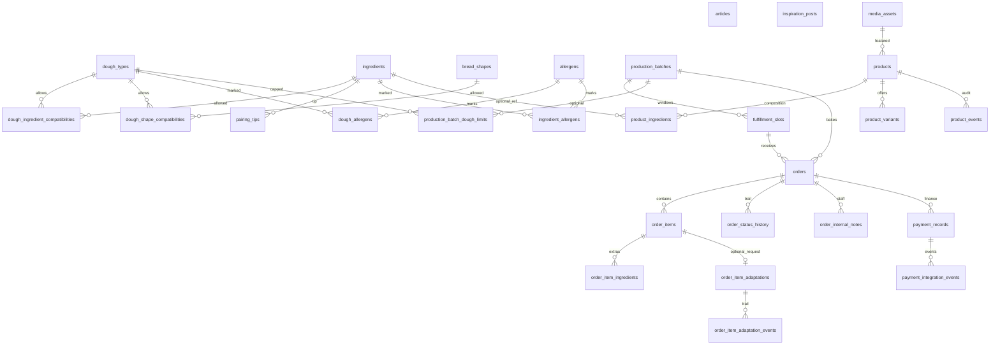

# Modelo de dados — Loja de Pães

Identificadores de negócio: UUID. Nomes técnicos em inglês (`snake_case`). Textos de vitrine em português. Instantes em `TIMESTAMPTZ` (UTC). Fuso da padaria para calendário: `LOJADEPAES_BAKERY_TIMEZONE` (padrão `America/Sao_Paulo`).

Estados finitos: `VARCHAR` + `CHECK` (não ENUM nativo do PostgreSQL), para o Alembic alterar valores sem recriar tipos. Valores conhecidos estão em `app/models/enums.py`.

`created_at` / `updated_at`: `now()` no insert; `updated_at` em UPDATE via trigger `set_updated_at()` nas tabelas mutáveis. Updates SQL crus devem deixar o trigger correr (não desligar `session_replication_role`).

Dinheiro: inteiros em **centavos**, moeda `BRL`. `NULL` em preço/acréscimo = **não configurado**, não grátis.

## Diagrama

## Produtos padrão da padaria

Tabelas novas: `media_assets`, `products`, `product_ingredients`, `product_variants`, `product_events`.

- `products.editorial_status`: `draft` | `published` | `archived`. `is_available` é disponibilidade manual, independente do estado editorial.
- Foto destacada: em desenvolvimento, arquivo em disco (`LOJADEPAES_MEDIA_DIR`). Em produção o adaptador pode gravar no S3 quando bucket e região existirem no servidor. O Postgres guarda `media_assets` (chave do objeto, backend, tipo e medidas), não o binário nem URL temporária. `products.featured_image_alt` é o texto de acessibilidade (`alt`); `products.featured_image_caption` é a legenda visível opcional na vitrine. Não há cópia automática de um para o outro.
- `product_ingredients` é lista informativa de composição (nome + ordem). Aparece no cartão público (`catalog/showcase`) e no detalhe. `catalog_ingredient_id` pode apontar a um ingrediente do assistente, mas **não** torna a composição uma inclusão selecionável.
- `product_variants.presentation_type`: `weight` (peso líquido em gramas) ou `pack` (unidades por embalagem). Preço em centavos da variação inteira, não por grama. Rascunho pode ter `price_cents` nulo; publicação exige preço > 0. Ausência de preço ≠ brinde.
- Pedido de adaptação (`order_item_adaptations`): texto original do cliente, motivo opcional (`preference` | `dietary_restriction`), estado (`pending` | `accepted` | `alternative_proposed` | `declined` | `alternative_accepted`), resposta da padaria e eventos. Não altera catálogo nem preço. Histórico em `order_item_adaptation_events`.
- Receitas-base (`recipe_bases.code`) são a referência estável compartilhada por produtos padrão e massas do assistente, só quando o administrador vincula.
- Agenda: `schedule_settings` (padrão), `schedule_week_overrides`, `schedule_date_overrides`. Precedência data > semana > padrão. O teto diário de pães físicos é distinto da `capacity_units` das fornadas/janelas.
- Não apague produto publicado ou cadastro que já entrou em pedido. Rascunho e arquivado sem pedido podem ser apagados. `ON DELETE RESTRICT` na foto, no vínculo produto→variação e em `order_items`.

## Extensão futura de `order_items` (não aplicada agora)

Hoje `order_items` representa só o pão personalizado (`dough_type_id` + `bread_shape_id` obrigatórios + inclusões). Produto padrão é outra origem e **não** deve ser simulado com uma massa/inclusão inventada.

No checkout (etapa posterior):

- cada item será **exclusivamente** personalizado **ou** produto padrão (variação), nunca os dois;
- quantidade comercial da variação (2 × pacote de 6 = 2 linhas/embalagens, 12 unidades físicas);
- snapshots de nome do produto, apresentação e preço da variação no momento da confirmação;
- totais do pedido calculados no servidor, sem aceitar o total enviado pelo navegador.

Capacidade da fornada **não** pode tratar um pacote com 6 unidades como uma unidade produzida. A relação comercial × produção × receitas do Panne será definida antes de aceitar pedidos reais desses produtos. A seleção local desta etapa não cria pedido nem reserva vaga.

## Políticas de exclusão

- Catálogo referenciado por pedido: `ON DELETE RESTRICT` (desative com `is_active`, não apague).
- Itens e histórico de um pedido: `CASCADE` a partir de `orders`.
- Eventos financeiros: `SET NULL` no `payment_record_id` se o registro for removido (não há operação de remoção nesta etapa).

## Capacidade

Ocupação = `SUM(order_items.quantity)` onde `orders.holds_capacity` é verdadeiro. Não há contador desnormalizado.

`holds_capacity` fica verdadeiro na confirmação e permanece:

- em `confirmed`, `in_production`, `ready` e `completed` (pães produzidos ou já planejados na fornada/janela não devolvem vaga);
- em `cancelled` **somente** se `production_started_at` estiver preenchido (produção já começou).

Cancelar um pedido ainda confirmado (antes da produção) zera `holds_capacity` e libera a reserva.

Confirmação: `app.domain.orders.confirm_order` — bloqueia pedido, depois fornada, depois janela (`FOR UPDATE`). Idempotente se o pedido já passou de `draft`. Cancelamento é idempotente (já cancelado) e exige motivo na primeira vez.

## Financeiro

Não há coluna de “pago” em `orders`. Quitação deriva de `payment_records` (`app.domain.payments.order_is_financially_settled`). Ausência de registro ≠ cobrança pendente no ActionHub.

## Conteúdo

`articles.body_markdown` é Markdown. Quando for à vitrine, renderizar com sanitização; não tratar HTML cru como confiável.

Alergênicos: `is_reviewed=false` por padrão. Linha ausente **não** significa “não contém”.
