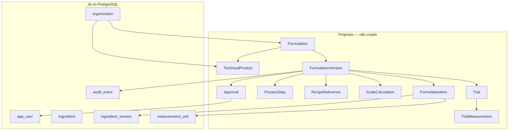

# Modelo conceitual — formulações

Persistido em `0004_formulation_lab` (ver `MODELO-DADOS-FORMULACOES.md`). Não replica `tbl_produto` polimórfico. Desvios da proposta anterior: produto técnico obrigatório; `recipe_reference` organizacional (não só `data_source`); itens de escala persistidos; aprovação só da `formulation_version`; status `retired` no lugar de `superseded`.

## Separação de papéis (anti-polimorfismo)

| Conceito | O que é | O que não é |
|----------|---------|-------------|
| Ingrediente | Insumo versionado (já existe) | Receita, rótulo, SKU |
| Formulação | Receita da casa: identidade + versões | Produto de prateleira |
| Produto técnico | Acabado que a formulação realiza (pão X) | Grade comercial / preço |
| Produto comercial | SKU, canal, preço — **fora deste núcleo** | Fonte nutricional |
| Documento técnico | Projeção (ficha PDF/HTML) | Fonte da composição |
| Rótulo | Snapshot de dados + regras + fontes | Segunda composição editável |

Um mesmo **produto técnico** pode ter várias formulações (variações). Uma formulação **não** é um ingrediente. Se uma preparação vira insumo de outra receita, isso já é `ingredient` tipo `preparation` + `ingredient_composition` — ou, no futuro, uma formulação **publicada** materializada como nova `ingredient_version`. **Decisão de especialista / arquiteto:** quando a preparação-ficha vira item de catálogo.

## Fonte técnica única

## Agregados

### `TechnicalProduct`

Identidade do acabado técnico (o “pão da casa”), sem flags `USO_*`. Opcional na v1 se a formulação bastar; recomendado para não reatar nome de receita ao SKU.

- Escopo: organizacional.
- Não carrega composição.
- Código único ativo por organização.

### `Formulation`

Identidade estável da receita (`NOME_RECEITA` + código). Não se sobrescreve ao republicar.

- 0..1 produto técnico.
- Código único ativo por organização.
- Sem nutrientes, sem PDF.

### `FormulationVersion`

Estado técnico publicável: rendimentos, perdas, cocção, totais **declarados ou calculados**, status.

Invariantes:

1. No máximo uma versão `published` vigente por formulação (índice parcial, como ingrediente).
2. Publicada é imutável; correção = nova versão.
3. Itens apontam `ingredient_version` **publicada** (não a cabeça viva do ingrediente).
4. Publicar não altera versões anteriores (sem retroatividade).
5. Sugestão de IA pode preencher rascunho; cálculo oficial exige evidência `official`.

Campos de domínio (conceituais): massa total alvo; rendimento cru / assado; fator de cocção; perda/ganho; baker’s % (se adotado); farinha-base (se adotado); tempos.

O que o legado **tem** no DDL: rendimento, cocção, perdas, pesos, custos, tempos.  
O que o legado **não tem**: número de versão, aprovação, baker’s %, ordem, unidade na linha.

### `FormulationItem`

Linha oficial. Substitui `tbl_ficha_tecnica_ingrediente`.

- `ingredient_version_id` (obrigatório).
- Quantidade bruta, líquida (opcional se derivável), `correction_factor`.
- `measurement_unit_id` (massa por padrão).
- `sort_order` — ordem de processo **e** base para ordem de declaração do rótulo (esta última pode ser sobrescrita no snapshot).
- Sem custo como invariante de conformidade; custo opcional em evidência comercial.

### `ProcessStep`

Etapa ordenada (`instruction`, duração, temperatura opcional). Substitui `longtext` único.

### `RecipeReference`

Ligação a `data_source` ou item da biblioteca de referências (módulo já previsto, ainda sem tabelas de ficha). Não é a composição.

### `ScaleCalculation`

Entrada: versão + fator ou quantidade alvo. Saída: massas escaladas. **Não** persistir cópia permanente das linhas como no legado; persistir parâmetros + evidência + resultado resumido.

### `Trial` / `TrialMeasurement`

Ensaio (primeiro pão piloto). Medidas observadas (peso assado, perda real) distintas dos valores da versão publicada. Podem **justificar** uma nova versão; não reescrevem a publicada.

### `Approval`

Evento append-only: alvo (`formulation_version` ou documento), `app_user`, papel (`tecnico` / `responsavel` / `proprietario`), decisão, timestamp. Não é flag `BLOQUEADO`.

## Regras fundamentais

- Formulações versionadas; publicadas imutáveis.
- Cálculo determinístico com memória (`calculation_evidence` no documento irmão).
- Ficha técnica **derivada** da versão (não segunda tabela de composição).
- Preparação usada como ingrediente: via catálogo já existente, não via produto polimórfico.
- Exclusão: soft em identidades (`cancelled`); versões não se apagam; `audit_event` para mutações de rascunho.

## Relação com o catálogo existente

`formulation_item` → `ingredient_version` (e, por ele, nutrientes e alergênicos do insumo).  
Não apontar `ingredient.id` sozinho: republicar o insumo não pode alterar ficha já publicada.
