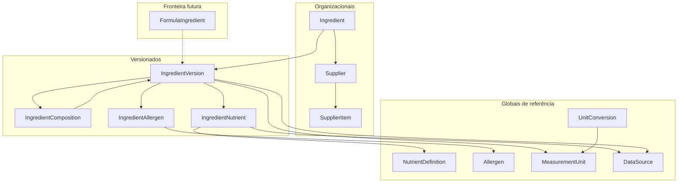

# Modelo conceitual — ingredientes (Panne)

Proposta nova, agora persistida no PostgreSQL `panne` (`0002` + `0003`). Não é cópia do MySQL. Sem `OrganizationIngredient`.

O legado trata ingrediente, produto, ficha e rótulo como registros atuais, ligados por ids sem FK. A Panne separa **identidade**, **versão técnica publicável**, **composição**, **nutrientes**, **alergênicos**, **origem** e **adesão organizacional**.

## Entidades

### `Ingredient`

Identidade estável do insumo (o “quem”). Não carrega nutrientes, preço vigente nem composição.

- Escopo: organizacional na operação; pode referenciar um item de catálogo global no futuro, sem misturar os ids.
- Identidade: UUID. Código interno único **por organização**.
- Não se sobrescreve a identidade ao republicar a ficha nutricional.

### `IngredientVersion`

Agregado versionado do dossiê técnico: situação, aditivo, unidade canônica de trabalho, notas, vínculo à fonte, vigência, status de publicação (`rascunho` / `publicado` / `substituido`).

- Imutável depois de publicado (correção = nova versão).
- Uma versão vigente por ingrediente (invariante).
- É o alvo de composição, nutrientes e alergênicos.

### `IngredientComposition`

Filho de uma versão: outra `IngredientVersion` + quantidade + unidade + ordem + papel (`constituinte`, `preparacao`).

- Permite composto e preparação-como-insumo.
- Invariante: grafo acíclico; filho é versão publicada; quantidade `numeric` > 0.

### `IngredientNutrient`

Valor de um `NutrientDefinition` numa versão, com **base explícita** (`per_100g`, `per_100ml`, `per_portion`, `per_unit`) e unidade do valor.

- Opcionalmente aponta `DataSource` (pode herdar o da versão).
- Não usar colunas fixas de macros.

### `NutrientDefinition`

Catálogo global: código estável (ex. sódio, energia), nome, unidade canônica, grupo.

### `MeasurementUnit` e `UnitConversion`

Unidade com dimensão (`mass`, `volume`, `count`, `energy`) e fator para a unidade SI da dimensão. Substitui `varchar` + `tbl_medida` sem conversão.

### `Allergen` e `IngredientAllergen`

Catálogo global (incluindo glúten e lactose como alergênicos/restrições declaráveis). Relação com presença: `contains` / `may_contain` / `absent` / `unknown`.

- Glúten e lactose **deixam de ser só flags manuais do rótulo**. Podem ser derivados da composição, com override documentado na versão.

### `DataSource`

Origem versionável: tipo (`catalogo_oficial`, `rotulo_fabricante`, `laudo`, `calculo_interno`, `declaracao_usuario`), identificador da obra/norma, vigência. Base para grounding e conformidade. Sem payload de evidência binária nesta proposta (só metadados + URI opcional).

### `OrganizationIngredient`

Adesão operacional da organização ao `Ingredient`: nome local, código de estoque, situação, se é o item “oficial” da casa.

- No legado isso estava misturado em `tbl_ingrediente` + `ID_EMPRESA`.
- Se a primeira implementação não tiver catálogo global compartilhado, `Ingredient` já nasce com `organization_id` e esta entidade pode colapsar. **Decisão pendente.**

### `SupplierItem`

Oferta de um fornecedor (organização terceira) para um `OrganizationIngredient`: SKU, embalagem, unidade de compra. Histórico de preço é filho desta entidade (ou evento separado), não da identidade técnica.

- No legado, fornecedor existe em `tbl_pessoa` e **não se liga** ao ingrediente.

### `FormulaIngredient` (fronteira)

Linha futura da ficha/fórmula: aponta `IngredientVersion` + pesos bruto/líquido + fator de correção + ordem. **Não modelar o agregado Formula neste prompt.**

## Agregados

| Agregado | Raiz | Filhos |
|---|---|---|
| Identidade do insumo | `Ingredient` | versões (referência); adesões |
| Dossiê técnico | `IngredientVersion` | composição, nutrientes, alergênicos |
| Referência global | `NutrientDefinition`, `Allergen`, `MeasurementUnit`, `DataSource` | conversões |
| Comercial | `OrganizationIngredient` | `SupplierItem` + custos |

## Identidades

- UUID em todas as raízes e filhos.
- Código de negócio: `ingredient` único por organização; `nutrient_definition.code` e `allergen.code` únicos globalmente.
- Não reutilizar `int` auto increment do legado.

## Global vs organizacional

| Global | Organizacional |
|---|---|
| NutrientDefinition, Allergen, MeasurementUnit, UnitConversion, DataSource (fontes oficiais) | Ingredient (operação), OrganizationIngredient, SupplierItem |
| DataSource de laudo da empresa pode ser organizacional — **pendente** | IngredientVersion (o dossiê é da casa, mesmo que cite fonte global) |

## Objetos versionados

Só `IngredientVersion` (e, por extensão, seus filhos). Custo e adesão comercial versionam por evento/histórico, não pelo mesmo número de versão nutricional — para não republicar o dossiê a cada compra.

## Invariantes

1. Versão publicada não se edita.
2. No máximo uma versão `publicado` por ingrediente.
3. Nutriente exige `nutrient_definition_id`, `basis` e `unit_id`.
4. Composição referencia versões, não a cabeça mutável.
5. Grafo de composição acíclico.
6. Item operacional tem organização.
7. Alergênico com status explícito; `unknown` é permitido e visível.
8. `FormulaIngredient` só aponta versão publicada.

## Relações com o legado (não são o modelo)

- `tbl_ingrediente` → parte `Ingredient` + parte versão + parte custo vigente.
- `tbl_ingrediente_info_nutricional` → várias `IngredientNutrient` de uma versão.
- `tbl_ingrediente_compra` → histórico em `SupplierItem`.
- `tbl_ficha_tecnica_ingrediente` → futuro `FormulaIngredient`.
- `USO_*` do produto → papéis, não uma única tabela polimórfica.

## Decisões pendentes

1. Haverá catálogo global compartilhado na v1 ou só itens por organização?
2. `OrganizationIngredient` é tabela própria ou atributo de `Ingredient`?
3. `DataSource` organizacional vs apenas global.
4. Energia: persistir ou calcular a partir de macros (com regra publicada).
5. Override de glúten/lactose: quem autoriza e que evidência exige.
6. Precisão padrão de massa (`numeric(12,3)` vs `numeric(14,6)` baker).
7. Se preparação reutilizada cria `Ingredient` próprio ou só fórmula (fronteira CURSOR futuro).
