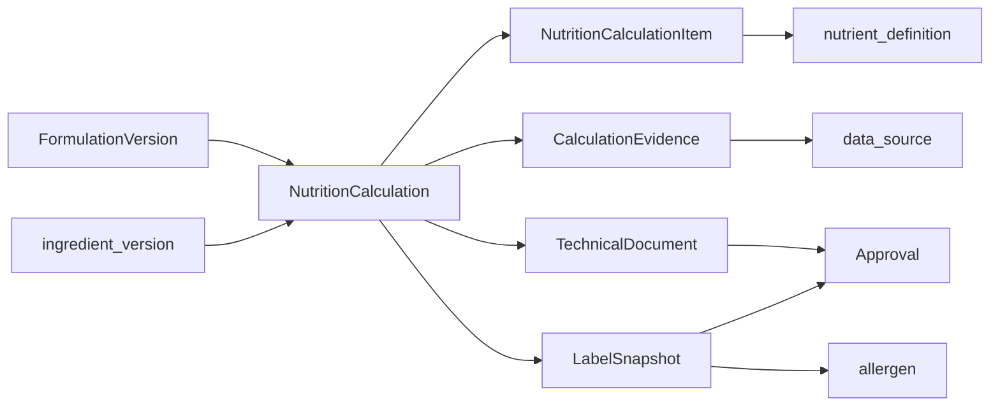

# Modelo conceitual — nutrição e documentos

O cálculo técnico bruto foi persistido em `0005_nutrition_calculation` (ver `MODELO-DADOS-NUTRICAO-TECNICA.md`). A biblioteca de conhecimento e o grounding determinístico estão em `0006_knowledge_grounding`. Rótulo, documento aprovado, %VD, conformidade, embeddings e LLM **continuam fora**. A composição oficial segue sendo só a da formulação.

## Fluxo

## Por que o legado diverge

No MySQL, `tbl_info_nutricional*` pode existir sem ficha, com outra lista de ingredientes, macros em colunas e tabela impressa em `varchar`. Isso permite rótulo legalmente desalinhado da receita **sem o banco perceber**.

Na Panne: a composição oficial é só a da formulação. A lista declarada do rótulo é **projeção** (expansão de compostos + ordem + overrides). Qualquer override vira evidência.

## `NutritionCalculation`

Cálculo oficial (ou preliminar) para uma `formulation_version` e um conjunto de parâmetros:

- base (`per_100g` do produto acabado, porção, rendimento final);
- massa da porção + unidade;
- medida caseira (qtde + `measurement_unit` ou texto controlado);
- rendimento usado no cálculo (cru vs assado — **decisão de especialista**);
- status: `draft` | `official` | `superseded`.

Invariantes:

1. Cálculo `official` é imutável.
2. Aponta versões concretas de ingredientes (via itens da formulação), não “ingrediente atual”.
3. Determinístico: mesmos inputs + mesma regra → mesmos itens (tolerância numérica documentada).
4. IA pode sugerir rascunho; promover a `official` exige evidência e, se política exigir, `approval`.

O legado armazena `PESO_TOTAL`, `PORCAO`, `RENDIMENTO_FINAL`, `MC_*` — preservar como **parâmetros**, não como segunda receita.

## `NutritionCalculationItem`

Um `nutrient_definition` + valor + unidade + base + `%VD` opcional. Substitui colunas fixas e a tabela `varchar`.

Arredondamento: aplicar **na projeção do snapshot**, não destruir o valor bruto no item oficial. A regra de arredondamento (ANVISA etc.) é `data_source` + identificador de regra — **decisão regulatória**, não inferível do DDL.

## `CalculationEvidence`

Memória append-only: inputs (ids de versões, fatores, perdas), algoritmo/regra, hash ou JSON canônico de parâmetros, `data_source_id`, tipo (`official` | `suggestion` | `manual_override`).

Sem evidência, não há cálculo oficial.

## `TechnicalDocument`

Documento derivado: ficha técnica, memorial, laudo interno.

- Tipos: `ficha_tecnica`, `memorial_calculo`, `rotulo_preliminar`.
- Status: `preliminary` | `approved` | `revoked`.
- Aponta `formulation_version` e, se houver, `nutrition_calculation`.
- Corpo: referência a artefato (URI) **ou** payload renderizado versionado — **não** misturar com `tbl_pop`.
- Aprovado só após `approval` compatível.

A ficha **não** tem composição própria.

## `LabelSnapshot`

Congelamento do que iria ao rótulo:

- lista declarada de ingredientes (texto canônico + estrutura);
- alergênicos derivados + overrides;
- glúten/lactose como presença tipada (`allergen`), não flags soltos;
- tabela nutricional já arredondada para apresentação;
- validade, conservação, embalagem, peso líquido de venda (metadados de rotulagem — **não** recalculam a fórmula);
- ids das regras e fontes vigentes na data do snapshot;
- responsável e data via `approval`.

Imutável. Correção = novo snapshot + nova aprovação.

Validade / conservação / embalagem existem no legado como texto livre. Tratar como dados de rotulagem do snapshot, não como regra de cálculo. Texto legado **não** é a norma atual.

## Distinções obrigatórias

| Preliminar | Aprovado |
|------------|----------|
| Documento `preliminary` | `approved` + evento |
| Cálculo `draft` | `official` + evidência |
| Rótulo ainda editável em rascunho | `LabelSnapshot` congelado |

## Relação com o catálogo existente

- Nutrientes do **insumo**: `ingredient_nutrient` (já existe).  
- Nutrientes do **produto acabado**: só via `nutrition_calculation_item`.  
- Alergênicos do insumo: `ingredient_allergen`.  
- Alergênicos do rótulo: união/derivação + override no snapshot.  
- `data_source` ancora norma e tabela oficial.  
- `audit_event` registra tentativas de mutação e publicações.

## Questões normativas (DDL não fecha)

Base legal da tabela; arredondamento; ordem de ingredientes; “contém / pode conter”; vigência de RDC; se o rendimento assado entra no denominador; se preparação expandida declara subingredientes. Ver `QUESTOES-FICHAS-E-NUTRICAO.md`.
