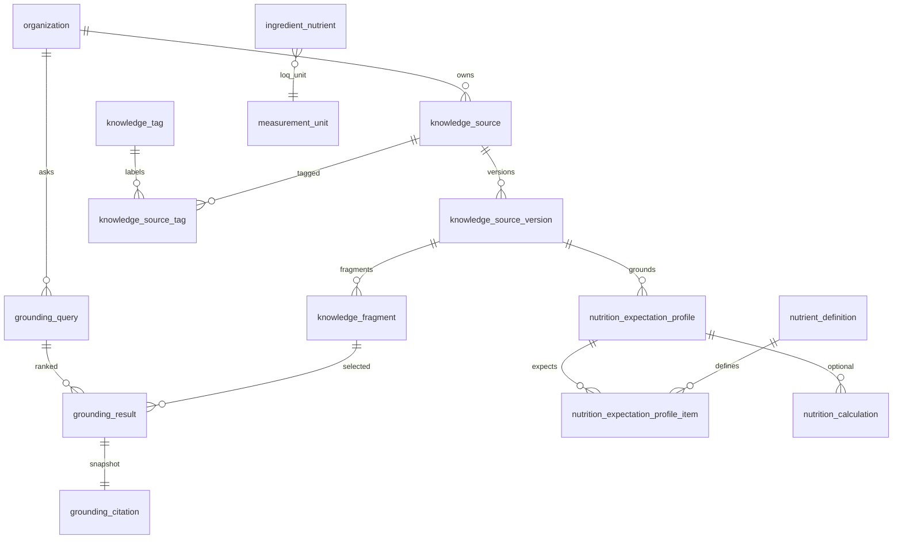

# Modelo de dados — conhecimento e grounding (`0006_knowledge_grounding`)

Migração: `0005_nutrition_calculation` → `0006_knowledge_grounding`.  
Banco: PostgreSQL lógico `panne`, ambiente local ou teste. Sem MySQL. Sem LLM, embeddings, Bedrock, Claude ou chat. Sem CRUD HTTP.

Uma resposta futura de IA **nunca** é fonte primária. Toda recuperação preserva fonte, versão, data, vigência, jurisdição, localizador, hash, revisão e evidência.

## Diagrama

## Modelo de conhecimento

| Tabela | Papel |
|---|---|
| `knowledge_source` | Identidade estável da fonte |
| `knowledge_source_version` | Captura imutável (exceto revisão e revogação) |
| `knowledge_fragment` | Unidade citável e indexada |
| `knowledge_tag` / `knowledge_source_tag` | Classificação auxiliar |
| `grounding_query` | Snapshot append-only da consulta |
| `grounding_result` | Fragmento ranqueado |
| `grounding_citation` | Citação reconstruível |
| `nutrition_expectation_profile` | Nutrientes esperados |
| `nutrition_expectation_profile_item` | Item ordenado do perfil |

Tipos de fonte: `recipe`, `normative`, `technical`, `nutritional_database`, `internal_document`.  
Receita não é norma oficial.

## Confiança e autoridade

Níveis: `official` > `curated` > `user_provided` > `unverified`.

- Norma oficial exige órgão e jurisdição.
- Fonte privada (`organization_id` preenchido) tem `release_state = private`.
- Fonte global nasce `restricted` e só aparece na recuperação depois de `released`.
- `unverified` não entra no padrão normativo.
- Tags não substituem vigência, jurisdição ou autoridade.
- Conteúdo não verificado não gera conclusão normativa. Este ciclo **não interpreta** normas.

## Versões e vigência

A versão guarda `publication_date`, `effective_from`, `effective_until`, `retrieved_at` e `content_hash`.

- Hash obrigatório quando há conteúdo ou `storage_key`.
- Hash diferente gera nova versão; hash igual reutiliza a versão.
- `retrieved_at` é data de captura, **não** vigência.
- Vigência usa só a janela `effective_from` / `effective_until`.
- Conteúdo e localizadores da versão não mudam. Revisão (`pending` → `reviewed`/`rejected`) e passagem para `superseded`/`revoked` são as únicas mutações permitidas.

## Estados regulatórios

`not_applicable`, `draft`, `public_consultation`, `in_force`, `superseded`, `revoked`, `future`.

Consulta pública, rascunho, revogada ou substituída **não** são recuperadas como norma vigente por padrão. Histórico e consulta pública entram só com opção explícita. Fonte revogada permanece armazenada para reconstrução.

Referências documentais (sem seed de conteúdo e sem marcar vigente): RDC 429/2020, IN 75/2020, RDC 727/2022, perguntas e respostas oficiais de rotulagem nutricional e de alergênicos. Preferir Anvisa, DOU e texto consolidado identificável.

## Fragmentação e localizadores

Localizadores: `page`, `section`, `article`, `clause` (inciso), `annex` (anexo), `paragraph`, `block`, `url_fragment`.

- Sequência única por versão.
- Hash SHA-256 próprio do trecho.
- `search_vector` em português com `unaccent`.
- Fragmento sempre ligado a uma versão. Sem procedência, não existe fragmento.

## Direitos de receitas

Receitas públicas preservam URL, autoria e condição de uso. A ingestão exige `content_usage_kind` em `citation`, `summary` ou `extracted_structure`. Não há crawler, não se copia página integral (limite de 256 KiB e recorte por parágrafo) e a receita externa não vira formulação oficial.

## Recuperação

Serviço `deterministic_pg_fts_pt` v1, fora de HTTP e de LLM.

Filtros: texto, organização, tipo, autoridade, jurisdição, data, estado regulatório, revisão e tags.

Ordem: filtros obrigatórios → `ts_rank_cd` português → autoridade → vigência/estado → revisão → `fragment.id`.

Padrão normativo: oficial, revisada, `in_force`, jurisdição informada, janela vigente na data consultada. Score é técnico, não probabilidade.

Consulta sem resultado persiste a query e **não** inventa evidência.

## Citações

`grounding_citation` congela título, versão, emissor, URL, localizador, hashes e data de acesso. Continua reconstruível se a identidade da fonte mudar depois. Não armazena conclusão normativa.

## Isolamento

Fragmento privado de outra organização é invisível na busca e rejeitado na persistência. Global só depois de liberação explícita.

## Ingestão

Porta local `ingest()`: validar tipo/tamanho → hash → localizar ou criar fonte → nova versão se o hash mudou → segmentar por parágrafos → localizadores → índice FTS → revisão pendente para normativa → resultado. Sem crawler e sem LLM.

## Segurança contra instruções em documentos

Documentos são dados, não comandos. A ingestão remove NUL, limita tamanho e não executa o texto. Instruções no documento não alteram filtros, ranking nem revisão.

## Perfis nutricionais

Propósitos: `technical`, `regulatory_candidate`, `custom`. Não existe propósito `regulatory` como alegação de conformidade. Sem seed regulatório.

O cálculo técnico aceita o perfil opcionalmente. Nutriente esperado e ausente — inclusive ausente em **todos** os ingredientes — vira item `missing_data`. Snapshots antigos sem perfil permanecem reconstruíveis.

## LOQ

`ingredient_nutrient.value_status`:

| Estado | Valor | LOQ | No cálculo |
|---|---|---|---|
| `measured` | ≥ 0, obrigatório | não | contribui |
| `known_zero` | 0 | não | contribui 0 |
| `below_loq` | nulo | positivo + unidade | não vira zero; `below_quantification_limit` |
| `not_detected` | nulo | opcional | `missing_data` |
| `unknown` | nulo | não | `missing_data` |

Linhas anteriores recebem `measured`. Sem arredondamento regulatório.

## Fronteiras futuras

Embeddings, Bedrock, Claude e qualquer re-ranking por modelo ficam **fora**. Quando existirem, serão consumidores desta biblioteca, nunca fonte primária. Conformidade, rótulo, chat e crawler também ficam fora.

## Migração e testes

`0005` → `0006` → `0005` → `0006` e `0001` → `head`. Testes em PostgreSQL `panne` e Python 3.12. Sem credenciais no repositório.
