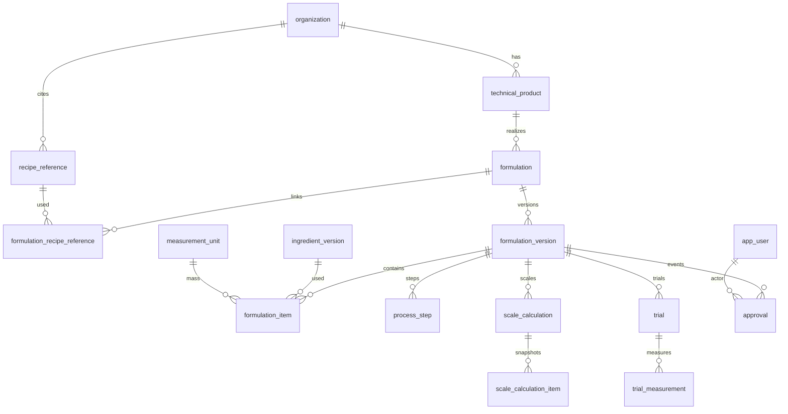

# Modelo de dados — formulações (`0004_formulation_lab`)

Migração: `0003_ingredient_catalog` → `0004_formulation_lab`.  
Banco autorizado: PostgreSQL lógico `panne`. Sem MySQL. Sem CRUD HTTP. Sem nutrição, rótulo, custo ou IA.

`FormulationVersion` é a **fonte técnica única**. Ficha, escala, nutrição, documentos e rótulos futuros derivam dela. Não há composição paralela.



## Tabelas

| Tabela | Finalidade | Exclusão |
|--------|------------|----------|
| `technical_product` | Identidade técnica do acabado (não comercial) | Física bloqueada; status |
| `recipe_reference` | Procedência (não é formulação) | Física bloqueada |
| `formulation` | Identidade da receita; pertence a um produto técnico | Física bloqueada; status |
| `formulation_recipe_reference` | Papel da referência (`inspiration`/`source`/`comparison`) | Física bloqueada |
| `formulation_version` | Fonte técnica versionada | Física bloqueada; `draft`/`published`/`retired` |
| `formulation_item` | Composição oficial (líquido + fator) | Só em rascunho |
| `process_step` | Etapas ordenadas | Só em rascunho |
| `scale_calculation` | Memória do motor de escala | Append-only |
| `scale_calculation_item` | Snapshot reconstruível | Append-only |
| `trial` | Ensaio / piloto | Concluído/cancelado preservado |
| `trial_measurement` | Medida observável tipada | Preservada com o trial |
| `approval` | Evento formal da versão | Append-only |

Toda tabela operacional carrega `organization_id`. Filhos usam **FK composta** `(id, organization_id)`. Sem RLS.

## Invariantes

- Código de produto técnico e de formulação único por organização; o mesmo código vale em outra org.
- Formulação e produto técnico na mesma organização.
- Item aponta `ingredient_version` da mesma organização; unidade com dimensão `mass`.
- Sequência única de itens e de etapas por versão.
- `net_quantity` `numeric(14,6)` > 0; `correction_factor` `numeric(20,10)` > 0, padrão 1.
- Bruto **derivado**: `gross = net × correction_factor`. Não é coluna fonte.
- Sem `current_version_id`. Unique `(formulation_id, version_number)`.
- No máximo uma `published` por formulação (índice parcial).
- Publicar exige a decisão **mais recente** `approved`.
- Publicada é imutável (conteúdo). Aposentadoria `published` → `retired` é a única mutação permitida, para liberar a próxima publicação.
- Itens e etapas de versão publicada/aposentada congelados.
- Exclusão física bloqueada nas identidades, versões, referências, cálculos e approvals.
- Sem preço, SKU comercial ou nutrição do produto acabado.

## Percentual do padeiro

Itens com `is_flour_basis = true` formam a base. **Não** se classifica farinha pelo nome.

```text
total_flour_mass = soma(net_quantity) dos itens farinha-base
bakers_percentage = net_quantity / total_flour_mass × 100
```

- `Decimal`; sem `float`.
- Percentual é derivado, nunca digitado como fonte.
- Várias farinhas somam a base.
- Sem farinha-base: formulação válida, percentual `None`.
- Com farinha-base: soma deve ser > 0 (garantido por `net_quantity > 0`).
- Persistido no snapshot de escala quando aplicável, já quantizado.

## Escala determinística

Módulo `app.modules.calculation_engine.scale`. Sem HTTP, sem LLM.

**Modo A — massa total de massa** (`total_dough_mass`):

```text
scale_factor = target_total_dough_mass / base_total_net_mass
```

**Modo B — unidades finais** (`final_units`):

```text
required_pre_bake_mass = units × final_unit_weight / (1 − bake_loss_rate)
scale_factor = required_pre_bake_mass / base_total_net_mass
```

Por item:

```text
scaled_net = base_net × scale_factor
scaled_gross = scaled_net × correction_factor
```

Rejeita: massa-base ≤ 0, unidades não inteiras ou ≤ 0, pesos ≤ 0, perda ∉ [0, 1), `float`.

## Precisão e arredondamento

| Uso | Quantum | Arredondamento |
|-----|---------|----------------|
| Massas / quantidades | `numeric(14,6)` → `0.000001` | `ROUND_HALF_UP` |
| Fatores / perda / escala | `numeric(20,10)` → `0.0000000001` | `ROUND_HALF_UP` |
| Percentual do padeiro persistido | `numeric(14,6)` | `ROUND_HALF_UP` |
| Apresentação | casas configuráveis (padrão 3) | `ROUND_HALF_UP` |

O cálculo interno usa `Decimal` em precisão cheia; a persistência quantiza. A apresentação **não** altera o valor interno nem o snapshot.

## Memória de cálculo

`scale_calculation` guarda modo, entradas, massa-base, fator, massa pré-forno, `algorithm_code = deterministic_scale`, `algorithm_version = 1`, política de arredondamento.  
`scale_calculation_item` guarda versões de ingrediente, líquido/bruto calculados, percentual (se houver), unidade e valores-base.  
Reconstrução: `base_net × scale_factor` (depois quantizar). Imutável. Alterar preço ou republicar ingrediente **não** muda o snapshot.

## Trials e medições

Estados: `planned`, `in_progress`, `completed`, `cancelled`.  
Tipos de medição: `dough_mass`, `units_produced`, `final_unit_weight`, `actual_loss`, `duration`, `temperature`.  
Observação sensorial fica em `notes` (texto), nunca como número artificial. Trial concluído/cancelado e suas medições são preservados.

## Aprovação e revogação

`approval` é append-only (`submitted`, `approved`, `rejected`, `revoked`). Sem endpoint.  
Revogar **insere** um novo evento; a aprovação anterior permanece.  
A publicação olha a decisão **mais recente**. Papéis de autenticação ficam para ciclo futuro.

## Fronteira — preparação como ingrediente

Não implementado automaticamente. No futuro, de forma explícita:

1. formulação aprovada e publicada;
2. publicação técnica deliberada (não implícita);
3. criar `ingredient` tipo `preparation` + `ingredient_version`;
4. rastrear a `formulation_version` de origem;
5. `formulation_item` continua apontando só `ingredient_version` — sem polimorfismo.

## Fronteira — custos

Não implementado. Preços vêm de `supplier_item_price`. Custo será cálculo satélite com snapshot próprio. Preço comercial não pertence à formulação. Mudança de preço não altera versão publicada nem memória de escala.

## Riscos residuais

- Sem RLS; isolamento só por FK composta.
- Sem autenticação; qualquer processo com acesso ao banco pode inserir `approval`.
- Aposentadoria de versão publicada é necessária para publicar a seguinte (índice parcial).
- Escala de rascunho é permitida (útil para trial); oficializar documento futuro deve exigir versão publicada.
- Sem semente de unidades; testes criam `g` sob demanda.
