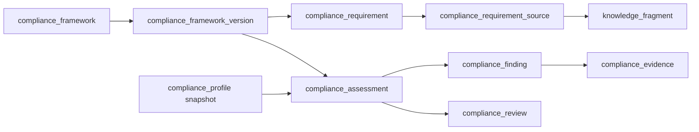

# Modelo de dados — governança regulatória (`0008_compliance_governance`)

Migração: `0007_ai_orchestration` → `0008_compliance_governance`.  
Banco: PostgreSQL lógico `panne`. Sem MySQL. Sem FTP. Sem HTTP de negócio. Sem rótulo, certificado, selo ou parecer jurídico.

## Incompatibilidade registrada

Este prompt citou ADR-011, ADR-012, ADR-014, REG-001 e REG-002. **Esses documentos não existem na pasta `panne/`**. Os ADR de mesmo número em `qmind/` tratam de outro produto e **não** foram usados. A implementação segue este prompt e os modelos já existentes de organização, estabelecimento, ingredientes, formulações, nutrição, conhecimento e IA.

## Diagrama

## Tabelas

| Tabela | Papel |
|---|---|
| `compliance_framework` | Pacote normativo estável, global ou organizacional |
| `compliance_framework_version` | Versão imutável no conteúdo, com uma ativa |
| `compliance_requirement` | Requisito declarativo ordenado |
| `compliance_requirement_source` | Citação rastreável à biblioteca |
| `compliance_profile` | Contexto declarado; snapshot imutável na avaliação |
| `compliance_assessment` | Avaliação determinística append-only |
| `compliance_finding` | Resultado por requisito |
| `compliance_evidence` | Snapshot técnico ou normativo |
| `compliance_review` | Decisão humana append-only |

## Limites

A IA não cria, ativa, revisa nem conclui conformidade. Extrações futuras permanecem `pending_review`. `grounding_insufficient` do CURSOR-008 permanece falha fechada. Materialização de proposta de formulação continua só em `draft`.
