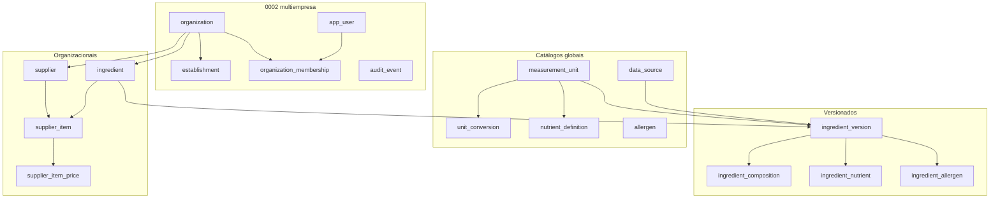

# Modelo de dados — núcleo regularizado

Migrações: `0001` → `0002` → `0003` → `0004_formulation_lab` → `0005_nutrition_calculation` → `0006_knowledge_grounding` → `0007_ai_orchestration`.  
Banco autorizado: PostgreSQL lógico `panne`, ambiente local. Formulações: `MODELO-DADOS-FORMULACOES.md`. Nutrição técnica: `MODELO-DADOS-NUTRICAO-TECNICA.md`. Conhecimento: `MODELO-DADOS-CONHECIMENTO-E-GROUNDING.md`. IA assistiva: `MODELO-DADOS-ORQUESTRACAO-IA.md`.

## Isolamento multiempresa

Toda tabela operacional carrega `organization_id`. Relações entre versões, composição e fornecedor usam **FK composta** `(id, organization_id)`. Isso impede componente ou SKU de outra organização. Sem RLS nesta etapa — o risco residual é acesso direto ao banco; avaliar com autenticação.

## Versionamento

- Sem `current_version_id`.
- Unique `(ingredient_id, version_number)`.
- No máximo uma linha `published` por ingrediente (índice parcial).
- `draft` / `published` / `retired`.
- Publicada é imutável na camada normal (`ensure_version_editable`) e por trigger `published_frozen`.
- Correção = nova versão.

## Base nutricional

Na versão, explícita: `nutrition_basis_type = per_100g`, `nutrition_basis_quantity = 100`, `nutrition_basis_unit_id` com dimensão `mass`. Nutrientes não repetem a base; herdam da versão. Valores `numeric(14,6)` ≥ 0 quando medidos. A partir de `0006`, `value_status` distingue medido, zero conhecido, abaixo do LOQ, não detectado e desconhecido. Não é a tabela nutricional do produto final.

## Composição e ciclos

Pai e componente são **versões**. Autorreferência bloqueada no SQL. Ciclo indireto bloqueado em `rules.assert_acyclic_composition`. Sequência única por versão pai.

## Append-only

`audit_event` e `supplier_item_price` não têm `updated_at`. Trigger `panne_forbid_mutation` barra UPDATE/DELETE.

## Fornecedores e preços

`supplier` pertence à organização. `supplier_item` liga fornecedor + ingrediente da mesma org, embalagem `numeric(14,6)` > 0. Preço histórico `numeric(14,4)`, moeda ISO, `observed_at`, `source`.

## Conversões

Só entre a mesma dimensão. Massa↔volume é recusada. Densidade fica para etapa futura.

## Fronteiras futuras

Ver `FRONTEIRAS-FUTURAS-FORMULA.md`. Não estão em `ingredient_version`.
