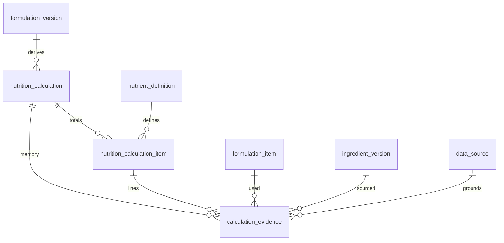

# Modelo de dados — cálculo nutricional técnico (`0005_nutrition_calculation`)

Migração: `0004_formulation_lab` → `0005_nutrition_calculation` → evolução opcional em `0006_knowledge_grounding`.  
Banco: PostgreSQL lógico `panne`. Sem MySQL. Sem CRUD HTTP. Sem rótulo. Perfis de nutrientes esperados e LOQ: `MODELO-DADOS-CONHECIMENTO-E-GROUNDING.md`.

Este ciclo produz uma **prévia técnica bruta**, incompleta quanto à conformidade e **não validada regulatoriamente**. Não é rótulo, não é tabela oficial e não afirma conformidade.

Contexto normativo (não implementado): RDC 429/2020, IN 75/2020, RDC 727/2022 e perguntas e respostas da Anvisa. As regras dessas normas **não** entram no motor.



## Fórmulas

```text
ingredient_contribution =
    formulation_item_net_mass_g × ingredient_nutrient_amount ÷ 100

formula_nutrient_total =
    soma das contribuições conhecidas

nutrient_per_100g_final =
    formula_nutrient_total ÷ expected_final_mass_g × 100

nutrient_per_portion =
    nutrient_per_100g_final × portion_mass_g ÷ 100
```

Massa do item: convertida para gramas pelo `si_factor` da unidade de massa (evidência `unit_conversion` se a unidade não for `g`).

## Massa final e perdas

```text
expected_final_mass = formula_net_mass × (1 − expected_bake_loss_rate)
```

- Taxa ∈ [0, 1).
- Massa final > 0.
- **Hipótese registrada:** perda de massa não implica perda proporcional de nutrientes. Sem fatores de retenção. Totais da fórmula preservados; só a concentração muda.
- Sem massa final válida: totais existem; `per_100g_amount` e porção ficam vazios.

## Dados ausentes

Ausência ≠ zero. Zero conhecido é `complete` com valor 0.  
Nutriente faltante na `IngredientVersion`: evidência `missing_value`, item `missing_data`, cálculo `incomplete`.  
Não há preenchimento por IA nem por outra versão.

`below_quantification_limit` existe no check; só será usado quando a fonte informar LOQ (ainda não há campo para isso).

## Compostos e preparações

Usa o dossiê publicado da `IngredientVersion` apontada. Não percorre `ingredient_composition` nem formulações externas. Preparação sem nutrientes: incompleto.

## Unidades

Só massa→gramas via catálogo (`si_factor`, mesma dimensão). Massa↔volume recusado. Sem conversão não declarada.

## Precisão

`Decimal`. Persistência `numeric(14,6)` com `ROUND_HALF_UP` técnico. Sem arredondamento regulatório. Política: `technical_quantize_14_6_half_up_no_regulatory`.

## Evidências

Tipos: `source_value`, `calculated_contribution`, `missing_value`, `yield_assumption`, `portion_assumption`, `unit_conversion`, `warning`.  
Rastreiam versão do ingrediente, fonte e contribuição. Reconstrução: soma das `calculated_contribution` do nutriente.

## Imutabilidade

Cálculo, itens e evidências append-only. Invalidação só muda `status` para `invalidated`. Novo cálculo é nova linha.

Rascunho da formulação: `is_simulation = true`. Não é cálculo aprovado.

## O que este ciclo não faz

Percentual de valor diário; porção legal; lupa frontal; alegações; glúten/lactose/alergênicos normativos; PDF; layout oficial; energia Atwater; açúcares adicionados; carboidrato por diferença; sódio a partir de sal.

## Riscos

Sem RLS. Sem autenticação. União de nutrientes só dos que existem em alguma versão — nutrientes nunca declarados no dossiê não aparecem. LOQ ainda sem campo na fonte. Publicar formulação como ingrediente continua fora.
