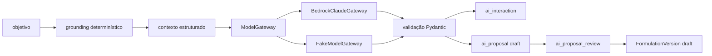

# Modelo de dados — orquestração assistiva (`0007_ai_orchestration`)

Migração: `0006_knowledge_grounding` → `0007_ai_orchestration`.  
Banco: PostgreSQL lógico `panne`. Sem MySQL. Sem endpoint. Sem chat. Sem publicação automática.

A IA produz **propostas**. Formulações oficiais só nascem depois de revisão humana, e somente como `draft`.

## Diagrama

## Porta e adaptador

`ModelGateway` recebe pedido estruturado e devolve JSON, modelo, tokens, `stop_reason` e latência. O domínio não importa `boto3`.

`BedrockClaudeGateway` usa `bedrock-runtime` + `Converse`. Não usa `bedrock-mantle`.  
`FakeModelGateway` cobre todos os testes comuns.

## Converse e structured output

Quando o modo é `json_schema`, a chamada envia `outputConfig.textFormat`.  
Alternativa explícita: `tool_schema` com `toolSpec.strict`.  
Se `unsupported`, a chamada falha de forma controlada. Não há parsing de Markdown.

O modelo é só `BEDROCK_MODEL_ID`. Nada fica fixo no domínio.

## Configuração e credenciais

Variáveis: `AWS_REGION`, `BEDROCK_REGION`, `BEDROCK_MODEL_ID`, `BEDROCK_MAX_TOKENS`, `BEDROCK_TEMPERATURE`, `BEDROCK_GUARDRAIL_ID`, `BEDROCK_GUARDRAIL_VERSION`.

Credenciais vêm da cadeia AWS (perfil, IAM, temporárias ou `.env` local).  
`.env.example` **não** declara access key, secret key nem session token.

## Templates

`panne_formulation_proposal` v1. System prompt versionado no código. O usuário não edita o prompt de sistema.

## Grounding e citações

Antes da inferência: receitas, fontes técnicas e documentos internos **revisados**. Sem norma para inventar formulação. Sem fonte rejeitada, restrita, de outra organização, consulta pública ou `unverified` (salvo opção explícita).

Citações são as da Panne (`grounding_citation` + token opaco). ID inventado rejeita a saída. URL solta do modelo não vira citação.

## Prompt injection

Fragmentos entram em `<panne_evidence token="eN">`. São dados. Instruções internas não mudam o papel, não pedem ferramenta, segredo, publicação nem comando.

## Validação

Schema Pydantic `extra="forbid"`. IDs de ingrediente só do conjunto permitido. Quantidades e temperaturas com faixa. Falha → `rejected_by_validation`, sem proposta utilizável.

## Revisão e materialização

`ai_proposal_review` é append-only. Aceitação válida materializa `Formulation`/`FormulationVersion` **draft**. Adaptação cria nova versão e preserva a base. Nunca publica nem aprova. Segunda aceitação é idempotente.

## Erros

Acesso negado, timeout, throttling, schema inválido, truncamento, grounding insuficiente e ID inventado são normalizados. Retry limitado só para erro transitório.

## Teste vivo

`tests/test_ai_bedrock_live.py` só roda com `BEDROCK_LIVE_TEST=1`. Entrada sintética, sem norma, sem gravar credencial.

## Limites da IA

Não calcula oficialmente padeiro, escala, nutrição, custo ou conformidade. Depois da proposta, a prévia usa os motores determinísticos e só registra aviso se houver inconsistência.
