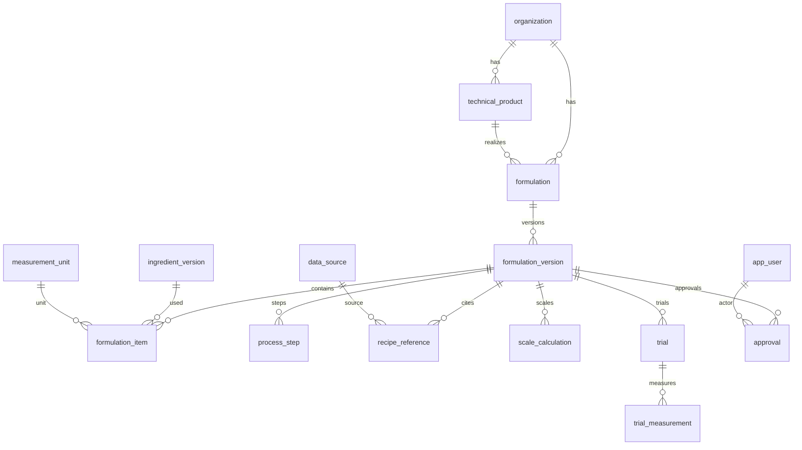

# Proposta PostgreSQL — formulações

**Status:** realizada em `0004_formulation_lab` com o contrato do CURSOR-005 (ver `MODELO-DADOS-FORMULACOES.md`). O texto abaixo é a proposta anterior; nomes de status, `recipe_reference` organizacional, itens de escala persistidos e aprovação só da versão divergem de propósito.

Tabelas já existentes (não recriar): `organization`, `app_user`, `audit_event`, `ingredient`, `ingredient_version`, `measurement_unit`, `data_source`.

Auditoria padrão em tabelas mutáveis: `created_at`, `created_by` → `app_user`, `updated_at`, `updated_by`. Versões/eventos append-only omitem `updated_*` ou o tornam no-op.

---

### `technical_product`

- **Finalidade:** acabado técnico (substitui o papel `USO_FICHA_TECNICA` sem polimorfismo).
- **Colunas:** `id uuid`, `organization_id uuid not null`, `code text not null`, `name text not null`, `status text not null default 'active'`, auditoria.
- **Tipos:** `status` check `in ('active','cancelled')`.
- **PK:** `id`.
- **FK:** `organization_id` → `organization`.
- **Unicidade:** unique parcial `(organization_id, code)` where `status = 'active'`.
- **Índices:** `(organization_id, name)`.
- **Checks:** `char_length(code) > 0`.
- **Escopo:** organizacional.
- **Auditoria:** padrão + `audit_event`.
- **Versionamento:** identidade; a receita versiona em `formulation_version`.
- **Exclusão:** `cancelled`; sem delete físico.

Opcional na primeira fatia se `formulation` absorver o nome do pão.

---

### `formulation`

- **Finalidade:** identidade da receita.
- **Colunas:** `id uuid`, `organization_id uuid not null`, `technical_product_id uuid null`, `code text not null`, `name text not null`, `status text not null default 'active'`, auditoria.
- **PK:** `id`.
- **FK:** `organization_id` → `organization`; `technical_product_id` → `technical_product`; **check composto** `technical_product.organization_id = formulation.organization_id` (FK composta ou trigger, como em `establishment`).
- **Unicidade:** unique parcial `(organization_id, code)` where active.
- **Escopo:** organizacional.
- **Versionamento:** não.
- **Exclusão:** `cancelled`.

---

### `formulation_version`

- **Finalidade:** estado técnico publicável (cabeçalho da ficha legado, com versão).
- **Colunas:**  
  `id uuid`, `formulation_id uuid not null`, `organization_id uuid not null`,  
  `version_number int not null`,  
  `status text not null` (`draft` / `published` / `superseded`),  
  `yield_count numeric(14,6) null` (unidades / peças — legado `RENDIMENTO` int),  
  `yield_note text null` (legado `RENDIMENTO_RECEITA`),  
  `prep_duration interval null`, `cook_duration interval null`,  
  `portion_mass numeric(14,6) null`, `portion_unit_id uuid null`,  
  `cooked_mass numeric(14,6) null`, `cooking_factor numeric(14,6) null`,  
  `loss_gain_ratio numeric(14,6) null`,  
  `declared_total_mass numeric(14,6) null`, `declared_real_mass numeric(14,6) null`,  
  `bakers_percent_base text null` (`flour` / `total` / `none` — pendente),  
  `notes text null`,  
  `published_at timestamptz null`, `superseded_at timestamptz null`,  
  `created_at`, `created_by`.
- **PK:** `id`.
- **FK:** `formulation_id` → `formulation`; `organization_id` alinhado à formulação; `portion_unit_id` → `measurement_unit`.
- **Unicidade:** `(formulation_id, version_number)`; unique parcial uma `published` por `formulation_id`.
- **Checks:** `version_number > 0`; massas `> 0` quando not null; `cooking_factor > 0` quando not null; `status` no enum.
- **Índices:** `(organization_id, status)`, `(formulation_id, status)`.
- **Auditoria:** criação; mutação só em `draft` (regra/trigger, espelhar `ingredient_version`).
- **Versionamento:** sim; publicado congelado.
- **Exclusão:** sem delete; só `superseded`.

Totais de custo **não** entram como colunas oficiais de conformidade. Se necessário, tabela satélite `formulation_cost_snapshot` (fora desta proposta nuclear).

---

### `formulation_item`

- **Finalidade:** linha da composição oficial.
- **Colunas:** `id uuid`, `formulation_version_id uuid not null`, `ingredient_version_id uuid not null`, `sort_order int not null`, `gross_quantity numeric(14,6) not null`, `net_quantity numeric(14,6) null`, `correction_factor numeric(14,6) null`, `unit_id uuid not null`, `item_role text not null default 'ingredient'` (`ingredient` / `preparation` / `additive`), `notes text null`, `created_at`.
- **PK:** `id`.
- **FK:** versão; `ingredient_version_id` → `ingredient_version`; `unit_id` → `measurement_unit`. Preferir FK composta para garantir `ingredient_version.status = 'published'` na publicação (aplicação + check na promoção).
- **Unicidade:** `(formulation_version_id, sort_order)`; unique `(formulation_version_id, ingredient_version_id)` **não** obrigatório (o mesmo insumo pode entrar duas vezes — **decisão de especialista**).
- **Checks:** `gross_quantity > 0`; `net_quantity is null or net_quantity > 0`; `correction_factor is null or correction_factor > 0`.
- **Escopo:** via versão.
- **Versionamento:** congela com a versão pai.
- **Exclusão:** só com a versão em `draft`.

---

### `process_step`

- **Finalidade:** etapas ordenadas.
- **Colunas:** `id uuid`, `formulation_version_id uuid not null`, `sort_order int not null`, `title text null`, `instruction text not null`, `duration interval null`, `temperature_c numeric(6,2) null`, `created_at`.
- **PK:** `id`.
- **FK:** `formulation_version_id`.
- **Unicidade:** `(formulation_version_id, sort_order)`.
- **Exclusão:** com o rascunho.

---

### `recipe_reference`

- **Finalidade:** citação de fonte / biblioteca.
- **Colunas:** `id uuid`, `formulation_version_id uuid not null`, `data_source_id uuid not null`, `locator text null`, `created_at`.
- **PK / FK:** versão + `data_source`.
- **Unicidade:** `(formulation_version_id, data_source_id, locator)`.

---

### `scale_calculation`

- **Finalidade:** escala determinística (substitui cópia `tbl_ficha_tecnica_porcao*`).
- **Colunas:** `id uuid`, `formulation_version_id uuid not null`, `organization_id uuid not null`, `target_kind text not null` (`factor` / `output_mass` / `portion_count`), `target_value numeric(14,6) not null`, `result_total_mass numeric(14,6) null`, `evidence_id uuid null`, `created_at`, `created_by`.
- **PK / FK:** versão; `evidence_id` → `calculation_evidence` (tabela irmã).
- **Checks:** `target_value > 0`.
- **Exclusão:** append-only recomendado.

Não persistir N linhas copiadas; o motor recalcula.

---

### `trial`

- **Finalidade:** ensaio / pão piloto.
- **Colunas:** `id uuid`, `organization_id uuid not null`, `formulation_version_id uuid not null`, `code text not null`, `performed_on date null`, `notes text null`, `status text not null default 'recorded'`, `created_at`, `created_by`.
- **FK:** versão (rascunho ou publicada).
- **Unicidade:** `(organization_id, code)`.
- **Exclusão:** `cancelled`; medidas permanecem.

---

### `trial_measurement`

- **Finalidade:** observado vs calculado.
- **Colunas:** `id uuid`, `trial_id uuid not null`, `metric_code text not null` (`baked_mass` / `dough_mass` / `loss_ratio` / …), `observed_value numeric(14,6) not null`, `unit_id uuid not null`, `notes text null`, `created_at`.
- **Unicidade:** `(trial_id, metric_code)` ou permitir repetição — **decisão do proprietário**.

---

### `approval`

- **Finalidade:** evento formal (compartilhada com documentos).
- **Colunas:** `id uuid`, `organization_id uuid not null`, `target_kind text not null` (`formulation_version` / `technical_document` / `label_snapshot` / `nutrition_calculation`), `target_id uuid not null`, `decision text not null` (`approved` / `rejected` / `revoked`), `role_code text not null`, `actor_user_id uuid not null`, `decided_at timestamptz not null`, `comment text null`, `created_at`.
- **FK:** `organization_id`, `actor_user_id` → `app_user`.
- **Checks:** `decision` e `target_kind` no conjunto.
- **Índices:** `(target_kind, target_id, decided_at)`.
- **Auditoria:** a própria linha é o evento; também `audit_event`.
- **Exclusão:** proibida (append-only).

---

## Política transversal

- Isolamento: toda raiz de negócio tem `organization_id`; filhos herdam e validam.
- Sem RLS neste desenho (igual ao núcleo atual).
- `audit_event` em publicar, substituir, cancelar, aprovar.
- Custo comercial e `tbl_produto_preco` ficam fora.
- Nome legado `formula_ingredient` (`FRONTEIRAS-FUTURAS-FORMULA.md`) = `formulation_item`.
