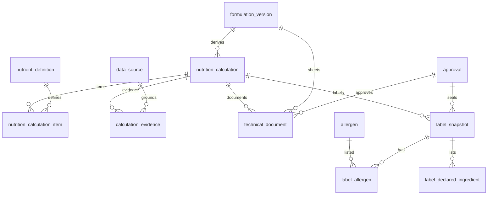

# Proposta PostgreSQL — nutrição e documentos

**Status:** o cálculo técnico bruto foi realizado em `0005`. A biblioteca de conhecimento e o grounding determinístico estão em `0006` (`MODELO-DADOS-CONHECIMENTO-E-GROUNDING.md`). Sem %VD, sem rótulo, sem LLM e sem documento aprovado. O texto abaixo é a proposta anterior (inclui rótulo e %VD, **não implementados**).

---

### `nutrition_calculation`

- **Finalidade:** cálculo nutricional derivado da versão da formulação (substitui cabeçalho `tbl_info_nutricional` como fonte paralela).
- **Colunas:**  
  `id uuid`, `organization_id uuid not null`,  
  `formulation_version_id uuid not null`,  
  `status text not null` (`draft` / `official` / `superseded`),  
  `basis text not null` (`per_100g` / `per_portion` / `per_final_yield`),  
  `total_mass numeric(14,6) not null`, `total_mass_unit_id uuid not null`,  
  `portion_mass numeric(14,6) null`, `portion_unit_id uuid null`,  
  `final_yield_mass numeric(14,6) null`,  
  `household_quantity numeric(14,6) null`, `household_unit_id uuid null`,  
  `rounding_rule_source_id uuid null`,  
  `created_at`, `created_by`, `officialized_at timestamptz null`.
- **PK:** `id`.
- **FK:** `formulation_version_id`; unidades → `measurement_unit`; `rounding_rule_source_id` → `data_source`; org alinhada.
- **Unicidade:** unique parcial uma `official` vigente por `(formulation_version_id, basis)` — **decisão arquitetural** se várias bases oficiais coexistirem.
- **Checks:** massas `> 0`; `status`/`basis` no conjunto.
- **Índices:** `(organization_id, status)`, `(formulation_version_id, status)`.
- **Auditoria:** padrão em rascunho; oficial imutável (trigger).
- **Versionamento:** sim.
- **Exclusão:** sem delete; `superseded`.

Não há colunas fixas de kcal/sódio. Não há lista paralela de ingredientes.

---

### `nutrition_calculation_item`

- **Finalidade:** valor por nutriente (substitui macros em colunas + `tbl_info_nutricional_tabela` como fonte).
- **Colunas:** `id uuid`, `nutrition_calculation_id uuid not null`, `nutrient_definition_id uuid not null`, `raw_value numeric(14,6) not null`, `value_unit_id uuid not null`, `daily_value_percent numeric(8,4) null`, `sort_order int not null`.
- **PK:** `id`.
- **FK:** cálculo; `nutrient_definition`; unidade.
- **Unicidade:** `(nutrition_calculation_id, nutrient_definition_id)`.
- **Checks:** `raw_value >= 0` (energia e nutrientes; exceções normativas — pendente).
- **Versionamento:** congela com o cálculo pai.
- **Exclusão:** com rascunho.

kcal e kJ: duas linhas (`energy_kcal`, `energy_kj`) no catálogo, não um `varchar` conjunto.

---

### `calculation_evidence`

- **Finalidade:** memória de cálculo; separa sugestão de IA do oficial.
- **Colunas:** `id uuid`, `organization_id uuid not null`, `subject_kind text not null` (`nutrition_calculation` / `scale_calculation` / `formulation_version`), `subject_id uuid not null`, `evidence_kind text not null` (`official` / `suggestion` / `manual_override`), `algorithm_code text not null`, `algorithm_version text not null`, `data_source_id uuid null`, `input_fingerprint text not null`, `payload_canonical text not null`, `created_at`, `created_by`.
- **PK:** `id`.
- **FK:** `data_source` opcional; `created_by` → `app_user`.
- **Checks:** `evidence_kind` no conjunto; `char_length(input_fingerprint) > 0`.
- **Índices:** `(subject_kind, subject_id, created_at)`.
- **Auditoria:** append-only = evidência.
- **Exclusão:** proibida.

`payload_canonical` guarda parâmetros (ids de `ingredient_version`, fatores, perdas). Sem binário de PDF.

---

### `technical_document`

- **Finalidade:** ficha / memorial derivado (não POP, não lançamento financeiro).
- **Colunas:** `id uuid`, `organization_id uuid not null`, `formulation_version_id uuid not null`, `nutrition_calculation_id uuid null`, `doc_type text not null` (`ficha_tecnica` / `memorial_calculo` / `rotulo_preliminar`), `status text not null` (`preliminary` / `approved` / `revoked`), `title text not null`, `artifact_uri text null`, `content_sha256 text null`, `created_at`, `created_by`.
- **PK:** `id`.
- **FK:** versão; cálculo opcional (obrigatório se `doc_type` nutricional — check).
- **Unicidade:** nenhuma natural; várias preliminares permitidas.
- **Checks:** `status`/`doc_type`; `approved` exige ao menos um `approval` compatível (aplicação ou constraint diferida).
- **Exclusão:** `revoked`; artefato permanece.

---

### `label_snapshot`

- **Finalidade:** rótulo congelado (dados + regras + fontes).
- **Colunas:**  
  `id uuid`, `organization_id uuid not null`,  
  `nutrition_calculation_id uuid not null`,  
  `formulation_version_id uuid not null`,  
  `status text not null` (`draft` / `sealed` / `superseded`),  
  `net_sale_mass numeric(14,6) null`, `net_sale_unit_id uuid null`,  
  `shelf_life_text text null`, `storage_text text null`, `packaging_text text null`,  
  `declared_ingredient_text text not null`,  
  `rounding_rule_source_id uuid not null`,  
  `regulation_source_id uuid not null`,  
  `sealed_at timestamptz null`,  
  `created_at`, `created_by`.
- **PK:** `id`.
- **FK:** cálculo, versão, unidades, dois `data_source` (regra de arredondamento e norma).
- **Unicidade:** unique parcial um `sealed` vigente por `nutrition_calculation_id` (ou por produto técnico — **decisão do proprietário**).
- **Checks:** `sealed` implica textos e fontes not null.
- **Versionamento:** snapshot imutável após `sealed`.
- **Exclusão:** sem delete.

Validade/conservação/embalagem: metadados de rotulagem, não inputs do motor nutricional.

---

### `label_declared_ingredient`

- **Finalidade:** lista estruturada do rótulo (projeção; substitui `tbl_info_nutricional_ingrediente` + `longtext` solto).
- **Colunas:** `id uuid`, `label_snapshot_id uuid not null`, `sort_order int not null`, `display_name text not null`, `ingredient_version_id uuid null`, `is_compound_expansion boolean not null default false`, `percent_display numeric(8,4) null`.
- **Unicidade:** `(label_snapshot_id, sort_order)`.
- **FK:** snapshot; versão de insumo opcional (agregados/aromáticos sem id — **decisão**).

---

### `label_allergen`

- **Finalidade:** presença no rótulo (substitui texto + flags manuais).
- **Colunas:** `id uuid`, `label_snapshot_id uuid not null`, `allergen_id uuid not null`, `presence text not null` (`contains` / `may_contain` / `absent`), `is_override boolean not null default false`, `override_reason text null`.
- **Unicidade:** `(label_snapshot_id, allergen_id)`.
- **FK:** `allergen`.
- **Checks:** `is_override = true` implica `override_reason` not null.

Glúten e lactose são códigos de `allergen`, não colunas `CONTEM_*`.

---

## Relação com o núcleo existente

| Existente | Uso nesta proposta |
|-----------|-------------------|
| `organization` | Dono de cálculo, documento e snapshot |
| `app_user` | Autor e `approval.actor_user_id` |
| `ingredient` / `ingredient_version` | Folhas da formulação; nutrientes de origem |
| `measurement_unit` | Porção, medida caseira, massa de venda |
| `nutrient_definition` | Itens do cálculo |
| `allergen` | Linhas do snapshot |
| `data_source` | Norma, arredondamento, grounding |
| `audit_event` | Publicar / selar / revogar |

## O que não entra

- PDF binário no Postgres (só URI + hash).
- `tbl_pop*` / `tbl_lancamento_docs`.
- Segunda composição editável.
- Implementação de motor, seed de RDC, ou API.
