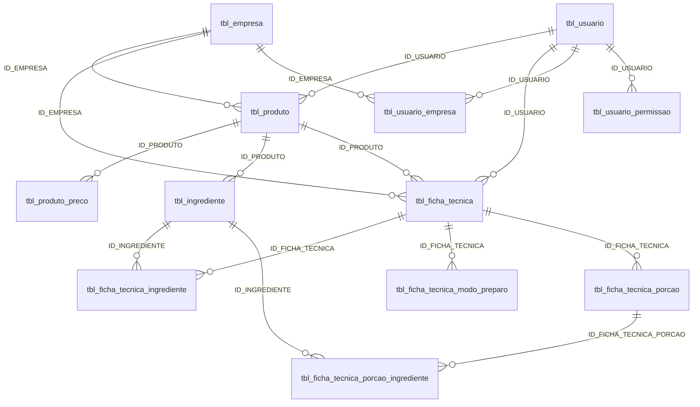

# Relacionamentos — produtos e fichas (legado)

Fonte: metadados e DDL. Sem linhas de negócio. **Zero FKs declaradas** no schema.

## Explícitas (constraints)

Nenhuma. Integridade só por aplicação.

## Inferidas (por `ID_*` e nomes)

## Produto polimórfico (`USO_*`)

Papéis possíveis no mesmo registro (`enum` `F`/`T`, todos `NOT NULL`):

| Flag | Papel aparente | Dependência inferida |
|------|----------------|----------------------|
| `USO_INGREDIENTE` | Insumo / item de catálogo de ingrediente | `tbl_ingrediente.ID_PRODUTO` |
| `USO_FICHA_TECNICA` | Receita / ficha | `tbl_ficha_tecnica.ID_PRODUTO` |
| `USO_INFO_NUTRICIONAL` | Documento de rotulagem | `tbl_info_nutricional.ID_PRODUTO` |

O DDL **não impede** os três flags em `T` no mesmo produto. Não há constraint de exclusão mútua. Conceitos misturados: identidade comercial, insumo técnico, formulação e rótulo.

Tabelas que **não** referenciam os flags: só o produto os carrega. Filhos usam `ID_PRODUTO` sem checar o flag no banco.

## Composição da ficha

- Uma ficha → N linhas em `tbl_ficha_tecnica_ingrediente`.  
- Linha aponta `ID_INGREDIENTE` (não `ID_PRODUTO` direto).  
- Nome e código **copiados** — sem versão do ingrediente.  
- Sem unidade, sem ordem, sem unique `(ficha, ingrediente)`.  
- Bruto / líquido / `FC` na linha; totais no cabeçalho (possível denormalização, não comprovável sem dados).

## Preparo

`tbl_ficha_tecnica_modo_preparo`: texto único (ou N textos sem ordem). Não há etapas numeradas, tempos por etapa, nem vínculo com equipamento.

## Porções

Cópia escalada, não versionamento. `QUANTIDADE__` é artefato de coluna. `CLIENTE` sugere personalização, não porção nutricional da ANVISA.

## Escopo e permissão

Empresa e usuário anuláveis. Permissão de módulo (`PER_FICHA_TECNICA`) sem granularidade por ficha. Associativa usuário–empresa sem PK.

## O que não está ligado

Não há coluna `ID_FICHA_TECNICA` em `tbl_info_nutricional`. O único elo inferido ficha↔nutrição é `ID_PRODUTO` compartilhado — frágil se um produto acumular vários papéis.

## Confiança

| Ligação | Confiança |
|---------|-----------|
| Ficha → linhas / preparo / porção | Alta (nome + `ID_FICHA_TECNICA`) |
| Ficha / ingrediente → produto | Alta (coluna) |
| Flags `USO_*` → existência de filhos | Média (aplicação, não DDL) |
| Ficha ↔ info nutricional | Baixa (só produto comum) |
