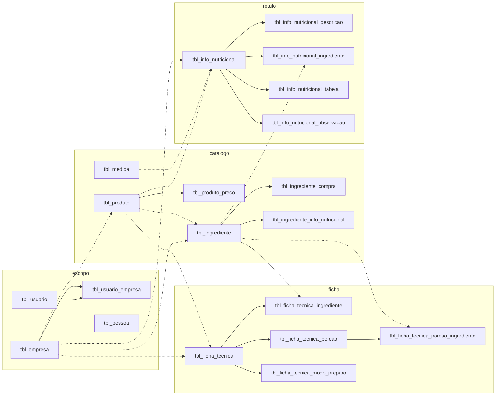

# Relacionamentos — ingredientes (legado)

Separação obrigatória: **declarado no DDL** versus **inferência**.

No núcleo de ingredientes, ficha, nutrição e produto **não há chaves estrangeiras declaradas**. Também não há `UNIQUE` de negócio nem índices secundários. Views e triggers: nenhuma no conjunto selecionado.

Toda aresta abaixo é **inferência**, com base em nomes `ID_*` e denormalização de código/nome.

Arestas pontilhadas: inferência mais fraca (id anulável ou só flag `USO_*`).

## Declarado no DDL

| Tipo | Onde |
|---|---|
| PK auto increment | `tbl_ingrediente`, `tbl_ingrediente_compra`, `tbl_medida`, `tbl_produto`, `tbl_produto_preco`, `tbl_ficha_tecnica` e filhos com id, `tbl_info_nutricional`, `tbl_empresa`, `tbl_usuario`, `tbl_pessoa` |
| Enums de situação | várias tabelas `CADASTRADO` / `CANCELADO` |
| Flags de uso do produto | `USO_INGREDIENTE`, `USO_FICHA_TECNICA`, `USO_INFO_NUTRICIONAL` `NOT NULL` |
| FK / UNIQUE de negócio | **nenhum** no núcleo |
| Associativa com PK | `tbl_usuario_empresa` **não tem PK** |

## Inferências (não confirmar como regra)

### Escopo

- Ingrediente, produto, ficha e info nutricional **pertencem à empresa** quando `ID_EMPRESA` está preenchido.
- `ID_USUARIO` no cadastro pode ser dono, consultor ou último editor — o DDL não distingue de `ID_USUARIO_CADASTRO`.
- Usuário liga-se a N empresas por `tbl_usuario_empresa`.
- `tbl_pessoa.FORNECEDOR` existe, mas **não há coluna** de fornecedor em ingrediente ou compra.

### Catálogo polimórfico

- `tbl_produto` é o item canônico da empresa.
- Se `USO_INGREDIENTE='T'`, o produto pode ter linha em `tbl_ingrediente` (`ID_PRODUTO`).
- Se `USO_FICHA_TECNICA='T'`, pode haver `tbl_ficha_tecnica.ID_PRODUTO`.
- Se `USO_INFO_NUTRICIONAL='T'`, pode haver `tbl_info_nutricional.ID_PRODUTO`.
- Um produto com ficha **e** uso ingrediente **pode** ser preparação reutilizada como ingrediente de outra ficha. O DDL permite o apontamento; a regra de composição aninhada **não está no banco**.

### Ficha

- `tbl_ficha_tecnica_ingrediente` é N:N implícita ficha↔ingrediente, com snapshot de nome, pesos e custo.
- `FC` é o fator de correção da linha (bruto/líquido). **Inferência de domínio**, não comentário de coluna.
- `PESO_BRUTO_ING` / `PESO_LIQUIDO_ING` no cabeçalho são totais agregados das linhas.
- Porção é uma escala da mesma ficha, não uma versão.
- Não há coluna de ordem; a ordem de declaração, se existir, está na aplicação.

### Nutrição e rótulo

- `tbl_ingrediente_info_nutricional` é o perfil do insumo (macros em colunas).
- `tbl_info_nutricional_ingrediente` recalcula `QTDE_*` a partir de quantidade/% — **inferência:** `CARBOIDRATO` etc. são base (provável 100 g) e `QTDE_*` é o valor na receita/rótulo.
- `MC_MEDIDA` → `tbl_medida`.
- `tbl_info_nutricional_tabela.TIPO` distingue bases de apresentação (100 g / porção / VD) — **inferência**.
- Glúten e lactose em `tbl_info_nutricional_descricao` são **manuais**, não derivados.
- Lista de ingredientes e alergênicos do rótulo é texto, não grafo.

### Medida e conversão

- `tbl_medida` não é usada pelo cadastro de ingrediente (`UNIDADE` livre).
- Não existe tabela de conversão.

### Custo

- Preço vigente no cadastro do ingrediente; histórico em `tbl_ingrediente_compra`.
- Custo da linha da ficha é snapshot (`PRECO_KG`, `CUSTO_POR_INGREDIENTE`).
- Grade comercial está em `tbl_produto` / `tbl_produto_preco`, não no insumo.

## Cardinalidades inferidas

| De | Para | Cardinalidade aparente | Confiança |
|---|---|---|---|
| empresa | ingrediente / produto / ficha / info | 1:N | média (coluna anulável) |
| produto | ingrediente | 1:0..1 ou 1:N | baixa |
| ingrediente | compras | 1:N | média |
| ingrediente | info nutricional do insumo | 1:0..1 | baixa (sem PK) |
| ficha | linhas de ingrediente | 1:N | alta (nome da tabela) |
| ficha | porções | 1:N | média |
| info nutricional | linhas / descrição / tabela | 1:N ou 1:0..1 | média |
| medida | info nutricional | 1:N | baixa |

## O que o banco não garante

- Existência do pai (`ID_INGREDIENTE` órfão possível).
- Um único perfil nutricional por ingrediente.
- Código único por empresa.
- Ordem estável das linhas.
- Consistência ficha ↔ rotulagem.
- Isolamento multiempresa na constraint.
