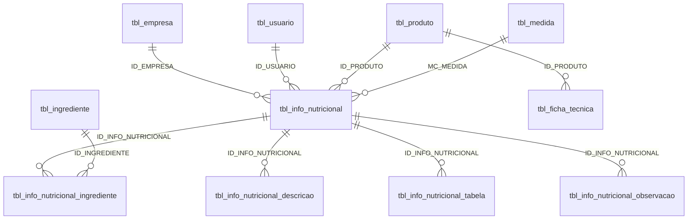

# Relacionamentos — nutrição e rotulagem (legado)

Fonte: metadados e DDL. Sem linhas de negócio. Sem FKs declaradas.

## Inferidas

A última aresta é o **único** elo inferido entre ficha e nutrição: produto compartilhado. Não há `ID_FICHA_TECNICA` no bloco nutricional.

## Duas composições

| Aspecto | Ficha | Nutrição |
|---------|-------|----------|
| Tabela | `tbl_ficha_tecnica_ingrediente` | `tbl_info_nutricional_ingrediente` |
| Quantidade | `PESO_BRUTO` / `PESO_LIQUIDO` / `FC` | `QUANTIDADE` / `PERCENTUAL` |
| Unidade | Ausente | Ausente |
| Ordem | Ausente | Ausente |
| PK na linha | Sim | **Não** |
| Nutrientes na linha | Não | `BASE_*` + `QTDE_*` |
| Declaração textual | Não | Cabeçalho + `descricao` |

O DDL **não impede** listas diferentes, quantidades divergentes ou omissão de um lado. Sem rastreio de origem comum.

## Calculado ou armazenado?

- Macros no cabeçalho: colunas persistidas.  
- Linha: pares `BASE_*` / `QTDE_*` sugerem valor de origem e valor na receita — **inferência**.  
- Tabela impressa: `varchar` — formatação persistida, não fórmula.  
- Sem trigger, sem view, sem coluna de “método de cálculo”.

**Questão normativa:** se o rótulo deve ser derivado ou pode ser editado à mão. O DDL permite edição independente.

## Rótulo vs ficha

O rótulo **pode** se afastar da ficha: estruturas distintas, sem FK, sem versão cruzada, textos de ingredientes duplicados (cabeçalho, descrição, linhas).

Riscos:

1. Ingredientes da ficha ≠ lista do rótulo.  
2. Bruto/líquido da ficha ≠ quantidade nutricional.  
3. Totais do cabeçalho ≠ soma das linhas.  
4. Flags de glúten/lactose manuais vs composição.  
5. Produto com os três `USO_*` sem uma fonte única.  
6. `%VD` e kcal como texto, sem regra versionada.

## Medida caseira

`MC_MEDIDA` sem FK. `tbl_medida` sem fator de conversão — conversão para gramas **não está no DDL**.

## Documentos

Nenhuma tabela de arquivo/PDF/rótulo gerado. Impressão é flag de usuário. POP e lançamento financeiro são outro domínio.
