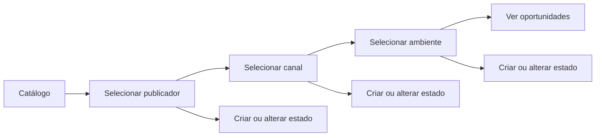
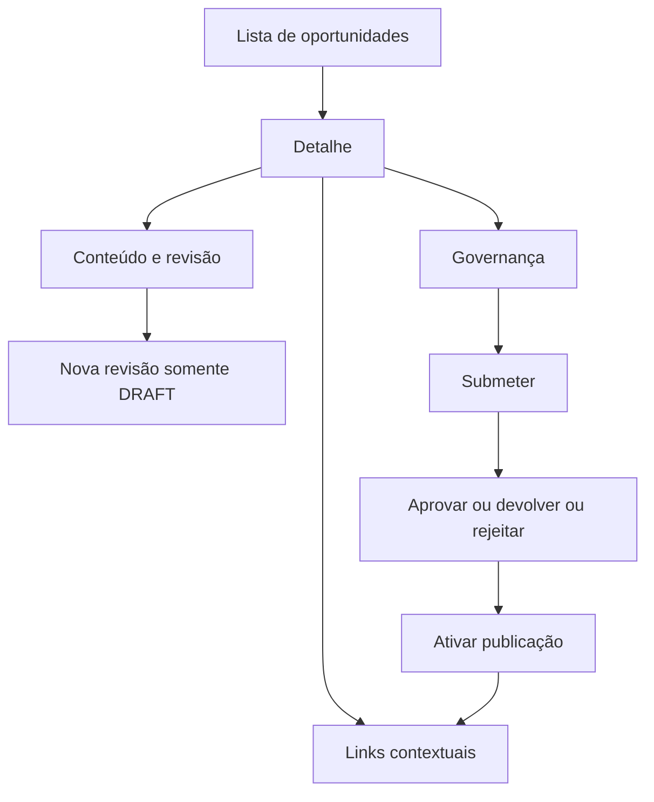
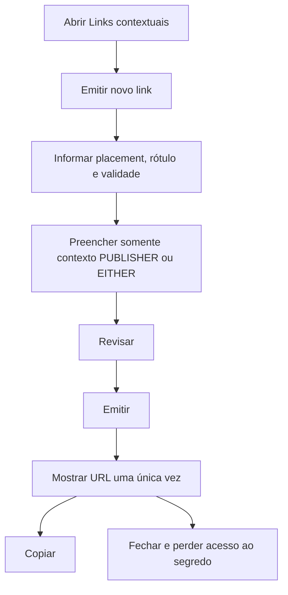
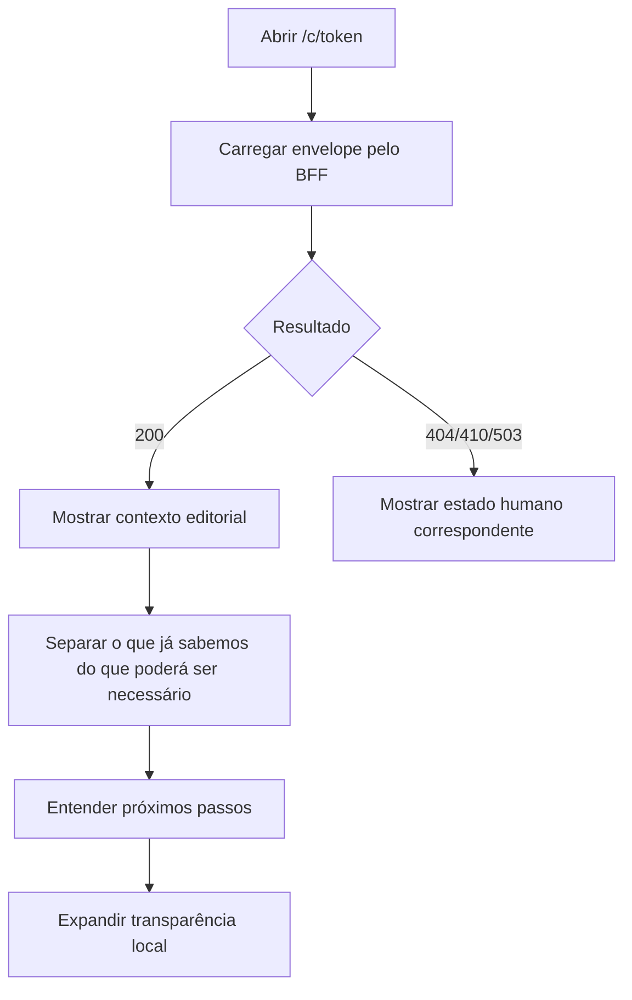

# SEGSENSE_UX_003 — Fluxos e wireframes das interfaces

## Controle

| Campo | Valor |
|---|---|
| Projeto | SegSense |
| Identificador | SEGSENSE_UX_003 |
| Título | Arquitetura de navegação, fluxos e wireframes |
| Categoria | UX — fluxos e interfaces |
| Versão | 1.0 |
| Status | Aprovado e implementado no PRM_008 |
| Data | 11/09/2026 |
| Dependências | SEGSENSE_UX_001; SEGSENSE_UX_002; SEGSENSE_API_005 |

## 1. Objetivo

Definir como as pessoas percorrem o admin editorial e a página pública `/c/{token}` antes de qualquer implementação do PRM_008.

Este documento fecha:

- navegação e hierarquia;
- fluxos principais;
- wireframes de referência;
- comportamento responsivo;
- estados de carregamento, ausência e falha;
- divulgação progressiva de detalhes técnicos;
- ação pública honesta enquanto a jornada ainda não existe.

Não implementa código, autenticação, consentimento, coleta de dados, cotação ou integração.

## 2. Princípios de fluxo

1. A pessoa sempre sabe em qual contexto está: Publicador → Canal → Ambiente → Oportunidade.
2. Seleção e ação não são misturadas na mesma lista.
3. A ação principal de cada tela é única e visível.
4. Estados técnicos são traduzidos para linguagem humana.
5. O admin nunca se parece com a jornada do visitante.
6. A página pública não promete continuidade ainda inexistente.
7. Voltar preserva o nível anterior e, quando seguro, a seleção.
8. URL pública continua contendo somente o token opaco.

## 3. Mapa de navegação

```text
Admin
├── Início
│   └── estado do ambiente
├── Catálogo
│   ├── Publicadores
│   │   └── Canais
│   │       └── Ambientes
│   └── seleção atual persistida somente no estado local da navegação
└── Oportunidades
    └── Detalhe da oportunidade
        ├── Conteúdo e revisões
        ├── Governança
        └── Links contextuais
            ├── Emitir
            ├── Ver metadados
            └── Revogar

Público
└── /c/{token}
    ├── Carregamento
    ├── Convite válido
    │   ├── Contexto já conhecido
    │   ├── Informações que poderão ser necessárias
    │   ├── Transparência
    │   └── Entender próximos passos
    └── Estado indisponível
```

O token nunca aparece como texto da página, breadcrumb, título, analytics ou detalhe técnico.

## 4. Rotas conceituais

O PRM de implementação deve escolher rotas React estáveis, sem expor IDs na linguagem visual. Sugestão:

```text
/admin
/admin/catalogo
/admin/oportunidades
/admin/oportunidades/:opportunityId
/c/:token
```

IDs em rota administrativa são aceitáveis tecnicamente, mas nunca servem como rótulo visível. O frontend público não replica o token em links internos.

## 5. Shell administrativo

### 5.1 Cabeçalho

```text
┌──────────────────────────────────────────────────────────────────────┐
│ [logo] SegSense      Início   Catálogo   Oportunidades      Ambiente │
└──────────────────────────────────────────────────────────────────────┘
```

- altura compacta;
- navegação horizontal;
- item atual indicado por texto, peso e marca visual, não só cor;
- “Ambiente” mostra estado humano do BFF; detalhes ficam recolhidos;
- sem avatar ou menu de conta enquanto não existir IdP.

### 5.2 Página-base

```text
Catálogo / Publicador / Canal / Ambiente

Título da página                              [Ação principal]
Descrição curta

[Aviso contextual, somente quando necessário]

Conteúdo
```

## 6. Fluxo administrativo: catálogo



### Wireframe

```text
Catálogo
Organize onde cada oportunidade poderá aparecer.

┌ Publicadores ──────────┐ ┌ Canais ───────────────┐ ┌ Ambientes ───────────┐
│ ● Cooperativa Aurora   │ │ ● Portal editorial    │ │ ● Notícias agrícolas │
│   Rede Parceira        │ │   Aplicativo           │ │   Área do produtor   │
│                        │ │                        │ │                      │
│ [+ Novo publicador]    │ │ [+ Novo canal]         │ │ [+ Novo ambiente]    │
└────────────────────────┘ └────────────────────────┘ └──────────────────────┘

Contexto selecionado
Cooperativa Aurora › Portal editorial › Notícias agrícolas
                                             [Ver oportunidades]
```

Regras:

- desktop: três colunas coordenadas;
- tablet: duas colunas e detalhe abaixo;
- compacto: uma etapa por vez com breadcrumb e botão “Continuar”;
- listas mostram nome, tipo e estado humano;
- detalhes técnicos ficam recolhidos;
- seleção não executa alteração.

## 7. Fluxo administrativo: oportunidade



### Lista

```text
Oportunidades
Notícias agrícolas                                      [Nova oportunidade]

Buscar por nome ou chave pública [________________]  Estado [Todos ▾]

Proteção para quebra de safra                 Publicada
Contexto dinâmico · revisão 3                 [Abrir]

Seguro contextual para máquinas               Rascunho
Contexto híbrido · revisão 1                   [Abrir]
```

Busca e filtro só devem ser implementados quando houver suporte real; até lá, omiti-los, em vez de filtrar dados parcialmente no browser.

### Detalhe

```text
Oportunidades / Proteção para quebra de safra

Proteção para quebra de safra                         [Ação disponível]
Publicada · revisão aprovada 3

[Conteúdo] [Governança] [Links contextuais]

Painel da aba selecionada
```

As abas são visões irmãs do mesmo objeto:

- Conteúdo: revisão corrente e histórico;
- Governança: estado, ações e linha do tempo;
- Links contextuais: emissão, lista e revogação.

Somente ações realmente retornadas ou permitidas pelo backend ficam habilitadas. A indisponibilidade deve ser explicada.

## 8. Fluxo administrativo: emissão do link



### Formulário

```text
Emitir link contextual

Identificação
Onde este link será usado?        [Artigo — quebra de safra          ]
Chave de publicação               [artigo-quebra-safra-2026          ]
Válido até                        [01/10/2026  00:00] [UTC]

Contexto fornecido pelo publicador
Tipo de risco                     [Quebra de safra ▾]
Tipo de cultura                   [Soja ▾]

Os valores ficam protegidos no SegSense e não aparecem no endereço.

                                  [Cancelar] [Revisar emissão]
```

### Revisão e emissão

```text
Revise antes de emitir

Uso: Artigo — quebra de safra
Validade: até 01/10/2026, 00:00 UTC
Contexto: Tipo de risco — Quebra de safra; Cultura — Soja

O endereço será mostrado apenas uma vez.

                                  [Voltar] [Emitir link]
```

### Exposição única

```text
Link emitido

Copie e guarde este endereço agora. Ele não poderá ser recuperado depois.

[ https://.../c/•••••••••••••••••••••••••••• ] [Copiar endereço]

☑ Endereço copiado

                                                     [Concluir]
```

O token pode aparecer integralmente no campo somente nessa resposta. Não usar máscara que impeça a cópia. Após fechar, a lista mostra apenas rótulo, placement, validade e estado.

## 9. Fluxo administrativo: revogação

```text
Revogar este link?

O endereço deixará de funcionar imediatamente e não poderá ser reativado.

Motivo da revogação
[____________________________________________________________]
Não inclua dados pessoais.

                         [Manter link] [Revogar definitivamente]
```

- foco inicial em “Manter link”;
- ação destrutiva não é a tecla Enter implícita;
- ao concluir, devolver foco ao item revogado;
- atualizar estado e eventos;
- não mostrar novamente a URL.

## 10. Fluxo público válido



### Wireframe compacto

```text
              [logo SegSense]

Um convite contextual

Proteção para situações de quebra de safra
Este conteúdo foi preparado para o contexto que você estava consultando.

┌ Contexto deste convite ─────────────────────────┐
│ Tipo de risco                                   │
│ Quebra de safra                                 │
│                                                │
│ Cultura                                        │
│ Soja                                           │
└────────────────────────────────────────────────┘

Para uma próxima etapa
Poderão ser necessárias informações adicionais. Nenhuma informação pessoal
está sendo solicitada agora.

Vigente até 1º de outubro de 2026.

[ Entender os próximos passos ]

Nenhuma cotação, análise de elegibilidade ou recomendação foi realizada.
```

### CTA decidido para o PRM_008

O CTA funcional do PRM_008 será:

```text
Entender os próximos passos
```

Comportamento:

- ação local, sem chamada de negócio;
- expande ou desloca o foco para uma seção de transparência;
- explica que a continuidade ainda não está disponível;
- não cria ContextInstance;
- não coleta campo USER;
- não registra consentimento;
- não materializa objetivo;
- não chama Spider ou seguradora.

O `callToActionLabel` editorial vindo da API não será usado como botão ativo enquanto sua ação real não existir. Ele poderá aparecer como finalidade em texto humano, por exemplo: “Finalidade deste convite: avaliar opções de proteção”. Isso evita transformar “Contratar” ou “Cotar agora” em promessa falsa.

No PRM_009, o CTA poderá mudar somente quando houver fluxo real de transparência, consentimento e coleta mínima.

## 11. Transparência pública

Seção inicialmente abaixo do CTA ou recolhida com controle acessível:

```text
O que acontece agora?

• O SegSense reconheceu apenas o contexto editorial associado a este convite.
• Nenhuma informação pessoal foi coletada nesta página.
• Nenhuma seguradora recebeu informações.
• Nenhuma cotação ou recomendação foi realizada.

A continuidade desta jornada ainda não está disponível.
```

Não mencionar arquitetura, BFF, hash, token, Spider, Icatu ou status técnico.

## 12. Estados públicos

### Carregando

```text
[logo]
Preparando este convite…
```

Após atraso perceptível, mostrar texto. Não usar percentual ou etapas fictícias.

### Não encontrado

```text
[logo]
Este endereço não está disponível.
Verifique se ele foi copiado por completo ou retorne ao conteúdo de origem.
```

### Revogado

```text
[logo]
Este convite não vale mais.
Ele foi encerrado por quem o publicou.
```

### Expirado

```text
[logo]
Este convite não está mais vigente.
O período de acesso terminou.
```

### Temporariamente indisponível

```text
[logo]
Temporariamente indisponível.
Não foi possível carregar este convite agora. Tente novamente em instantes.
[Tentar novamente]
```

### Terminal

```text
[logo]
Este convite não está mais disponível.
Não há nenhuma ação necessária.
```

Não oferecer “tentar novamente” em estados terminais. Não criar retorno externo sem URL segura previamente contratada.

## 13. Comportamento responsivo

### Público

- 320–639 px: uma coluna, padding de 16 px, CTA com largura total;
- 640–1023 px: conteúdo central até 640 px;
- 1024 px ou mais: conteúdo central até 720 px, sem laterais decorativas vazias;
- logo entre 120 e 160 px no compacto e até 180 px no amplo;
- contexto em definição vertical no compacto e pares lado a lado somente quando legíveis;
- sem scroll horizontal e sem ação dependente de hover.

### Admin

- amplo: listas coordenadas e, no detalhe, conteúdo de até 1200–1440 px;
- intermediário: painéis em duas colunas quando couberem;
- compacto: painéis empilhados, ações principais em largura disponível;
- abas podem quebrar em duas linhas, mas não virar carrossel horizontal;
- diálogo ocupa largura quase total no compacto, com margem mínima de 16 px.

## 14. Foco e teclado

- mudança de rota posiciona foco no `h1` ou início do conteúdo principal;
- erro de formulário move foco para resumo e mantém vínculos com campos;
- abrir diálogo move foco para o título ou primeira ação segura;
- fechar diálogo devolve foco ao acionador;
- após emissão, foco vai para o aviso “Link emitido”;
- após copiar, `aria-live` anuncia “Endereço copiado”;
- ao abrir transparência pública, foco não salta inesperadamente; se houver deslocamento explícito, usar foco programático no título da seção;
- retry público mantém o botão operável e anuncia carregamento.

## 15. Dados e linguagem por superfície

| Informação | Admin | Público |
|---|---|---|
| Nome do publicador/canal/ambiente | visível quando útil | não expor |
| Revisão e estado | humano; técnico recolhido | não expor |
| Placement | visível | não expor |
| Token completo | somente após emissão | nunca como conteúdo |
| Token hint | detalhe técnico recolhido | nunca |
| Contexto PUBLISHER | editável antes de emitir | visível em linguagem humana |
| Campo USER ainda vazio | definição editorial | explicação do que poderá ser necessário |
| Objective template | editor admin | nunca no PRM_008 |
| Auditoria | recolhida | nunca |

## 16. Critérios de aceite dos wireframes

1. Admin e público são visual e semanticamente distintos.
2. Navegação do admin preserva a hierarquia contextual.
3. Cada tela tem uma ação principal inequívoca.
4. Emissão explica que a URL só será mostrada uma vez.
5. Revogação explicita irreversibilidade.
6. A página pública distingue contexto conhecido de informação futura.
7. CTA público executa apenas transparência local.
8. Nenhum estado oferece ação impossível.
9. Nenhum wireframe expõe token, UUID, enum ou código HTTP como linguagem principal.
10. Layout público funciona desde 320 px.
11. Foco e teclado estão definidos nos momentos críticos.
12. Nada simula seguro, cotação, consentimento, Spider ou Icatu.

## 17. Gate anterior ao PRM_008

Antes de emitir o PRM_008:

1. aprovar UX_002 e UX_003;
2. incorporar ambos ao índice oficial por prompt documental ou pelo próprio PRM_008;
3. decidir se o refinamento visual do admin será feito junto do PRM_008 ou em prompt separado;
4. confirmar o CTA temporário “Entender os próximos passos”;
5. confirmar que não haverá imagem editorial externa nesta primeira página pública.

Até esse gate, não implementar `/c/{token}`.
