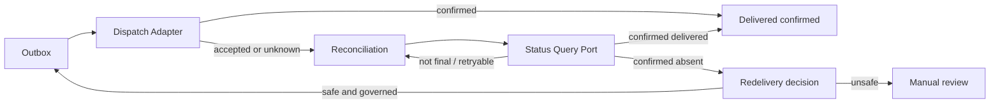

# SPIDER-PROMPT-008 — Reconciliação de Callback, Confirmação e Recovery

## Objetivo

Distinguir **dispatch / ACK / aceite / confirmação**, persistir ciclos de reconciliação governada e permitir recovery de leases — sem transporte real e sem alterar outcome da execução.

## Baseline

- Antes: **105 tests, 0 failures** (`mvn test`).
- Contrato PROMPT-007 preservado: Outbox, Mock dispatch, `UNKNOWN` sem retry cego, endpoint legado intacto.

## Diferença semântica

| Conceito | Significado |
|---|---|
| Dispatch | Tentativa de envio via Adapter |
| ACK / 2xx técnico | Evidência de transporte; **não** confirmação de negócio por default |
| Aceite inconclusivo | Destino pode ter recebido; requer query ou modo síncrono final |
| Confirmação | Evidência autoritativa (`SYNCHRONOUS_ACK_IS_FINAL` explícito **ou** status query `CONFIRMED_DELIVERED`) |

`UNKNOWN` **nunca** promove para `DELIVERED` por tempo decorrido e **nunca** reenvia cegamente.

## Confirmation modes

- `SYNCHRONOUS_ACK_IS_FINAL`
- `STATUS_QUERY_REQUIRED`
- `STATUS_QUERY_WHEN_UNCERTAIN`
- `NO_CONFIRMATION_AVAILABLE`

Fixados no snapshot `ExecutionCallbackContext` junto com `statusQueryBindingRef`, `reconciliationPolicyRef`, `redeliverySafety`, `deliveryKeyHash`.

## Redelivery safety

- `IDEMPOTENT_BY_DELIVERY_KEY`
- `QUERY_BEFORE_REDELIVERY`
- `NEVER_AUTOMATIC` (default conservador — nunca redispatch automático)

## Reconciliation policy

Catálogo `ConfiguredCallbackReconciliationPolicyCatalog` **vazio por default**. Fixtures só em teste.

## Status query port

`CallbackDeliveryStatusQueryPort` + `ConfiguredCallbackStatusQueryBindingResolver` (mapa explícito, sem fallback).

Somente `MockCallbackDeliveryStatusQueryAdapter` (cenários determinísticos, sem rede/sleep).

## Fluxo



## Persistência

Migration `V20260821f__tb_callback_reconciliation.sql` + `database/init.sql`:

- colunas de confirmação no context;
- lease/confirmation no outbox;
- `tb_callback_reconciliation` (unique por outbox);
- `tb_callback_reconciliation_attempt` (unique reconciliation+attempt).

Adapters: memory + JPA.

## Claim / lease

Claim condicional com `workerId`, `leaseUntil` e optimistic version. Dois workers: no máximo um consulta o mesmo record por attempt.

## Recovery

`CallbackProcessingRecoveryService.recover(now)` — invocável; **sem scheduler**. Leases expirados → `RETRY_SCHEDULED` ou `EXPIRED`. Dispatch interrompido continua indo para `UNKNOWN` (PROMPT-007).

## Late confirmation

Confirmação após `EXPIRED` não muta silenciosamente o record expirado neste incremento; permanece observação operacional para incremento futuro (manual review / late observation). Documentado como limitação.

## Status query Spider

`CallbackDeliverySummary` evoluiu com confirmation/reconciliation fields seguros (sem lease owner, binding físico, external ref ou payload).

## Flags

```properties
spider.callback.reconciliation.enabled=false
spider.callback.reconciliation.batch-size=25
spider.callback.reconciliation.lease-duration=PT30S
spider.callback.reconciliation.max-batch-size=100
spider.callback.recovery.enabled=false
```

Processors **não** agendam sozinhos. Mock status query **não** é binding produtivo automático.

## Ops internas

`ReconcileCallbackNowUseCase` / `RecoverCallbackProcessingUseCase` — deny-by-default via `CallbackOpsAuthorizationPort`. Sem Controller HTTP.

## Testes

Suíte completa após o incremento: **115 tests, 0 failures**. Cobertura: policies, mock status, processor, redelivery `NEVER_AUTOMATIC`, claim concorrente, deny-by-default ops, regressão Outbox.

## Limitações restantes

- Sem scheduler/worker deployment;
- Sem consulta HTTP real ao destino;
- Sem late-observation store dedicado;
- Sem dashboard operacional / Control Plane;
- Sem IdP/mTLS/HMAC/KMS;
- Endpoint legado `POST /v1/products/orchestrate` intocado;
- HTTP canônico continua desabilitado por default.
