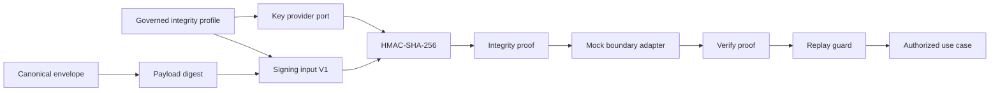

# SPIDER-PROMPT-009 — Integridade HMAC, Anti-Replay e Rotação de Chaves

## Baseline

- Antes: **115 tests, 0 failures**
- Objetivo: camada criptográfica governada (HMAC-SHA-256), Replay Guard, fingerprint v2 opcional, Mock Key Provider — sem KMS/IdP/transporte real.

## Trust boundaries

HMAC prova **integridade + conhecimento de segredo compartilhado** dentro de um Integrity Profile. **Não** substitui OAuth/OIDC, mTLS, identidade de workload, autorização de negócio nem não repúdio.

Authn/Authz deny-by-default permanece separado e obrigatório.

## Integrity Profile

Purposes: `CALLBACK_DELIVERY`, `CALLBACK_STATUS_QUERY`, `EXTERNAL_SIGNAL`, `SENSITIVE_FINGERPRINT`.

Algoritmo neste incremento: **somente `HMAC_SHA_256`**.

Catálogo `ConfiguredIntegrityProfileCatalog` **vazio por default**. Fixtures só em teste.

## Key material

Porta `CryptographicKeyMaterialProviderPort` → `CryptographicKeyHandle` (AutoCloseable, sem getter público de bytes, `toString` mascarado).

`MockCryptographicKeyMaterialProvider`: material de teste v1/v2 + revoked; **não** bean produtivo (`spider.security.mock-key-provider.enabled=false`).

Segredo nunca em modelo, banco, logs ou `application.yml`.

## Canonicalização V1

`SPIDER_SIGNING_INPUT_V1` — campos length-prefixed UTF-8; null ≠ empty; domain separators distintos:

- `SPIDER/CALLBACK_DELIVERY/V1`
- `SPIDER/CALLBACK_STATUS_QUERY/V1`
- `SPIDER/EXTERNAL_SIGNAL/V1`
- `SPIDER/SENSITIVE_FINGERPRINT/V1`

Payload entra como **digest SHA-256** (base64url), não como bytes concatenados ambíguos.

## Fluxo



- **Callback**: assina antes de `CallbackDeliveryPort`; falha de assinatura não chama Adapter e não muda execution outcome.
- **Status query**: proof próprio (domain separator distinto) quando perfil aplicável.
- **Signal**: gate de verify + Replay Guard antes do efeito; Inbox permanece camada semântica distinta.

## Replay Guard

`tb_security_replay_guard` — unique `(replay_scope_hash, nonce_hash, fingerprint_version)`.

Decisões: `RESERVED` | `DUPLICATE_SAME_MESSAGE` | `REPLAY_CONFLICT` | `EXPIRED_PROOF`.

Nonce puro não é persistido (apenas hash). Cleanup invocável, sem scheduler.

## Rotação

Assinatura usa `activeSigningKeyVersion` exata. Verificação aceita somente `acceptedVerificationKeyVersions`. Sem fallback silencioso. Revoked falha imediatamente.

## Compatibilidade fingerprint

- **v1 SHA-256** (default): `Sha256IdempotencyKeyHash` permanece para idempotência/Inbox/delivery key hash.
- **v2 HMAC**: `SensitiveFingerprintService` somente com `spider.security.sensitive-fingerprint-v2.enabled=true` + provider/perfil.
- Lookup legacy documentado; remoção de v1 fica para incremento futuro.

## Proof metadata persistida

Somente `proof_profile_ref`, `proof_key_version`, `proof_mac_fingerprint` (sufixo) — **não** MAC/nonce completos.

## Flags (defaults seguros)

```properties
spider.security.integrity.enabled=false
spider.security.replay-guard.enabled=false
spider.security.replay-guard.cleanup-enabled=false
spider.security.sensitive-fingerprint-v2.enabled=false
spider.security.mock-key-provider.enabled=false
```

Integrity habilitada sem provider/catálogo válido: falha fechado (bean `MessageIntegrityService` exige provider).

## Testes

Suíte final: **130 tests, 0 failures**. Cobertura: golden/canonicalização, HMAC round-trip/tamper, rotação v1→v2, revoked, Replay Guard duplicate/conflict/cleanup, ops deny-by-default, regressão 115.

## Limitações restantes

- Sem KMS/Vault/HSM
- Sem mTLS/OAuth/OIDC
- Sem transporte HTTP real de callback/query
- Fingerprint v2 não migrado in-place para todas as tabelas (abstração pronta; v1 permanece default)
- Sem Control Plane de rotação
- Late confirmation / scheduler workers fora de escopo
