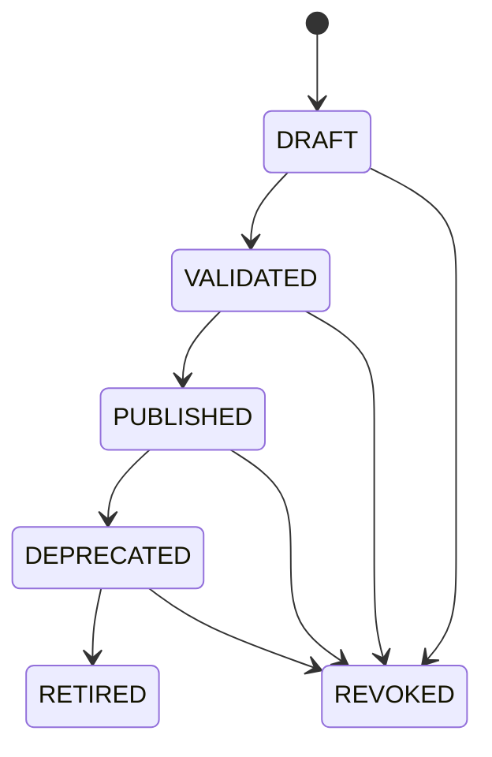
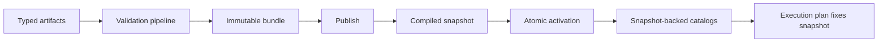

# SPIDER-PROMPT-010 — Control Plane, Bundles, Snapshots e Publicação Governada

## Baseline

- Antes: **130 tests, 0 failures**
- Modo default: `spider.governance.mode=STATIC` / `control-plane.enabled=false` — catálogos estáticos atuais preservados.

## Inventário de catálogos (inclusão)

| Tipo | Porta existente | Inclusão CP |
|------|-----------------|-------------|
| Route | `RouteCatalogPort` / `InMemoryRouteCatalog` | Incluído (`ROUTE_DEFINITION`) |
| Retry | `RetryPolicyCatalogPort` | Incluído |
| Wait | `WaitPolicyCatalogPort` | Incluído |
| Callback definition/delivery/reconciliation | ports Configured* | Incluído |
| Integrity profile | `IntegrityProfileCatalogPort` | Incluído |
| Binding resolvers | Callback/Status query | Descriptor lógico `MOCK` apenas |
| Key material / URLs | — | **Excluído** (fora de escopo) |

## Princípios

1. Engine **não** consulta tabelas admin por step — snapshot imutável no início.
2. **Publicar ≠ ativar**.
3. Rollback = reativação de snapshot publicado anterior.
4. Artefato sem segredo/destino físico.
5. Snapshot só com tipos de domínio fechados (sem JSON bruto na Engine).

## Lifecycles



Neste slice, `validateArtifact` promove DRAFT→VALIDATED→PUBLISHED para elegibilidade de bundle.

## Fluxo



## Validação

Categorias: STRUCTURAL, REFERENTIAL, COMPATIBILITY, SECURITY, OPERABILITY.

Regras mínimas: refs existentes, digest, lifecycle elegível, route published com steps, somente binding MOCK, bundle não-vazio exige rota, errors bloqueiam publish.

## Publicação / ativação

- Publish compila snapshot + marca bundle PUBLISHED; **não** ativa.
- Activation compare-and-set por scope + sequence; cache atualizado após commit.
- Reactivate previous cria nova sequence.
- Approval: `require-distinct-publisher=true` por default.

## Fixação na execução

`ExecutionGovernanceFixation` + `tb_execution_governance_fixation` — snapshot/bundle/digest/sequence por executionId. Em modo STATIC não é obrigatório.

## Authz / bootstrap

- `GovernanceAuthorizationPort` deny-by-default.
- Bootstrap Mock: flags `spider.governance.bootstrap.enabled=false`.
- Sem Controller HTTP.

## Flags

```properties
spider.governance.mode=STATIC
spider.governance.control-plane.enabled=false
spider.governance.require-distinct-publisher=true
spider.governance.require-distinct-activator=true
spider.governance.bootstrap.enabled=false
```

## Migrations

`V20260821h__tb_governance_control_plane.sql` + `init.sql`.

## Testes

- Baseline preservada: 130
- Novos: +8 (Control Plane + authz)
- **Final: 138 tests, 0 failures**

Cobertura: refs/`latest` rejeitado, digest/tamper, binding URL/secret rejeitado, validate→publish→activate, validation errors bloqueiam publish, distinct publisher, deny-by-default, regressão STATIC.

## Limitações restantes

- JPA adapters completos por tabela (schema pronto; runtime default memory stores)
- Snapshot-backed catalogs para todos os ports além de Route (padrão estabelecido)
- Fixação automática no `DefaultCanonicalExecutionEngine` submit (store pronto; wiring completo no modo CONTROL_PLANE fica como hardening)
- Bootstrap classpath loader
- Propagação distribuída de cache / UI / HTTP admin
- Bindings físicos reais
