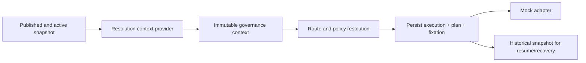

# SPIDER-PROMPT-011 — Control Plane JPA, Catálogos Completos e Fixação no Runtime

## Baseline

- Antes: **138 tests, 0 failures**
- Lacunas do Prompt 010 fechadas neste incremento.

## Lifecycle corrigido

| Comando | Estado resultante |
|---------|-------------------|
| register | DRAFT |
| validate | VALIDATED (nunca PUBLISHED) |
| publishArtifact | PUBLISHED (exige VALIDATED + authz + distinct publisher) |

## Matriz Store Port

| Port | Memory | JPA | Testes |
|------|--------|-----|--------|
| ArtifactStore | InMemoryGovernanceStores | JpaGovernanceStoresAdapter | ControlPlane + E2E |
| BundleStore | idem | idem | idem |
| ValidationReportStore | idem | idem | idem |
| SnapshotStore | idem (+ SnapshotCodec JSON) | idem | codec/digest |
| ActivationStore | CAS memory | CAS + history table | activation |
| AuditStore | append list | JPA append | audit |
| FixationStore | InMemoryExecutionGovernanceFixationStore | JpaExecutionGovernanceFixationStoreAdapter | E2E fixation |

## Fluxo runtime CONTROL_PLANE

## Catálogos snapshot-backed

Route, Retry, Wait, Callback definition/delivery/reconciliation, Integrity, Adapter/Callback/StatusQuery binding resolvers.

## Mode

- `STATIC` (default): catálogos configured/empty atuais; Engine não resolve Control Plane.
- `CONTROL_PLANE` + `enabled=true`: um `GovernanceResolutionContext` por submit; sem fallback STATIC.

## Fixation

Campos: mode, scope, snapshotId, bundleCode/version, digests, activationSequence, fixedAt.  
Persistida após plan e **antes** do Adapter.

## Bootstrap

`ClasspathGovernanceBootstrapLoader` — allowlist prefix, off por default, via use cases.

## Migrations

- `V20260821h` (baseline CP)
- `V20260821i` — activation history + colunas expandidas de fixation

## Testes

- Baseline: 138
- Final: **140 tests, 0 failures**
- Inclui `validateDoesNotPublish` e `ControlPlaneRuntimeE2ETest` (CONTROL_PLANE → Mock Adapter + fixation)

## Limitações restantes

- Propagação distribuída de activation/cache
- UI/HTTP admin
- Bindings físicos / KMS / IdP
- Wiring completo de resume path para todos os processors de callback (padrão provider histórico disponível)
