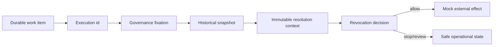

# SPIDER-PROMPT-012 — Governança Assíncrona, Resume, Callback e Recovery

## Baseline

- Antes: **140 tests, 0 failures**
- Depois: **144 tests, 0 failures** (+3 loader/revocation, +1 E2E v1 vs v2)
- Lacuna: porta histórica existia; resume/callback/wait/recovery ainda usavam catálogos globais.

## Matriz de fluxos

| Fluxo | Work item | Linkage | Antes | Depois | Adapter |
|-------|-----------|---------|-------|--------|---------|
| Submit | execution | fixation | snapshot ativo | snapshot ativo (só nova) | Mock |
| Resume | wait | executionId | catalogs globais | HistoricalLoader → fixation | Mock |
| Signal | inbox/wait | executionId | profile global | context histórico + revocation | — |
| Wait expiry | wait | executionId | WaitPolicy global | WaitPolicy do snapshot fixado | — |
| Outbox | outbox | executionId | catalogs globais | definition/policy/binding históricos | Mock |
| Reconciliation | reconciliation | executionId | policy/binding globais | policy/binding históricos | Mock query |
| Recovery | lease/outbox | executionId | reprocess global | loader antes de efeito | Mock |

Decisão de schema: **não** adicionar `governance_snapshot_id` redundante nos work items — `executionId` já é ownership inequívoco da fixation. Verificação é via loader.

## Loader

`HistoricalGovernanceContextLoader` / `DefaultHistoricalGovernanceContextLoader`

- `loadForExecution` / `loadForWorkItem`
- Erros tipados: `GOVERNANCE_FIXATION_NOT_FOUND`, `SNAPSHOT_NOT_FOUND`, `DIGEST_MISMATCH`, `WORK_ITEM_OWNER_MISMATCH`
- Cache histórico por snapshot id (separado do active pointer)
- JPA/bloqueante em `boundedElastic`

## Runtime support

`GovernedRuntimeSupport` — resolve context + `GovernanceInFlightDecisionService` antes de efeito.

`RevokedSnapshotInFlightPolicy` default: `STOP_BEFORE_NEXT_EXTERNAL_EFFECT`.

## Wiring

- `ExecutionResumeService` — SIGNAL_APPLICATION + retry/binding históricos
- `WaitExpiryProcessor` — WaitPolicy fixada
- `CallbackOutboxProcessor` — delivery/definition/binding históricos
- `CallbackReconciliationProcessor` — reconciliation/status-query históricos

## Fluxo



## Flags

```properties
spider.governance.historical-context-cache.enabled=true
spider.governance.in-flight-revocation-check.enabled=true
spider.governance.revoked-in-flight-policy=STOP_BEFORE_NEXT_EXTERNAL_EFFECT
```

Defaults de mode/control-plane permanecem STATIC/false.

## Limitações restantes

- Propagação distribuída de revocation/cache
- Cleanup físico de snapshots
- Wiring fino de ExternalSignalIntegrityGate profile histórico (loader disponível)
- Scheduler/worker deployment
