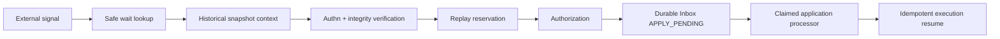

# SPIDER-PROMPT-013 — Signal Ingress Governado

## Baseline

- Antes: **144 tests, 0 failures**
- Depois: **147 tests, 0 failures** (+codec Signal Definition, +lease Inbox, +E2E histórico v1 vs v2)
- Lacunas: `ExternalSignalIntegrityGate` usava profile do caller/catálogo ativo; ingress aplicava resume inline; Inbox sem `APPLY_PENDING`/lease.

## Threat model (curto)

| Ameaça | Mitigação |
|--------|-----------|
| Forged/tampered signal | HMAC + digest no profile histórico |
| Replay idêntico | Replay Guard + Inbox dedup |
| Nonce reuse divergente | `REPLAY_CONFLICT` |
| Wait enumeration | Outcome externo normalizado (ORPHAN/REJECTED) |
| Cross-execution substitution | Wait ownership vs claim |
| Profile/key downgrade | Profile autoritativo do snapshot fixado |
| Crash após verify | Inbox `APPLY_PENDING` + envelope store |
| Concurrent duplicate | Unique + claim/lease |

## Signal Definition

Artifact `EXTERNAL_SIGNAL_DEFINITION` — codec fechado, snapshot-backed catalog, elegível só `PUBLISHED`.

Wait fixa `signalDefinitionRef` / `integrityProfileRef` a partir da Wait Policy no create.

## Pipeline



Ordem: structural → wait → historical context → contract/event → integrity/replay → revocation → authz → Inbox APPLY_PENDING (sem Adapter/resume).

`spider.signal.ingress.durable-application.enabled=false` (default): delega ao fluxo legado inline (compat).

## Processor / recovery

- `ExternalSignalApplicationProcessor` — claim/lease APPLY_PENDING → APPLYING → resume → APPLIED
- `ExternalSignalApplicationRecoveryService` — opt-in; lease expirado / ambiguidade → MANUAL_REVIEW

## Persistência

Migration `V20260821j__tb_inbox_signal_application.sql` — colunas lease/attempt/signal refs; wait signal/profile refs.

Digest V1: `;signals=N` só quando N>0 (compat snapshots sem signal defs).

## Flags

```properties
spider.canonical.signal-http.enabled=false
spider.signal.ingress.durable-application.enabled=false
spider.signal.application.batch-size=25
spider.signal.application.lease-duration=PT30S
spider.signal.application.max-attempts=5
spider.signal.application.recovery-enabled=false
spider.signal.max-envelope-bytes=262144
```

## Limitações

- Envelope verificado em memory store (não criptografia at-rest)
- HTTP ainda chama `ExternalSignalApplicationPort` (legado); ingress use case disponível para wiring
- Sem scheduler; processor invocável
- Authn/authz reais fora de escopo
