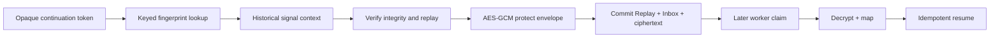

# SPIDER-PROMPT-014 — Token Opaco, Envelope Protegido e HTTP Durável

## Baseline

- Pré: **147** testes, 0 failures.
- Lacunas confirmadas: envelope memory-only; lookup `executionId+stepId`; HTTP inline; sem AES at-rest; sem retention/lifecycle.

## Data-flow (plaintext → ciphertext)



Pontos de minimização:
- Token puro só no `ContinuationDescriptor` / request HTTP; DB guarda fingerprint.
- Envelope verificado serializado (`VERIFIED_SIGNAL_ENVELOPE_V1`), digest, AES-256-GCM, zeroização de arrays temporários.
- Logs/métricas sem token, fingerprint, ciphertext, IV, key bytes.

## Token / fingerprint / lookup

- `ContinuationToken` ≥256 bits SecureRandom, base64url, `toString` REDACTED.
- Fingerprint via `SensitiveFingerprintService` (scope `SPIDER_CONTINUATION_TOKEN_V1`); persistência em `tb_execution_wait`.
- `ContinuationTokenWaitResolver` — índice por fingerprint; sem scan.
- Flags: `continuation-token.enabled=false`, `legacy-lookup-enabled=true`, `require-for-durable=true`.

## Data Protection

- `DataProtectionProfileDefinition` purpose `EXTERNAL_SIGNAL_ENVELOPE_AT_REST`, algo `AES_256_GCM`.
- Porta `DataProtectionKeyMaterialProviderPort` separada do HMAC; Mock sob `envelope-protection.mock-key-provider.enabled`.
- `ProtectedPayloadService` AES/GCM/NoPadding, IV 96-bit aleatório, tag 128-bit, AAD canônica V1.
- Rotação: decrypt aceita `acceptedDecryptionKeyVersions`; sem re-encrypt automático.

## Protected envelope store

- Modelo `ProtectedSignalEnvelope` + estados AVAILABLE…DELETED_TOMBSTONE.
- Memory + JPA (`tb_protected_signal_envelope`); sem coluna plaintext.
- Retention/Health invocáveis, sem scheduler/Controller.

## Ingress / Processor / HTTP

- Durable ingress: token obrigatório (quando require-for-durable); encrypt antes de APPLY_PENDING; sem resume inline.
- Processor: claim → decrypt → resume → CONSUMED; corrupt/key_unavailable seguros.
- HTTP: `ExternalSignalHttpApplicationPort` — INLINE se durable=false; DURABLE → `ExternalSignalIngressUseCase` se durable=true.
- Startup falha se durable=true sem token+protection+key provider.

## Schema

- Migration `V20260821k__token_protected_envelope.sql` + `init.sql`.

## Defaults

```properties
spider.canonical.signal-http.enabled=false
spider.signal.ingress.durable-application.enabled=false
spider.signal.continuation-token.enabled=false
spider.signal.continuation-token.legacy-lookup-enabled=true
spider.signal.continuation-token.require-for-durable=true
spider.signal.envelope-protection.enabled=false
spider.signal.envelope-protection.mock-key-provider.enabled=false
```

## Limitações restantes

- Reemissão de token perdido / physical delete amplo fora de escopo.
- Sem KMS/Vault/HSM, scheduler ou integração real.
- Endpoint legado `/v1/products/orchestrate` intacto.

**Atualização CONSOLIDAÇÃO-001:** Data Protection Profile passou a artifact governado (`DATA_PROTECTION_PROFILE`), catalog snapshot-backed e schema `GOVERNANCE_SNAPSHOT_V2` quando há profiles; ingress/processor resolvem profile histórico (sem fallback hardcoded).

## Estratégia se resposta com token se perder

Não expor token via status query. Recuperação futura: reemissão autenticada com invalidação do fingerprint anterior (não implementada neste incremento).
