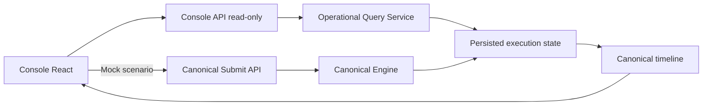

# SPIDER-PROMPT-015 — Console Operacional Canônico

## Baseline

- Backend pré-015: **169** testes; pós-console inicial **181**; pós-revisão cockpit/apresentação: ver manifesto (`baseline.backendTests` / `frontendTests`).
- Totais verificados nesta revisão: backend **186**, frontend **10**, 0 failures / errors / skipped.
- Stack: Java 21, Spring Boot 3.4.2, WebFlux + JPA; React 19 + Vite.
- Preservado: engine canônica, wait/inbox/callback, governance fixation, `POST /v1/products/orchestrate` legado.

## O que foi preservado da UX original

- Estética escura, accent teal/blue, cards/painéis, tipografia legível.
- Conceito de console de observação com timeline e inspectors.

## O que deixou de ser simulado

- Removidos `sleep()` e jornada de 6 etapas inventadas.
- Removida chamada a `/v1/products/orchestrate` no fluxo ativo.
- Removido `JwtInspector` / decodificação de JWT no caminho canônico.
- Timeline e journey map vêm do read model persistido.

## Arquitetura



Packages:

- `br.com.banco.spider.application.console`
- `br.com.banco.spider.operational.readmodel`
- `br.com.banco.spider.integration.inbound.http.console`

Frontend: `frontend/src/console/*` montado por `App.jsx` → `main.jsx`.

## Segurança / authz / redaction

- `OperationalConsoleAuthenticationPort` / `AuthorizationPort` com **DenyAll** por default.
- Ações fechadas: `LIST_EXECUTIONS`, `VIEW_EXECUTION_SUMMARY`, `VIEW_EXECUTION_TIMELINE`, `VIEW_SAFE_PROJECTIONS`, `VIEW_GOVERNANCE_REFERENCE`, `SUBMIT_MOCK_SCENARIO`.
- Profile `local-demo` + `spider.console.local-demo.enabled=true` ativa beans permissivos (somente esse profile).
- `OperationalRedactionService` remove chaves sensíveis (token/secret/password/authorization/mac/nonce/ciphertext/iv/key…).
- Envelope protegido **não** é decriptado para o console.
- Execução inexistente e não autorizada → resposta externa equivalente (404).

## Flags (default false)

```properties
spider.console.enabled=false
spider.console.http.enabled=false
spider.console.local-demo.enabled=false
spider.console.max-page-size=50
spider.console.default-page-size=20
spider.console.polling-min-interval=PT1S
spider.console.safe-projections.enabled=false
```

Combinações inválidas falham na inicialização (`OperationalConsoleConfig`).

## Endpoints

| Método | Path | Notas |
|--------|------|-------|
| GET | `/v1/console/executions` | lista cursor + filtros; `Cache-Control: no-store` |
| GET | `/v1/console/executions/{id}` | detalhe agregado; no-store |
| GET | `/v1/console/implementation` | cockpit/manifesto + flags redigidas |
| GET | `/v1/console/presentation/readiness` | Presentation Readiness |
| POST | `/v1/canonical/executions` | laboratório / modo apresentação Mock |

Não reutiliza `/api/v1/routes` nem `/api/v1/traces/recent`.

## Revisāo 002 — Alinhamento do roadmap no cockpit

- Roadmap vivo: `docs/roadmap/SPIDER-ROADMAP-IMPLEMENTACAO-016-026.md`
- Grupos oficiais 015–026 (A/B/C/D); `currentGroup=GROUP_A_VISIBILITY_OBSERVABILITY`
- Títulos/objetivos/deps/integration levels alinhados à tabela oficial
- Contrato anti-drift: `spider-roadmap-015-026-contract.json` + `Roadmap015026ContractFreezeTest`
- Screenshots regeneradas após alinhamento

## Revisāo 001 — Cockpit e Modo Apresentação

- ARCH-013 + alinhamento ARCH-010/012/README.
- Manifesto `implementation/spider-capability-manifest.json` + schema (001–014/015 VERIFIED; 016–026 PLANNED; MOCK_ONLY).
- Cockpit UI deriva do endpoint `/implementation` (sem importar JSON no React).
- Presentation Readiness + Modo Apresentação (**DEMONSTRAÇÃO MOCK**).
- Scripts: `scripts/validate-presentation.ps1`, `scripts/start-presentation.ps1`.
- Guia: `docs/presentation/SPIDER-PRESENTATION-GUIDE.md` (roteiros 3/8/15).
- Screenshots reais:
  - `docs/technical/screenshots/015-implementation-cockpit-desktop.png`
  - `docs/technical/screenshots/015-presentation-readiness-desktop.png`
  - `docs/technical/screenshots/015-live-execution-desktop.png`
  - `docs/technical/screenshots/015-implementation-cockpit-mobile.png`

## Queries esperadas

- **Lista:** 1 query `listRecent` (+ filtros em memória capped); sem N+1 de steps.
- **Detalhe:** control + plan + steps + attempts(por step) + transitions + waits + outbox?/recon?/fixation? (ordem ~6–12 reads).

## Timeline

Fontes: transitions, steps, attempts, waits, callback outbox. `source=PERSISTED`. Ordenação por `occurredAt` + `sequence`.

## Journey map

Ordenação do plan/steps persistidos; attempt count; wait assíncrono marcado; sem portas legadas hardcoded.

## Polling

Frontend: `useExecutionPolling` com `AbortController`, para em estados terminais / unmount / falhas repetidas, pausável.

## Local-demo Mock

Cenários: `SUCCESS_MULTI_STEP`, `RETRY_THEN_SUCCESS`, `BUSINESS_NEGATIVE`, `WAIT_SIGNAL_RESUME`, `CALLBACK_RECONCILIATION`, `TECHNICAL_FAILURE` via submit canônico.

## Testes

- Backend: redaction, query service, flag matrix, HTTP disabled, DenyAll beans, E2E read model lista/detalhe/legacy smoke.
- Frontend: Vitest + Testing Library (lista, detalhe, banner off, lab canônico, sem orchestrate).

## Validação visual

- Desktop ~1440×900 e mobile ~390×844.
- Screenshots reais obrigatórios sob `docs/technical/screenshots/015-*.png` (capturados contra API/UI locais).

## Limitações fora de escopo

- Métricas/OTel/Prometheus/Grafana, SLO, incident mgmt, admin requeue, WebSocket/SSE, IdP corporativo, payload integral, analytics denormalizado, migração do endpoint legado.
